# 设计哲学

## [一切皆文件](https://cloud.tencent.com/developer/article/1512391)

+ 在Linux系统中，由于管道文件、socket文件等特殊文件的存在，一切皆文件退化为**一切皆文件描述符**。
+ bash再处理到`/dev/tcp/host/port`的充电向时建立了一个`host:port`的socket连接，将socket的读写表现的和普通文件的读写一样，但是上述的文件在文件系统并不是真实存在的，知识bash对用户的一个善意的谎言。
+ plan9系统承诺彻底贯彻执行一切皆文件，将分布在不同位置的所有资源作为文件统一在同一棵目录树中，实现Unix最初的愿景。

## 提供机制而非策略

## 使用文本文件保存配置信息

## 尽量避免跟用户交互

## 由众多功能单一的程序组成


# 虚拟文件系统VFS

一个操作系统可以支持多种底层不同的文件系统（比如NTFS, FAT,  ext3,  ext4），为了给内核和用户进程提供统一的文件系统视图，Linux在用户进程和底层文件系统之间加入了一个抽象层，即虚拟文件系统(Virtual  File System, VFS)。通过虚拟文件系统VFS提供的抽象层来适配各种底层不同的文件系统甚至不同介质，进程所有的文件操作都由VFS完成实际的文件操作。文件IO流程简化为：

1. 应用程序通过文件操作函数（`open()、close()、read()、write()、ioctl()`）调用VFS提供的系统调用函数接口(`sys_open()、sys_close()、sys_read()、sys_write()、sys_ioctl()`)同VFS进行交互。
2. VFS通过驱动程序提供的`file_operation`接口同设备驱动进行交互（驱动层的`file_operations`方法的屏蔽了不同类型设备的底层操作方法的差异）

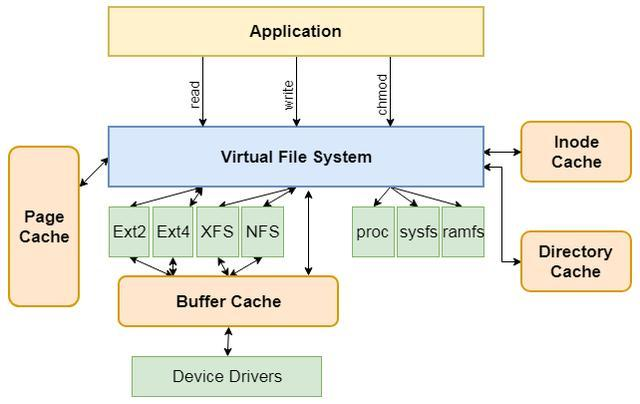

## 数据结构

VFS主要通过四个主要的结构体实现抽象层，每个结构体包含了指向该结构体支持的方法列表的指针。


### 超级块对象 super block

存储一个已安装的**文件系统的控制信息**，代表一个已安装的文件系统；每次一个实际的文件系统被安装时，内核会从磁盘的特定位置读取一些控制信息来填充**常驻内存**中的超级块对象。一个安装实例和对应一个超级块对象。

### 目录项对象

为了方便查找文件而创建的对象，存储的是这个目录下的所有的文件的inode号和文件名等信息。其内部是树形结构，操作系统检索一个文件，都是从根目录开始，按层次解析路径中的所有目录，直到定位到文件。

### 文件对象

**已打开的文件**在内存中的表示，主要用于建立进程和磁盘上的文件的对应关系。文件对象和物理文件的关系类型进程和程序的关系，文件对象仅仅在进程观点上代表已经打开的文件。**一个文件对应的文件对象可能不是惟一的**，但是其对应的索引节点和目录项对象是惟一的。

**file_operations**：一系列函数指针的集合，其中包含所有可以使用的系统调用函数（例如`open、read、write、mmap`等）。每个打开文件（打开文件列表模块的一个表项）都可以连接到`file_operations`模块，从而对任何已打开的文件，通过系统调用函数，实现各种操作。

**address_space**：表示一个文件在页缓存中已经缓存了的物理页。它是页缓存和外部设备中文件系统的桥梁，**关联了内存系统和文件系统**。

### 索引节点对象 inide

存储了文件的相关信息，代表了存储设备上的一个实际的**物理文件**。当一个文件被访问时，内核会在内存中组装相应的索引节点对象，以便向内核提供对一个文件进行操作时所必需的全部信息（这些信息一部分存储在磁盘特定位置，另外一部分是在加载时动态填充的）。

### NOTE

1. Linux支持的文件系统无论是否有文件系统的实例存在，都有且仅有一个`file_system_type`结构用于描述具体的文件系统的类型信息。相同文件系统的多个实例的超级块通过其域内的s_instances成员链接。
2. 每一个文件系统的实例都对应有一个超级块和安装点，超级块通过它的一个域s_type指向其对应的具体的文件系统类型`file_system_type`。

## 进程与VFS


内核通过进程的`task_struct`中的`files`域指针找到**`file_struct`结构体**，该结构体包含了一个由`file *`构成的**已打开文件描述符表**，表中的每一个指针指向VFS中文件列表中的**文件对象**。

## 特殊文件系统

|   文件系统    |              内容              |                 作用                 |
| :-----------: | :----------------------------: | :----------------------------------: |
|    `tmpfs`    |   基于内存的临时文件存储系统   |     极高IO速度、减少存储设备损耗     |
|   `debugfs`   |                                |                                      |
|   `procfs`    | 映射内核中的系统信息、进程信息 |        便于访问和控制内核行为        |
|   `sockfs`    |                                |                                      |
| `devfs(<2.6)` |       硬件设备的文件表示       | 提供了一种类似于文件的方法来管理设备 |
| `sysfs(≥2.6)` |  实际连接到系统上的设备和总线  |           实现和内核的交互           |

**sockfs**：socketfs伪文件系统被编译进内核（而非一个模块）在系统运行期间**总是被装载**着的（因为要支持整个TCP/IP协议栈）。它实现了VFS中的4种主要对象：超级块super block、索引节点inode、目录项对象dentry和文件对象file，当执行文件IO系统调用时，VFS就将请求转发给sockfs，而sockfs就调用具体的协议实现。

# 任务调度

Linux将所有的执行实体都称之为任务Task（Task是进程概念在Linux中的实现），由`Task_Struct`进行描述。每一个**Task都具有内存空间、执行实体、文件资源等进程都具有的资源**，从表现形式上看类似于一个单线程的进程。同时Linux允许多个任务**共享内存空间**（在`Task_Struct`对应域中指明**共享的资源空间**即可），从而使多个任务运行在同一个内存空间上。从表现上来看，此时的多个任务相当于多个线程，多个这样的线程构成了一个进程。

## Linux线程

在linux2.6之前，内核并不支持线程的概念，仅通过轻量级进程LWP模拟线程，一个用户线程对应一个内核线程（内核轻量级进程），这种模型最大的特点是线程调度由内核完成了，而其他线程操作（同步、取消）等都是核外的线程库（LinuxThread）函数完成的。[参考来源](https://developer.aliyun.com/article/374623)

在linux2.6之后，为了完全兼容posix标准，linux2.6对内核进行改进，引入了线程组的概念（仍然用轻量级进程表示线程），有了这个概念就可以将一组线程组织称为一个进程。通过这个改变，linux内核正式支持多线程特性。在实现上主要的改变就是在task_struct中加入tgid字段，这个字段就是用于表示线程组id的字段。在用户线程库方面，也使用NPTL代替LinuxThread。[参考来源](https://developer.aliyun.com/article/374623)

### 共享的资源

内存地址、空间进程基础信息、大部分数据、打开的文件、信号处理、当前工作目录用户和用户组属性等

### 线程独有

线程ID、寄存器、栈的局部变量、返回地址、错误码errno、信号掩码、优先级等

## 多级页表

32bit Linux采用了3级页表$[PGD(16b)|PMD(4b)|PTE(4b)|Offset(12b)]$。64bit采用了4级页表$[PG_{lobal}D|PU_{pper}D|PM_{iddle}D|PTE|Offset]$。

## 抢占内核

在Linux 2.6以前，内核只支持用户态抢占，内核态代码会一直运行直到代码被完成或者被阻塞(系统调用可以被阻塞)。Linux从2.6开始支持可抢占式内核，kernel可以在任何时间点（因为中断造成的抢占可以发生在任何时间）上抢占一个任务（要求此时间点的内核代码不持有锁处于临界区且内核代码[可重入](https://www.wikiwand.com/zh-hans/%E5%8F%AF%E9%87%8D%E5%85%A5)），从中断处理例程返回到内核态时，kernel会检查是否可以抢占和是否需要重新调度。[参考1](https://github.com/IMCG/-/blob/master/kernel/Linux%E5%86%85%E6%A0%B8%E6%80%81%E6%8A%A2%E5%8D%A0%E6%9C%BA%E5%88%B6%E5%88%86%E6%9E%90.md)

## CFS调度算法


# [IO](https://zhuanlan.zhihu.com/p/308054212)

为了满足速度与容量的需求，现代计算机系统都采用了多级金字塔的存储结构。在该结构中上层一般作为下层的Cache层来使用。而狭义的文件IO聚焦于Local Disk的访问特性和其与DRAM之间的数据交互。

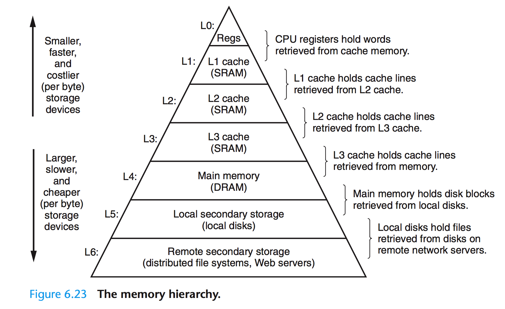
<center class="half">
    <center mg src="img/OS/storage-arch.png" title="a" width="300" alt="图片说明1"/> 题注
</center>

一个简单的用户态的`stdio::printf()`将经过运新模式切换、缓存切换等多个过程才能将更改内容写入存储介质：**用户态的IO函数都有自己在用户态建立的`buffer`**，这主要是出于性能的考虑（系统调用的代价是昂贵的，没必要对每一次IO都使用系统调用，尤其是小的IO，通过用户态缓冲可以**将多次IO请求聚合成一次内核IO**）。同时下图中有意忽略了存储介质自带的缓存（由介质自己管理），图中的`Kernel buffer cache`也被习惯性称之为`Page Cache`；

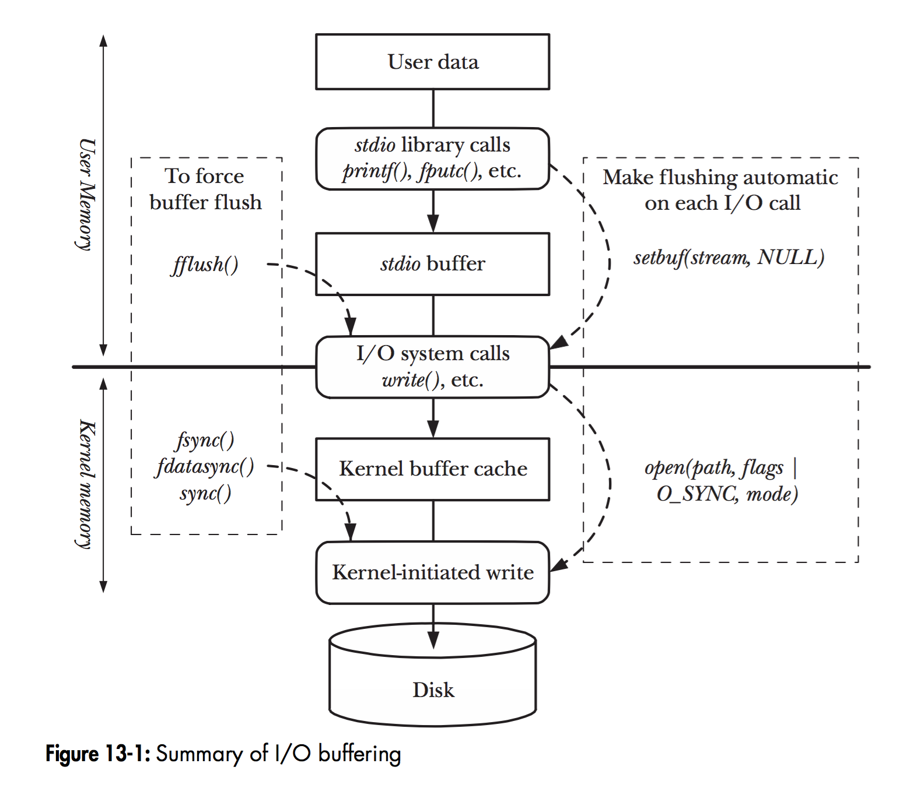

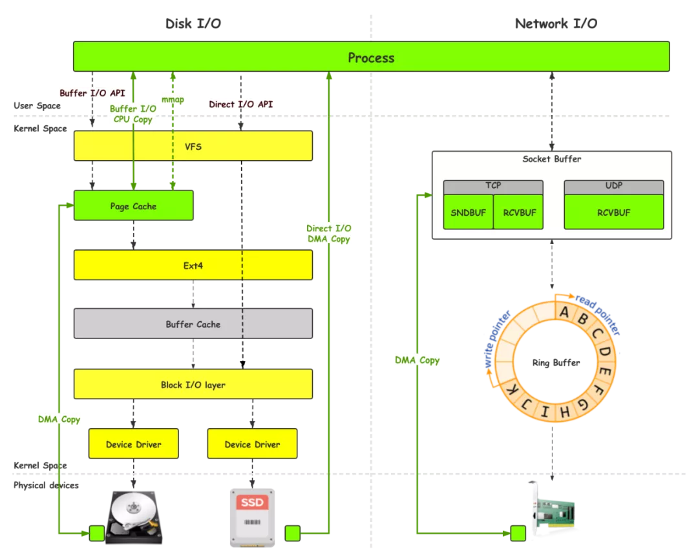

##  内核IO栈


## [内存中的Buffer与Cache](https://linux.cn/article-7310-1.html)

|                    |               作用               |    访问特点    |      丢失      |      透明性      |
| :----------------: | :------------------------------: | :------------: | :------------: | :--------------: |
| **Buffer（缓冲）** | 流量整形（大量小IO变为少量大IO） | 往往是顺序访问 | 影响数据正确性 | 不透明、属于程序 |
| **Cache（缓存）**  |    加快访问速度、重复使用数据    |    随机访问    |   可能不影响   |    对应用透明    |

Page cache 是建立在文件系统之上的，因此其缓存的是逻辑数据 。Buffer cache 是建立在块层之上的，因此其缓存的是物理数据。

### Cache

Page **Cache**：也叫页缓冲或文件缓冲，主要用来作为**文件系统上的文件数据的缓存**来用，尤其是针对当进程对文件有 read / write 操作的时候。在当前的系统实现里，Page Cache 也被作为其它文件类型的缓存设备来用，所以事实上Page Cache 也负责了大部分的**块设备文件的缓存**工作。

### Buffer

**Buffer** Cache：也叫**块缓冲**、用来在系统对块设备进行读写的时候，对块进行数据缓存的系统来使用。这意味着某些对块的操作会使用 Buffer Cache 进行缓存。

### 融合Buffer与Cache

Linux 2.4之后**两个缓存系统被合并使用的**，比如当我们对一个文件进行写操作的时候，Page Cache 的内容会被改变，而 Buffer Cache 则可以用来将 page 标记为不同的缓冲区，并记录是哪一个缓冲区被修改了。**此时 Buffer cache 只是 Page cache 中的 buffer_head 描述符**。这样内核在后续执行脏数据的回写（write back）时，就不用将整个 page 写回，而只需要写回修改的部分即可。

### 内存回收

Linux 内核会在内存将要耗尽的时候，触发内存回收的工作，以便释放出内存给急需内存的进程使用。一般情况下，这个操作中**主要的内存释放都来自于对 Buffer / Cache 的释放**（尤其是被使用更多的 Cache 空间）。这种内存释放需要对Page **Cache**中的脏数据写回，会**带来短时间的大量IO**。

**并不是所有的Page Cache都可以被直接释放回收**：tmpfs中的文件再被删除前都不能自动释放。

1. **tmpfs 中存储的文件**会占用 cache 空间，除非文件删除否则这个 cache 不会被自动释放。
2. 使用 **`shmget `**方式申请的共享内存会占用 cache 空间，除非共享内存被 ipcrm 或者使用 shmctl 去 IPC_RMID，否则相关的 cache 空间都不会被自动释放。
3. 使用 **mmap 方法申请的 MAP_SHARED** 标志的内存会占用 cache 空间，除非进程将这段内存 munmap，否则相关的 cache 空间都不会被自动释放。

## 标准IO

即`Buffer IO`，大多数文件系统的默认IO（如`printf(), puts()`）都采用的是标准IO的方式，需要经历**物理设备<–>设备自带缓存<–>内核缓冲区（Page Cache）<–>（用户缓冲区）<–>用户程序**的过程，其中用户缓冲区即上文提到的`stdio`等程序库提供的自实现缓冲。对于写过程一般函数只实现到由用户缓冲到内核缓冲（`write back`机制），至于**何时写入设备缓冲由OS决定、pdflush (page dirty flush)内核线程执行**（可以调用`sync`等干预），由设备缓存到设备由设备自身控制。


**优点**：隔离用户和内核地址空间以加强安全；汇聚IO请求以减少硬件请求；

**缺点**：数据在用户和内核之间的多次拷贝带来的CPU和内存开销；**延迟写**机制可能造成数据丢失

**场景**：适用于大多数普通文件操作，对性能、吞吐量没有特殊要求，由kernel通过page cache统一管理缓存。默认是异步写，如果使用sync则是同步写。

### 读写过程

1. 进程发起读文件请求。
2. 内核通过查找进程文件符表，定位到内核已打开文件集上的文件信息，从而找到此文件的inode。
3. inode在address_space上查找要请求的文件页是否已经缓存在页缓存中。如果存在，则直接返回这片文件页的内容。
4. 如果不存在，则通过inode定位到文件磁盘地址，将数据从磁盘复制到页缓存。之后再次发起读页面过程，进而将页缓存中的数据发给用户进程。

## 零拷贝技术

指计算机执行操作时**CPU**不需要先将数据**从某处内存复制到另一个特定区域**，从而**节省 CPU 周期和内存带宽**的技术。按照实现的核心思想可以分为三类：

1. **减少甚至避免用户空间和内核空间之间的数据拷贝**：如`mmap()、sendfile() 、 splice() `
2. **绕过内核的直接 I/O**：允许在用户态进程绕过内核直接和硬件进行数据传输，内核在传输过程中只负责一些管理和辅助的工作。
3. **优化内核缓冲区和用户缓冲区之间的数据传输**：对传统IO方式的延续

### [减少拷贝：`mmap()`内存映射](# 内存映射：`mmap()`)

### [减少拷贝：`Linux::sendfile()`](# `sendfile()`)

### [减少拷贝：`Linux::splice()`](# `splice()`)

### 减少拷贝：`Linux::tee()`

在两个管道文件描述符之间复制数据，同是零拷贝。但它不消耗数据，数据被操作之后，仍然可以用于后续操作。 `flag`参数和`splice()`一样。

```c
ssize_t tee(int fdin, int fdout, size_t len, unsigned int flags);
```

### 直接IO

#### 概述

不经过内核缓冲区直接访问介质数据（此时由用户程序**自己设计提供缓冲机制**，通常和**异步IO**结合使用来等待硬件响应）。需要经历**物理设备<–>设备自带缓存<–>（用户缓冲区）<–>用户程序**的过程。其主要的实现方式有用户直接访问硬件和内核控制访问硬件两种方式。


**优点**：减少了内存拷贝和一些系统调用

**缺点**：用户程序实现复杂，需要自己提供缓冲机制和与设备的IO处理

**场景**：性能要求较高、内存使用率也要求较高的情况下使用。如数据库等结合自身数据特点设计了自己高线缓存的程序。

```c
int open(const char *pathname, int flags, mode_t mode);//设置flag就可以启用内核支持的直接IO
```

#### 用户直接访问硬件

**思想**：赋予用户进程直接访问硬件设备的权限，在数据传输过程中只需要内核做一些虚拟内存配置相关的工作。

**缺点**：适用性窄（只适用于诸如 MPI 高性能通信、丛集计算系统中的远程共享内存等有限的场景）、破坏硬件抽象、需要定制的硬件和专门设计的应用程序、存在安全问题。

#### 内核控制访问硬件

**思想**：内核只控制 DMA 引擎替用户进程做缓冲区的数据传输工作而不参与到实际的数据传输过程。

### 传输优化

#### 动态重映射与写时拷贝 (Copy-on-Write)

**`COW`**：如果有多个调用者（callers）同时请求**相同资源**（如内存或磁盘上的数据存储），他们会共同获取相同的指针指向相同的资源，直到某个调用者试图修改资源的内容时，系统才会真正复制一份专用副本（private copy）给该调用者，而其他调用者所见到的最初的资源仍然保持不变。这过程对其他的调用者都是**[透明](https://link.zhihu.com/?target=https%3A//zh.wikipedia.org/wiki/%E9%80%8F%E6%98%8E)**的。此作法主要的优点是如果调用者没有修改该资源，就不会有副本（private copy）被创建，因此**多个调用者只是读取操作时可以共享同一份资源**。

**优点**：节省内存减少拷贝、适合读多写少的场景。

**局限**：构建于虚拟内存之上需要MMU硬件支持（标记只读页，当尝试写时发生异常产生副本），COW事件开销也大。

#### 缓冲区共享 (Buffer Sharing)

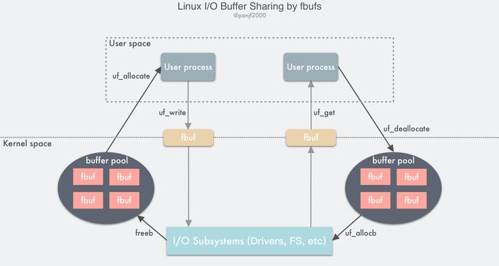

**实现**：内核提供**快速缓冲区fbufs**（fast buffers），使用一个fbuf 缓冲区作为数据传输的最小单位。用户区和内核区、内核区之间的数据都必须严格地在 fbufs 这个体系下进行通信。fbufs 为每一个用户进程分配一个 buffer pool，里面会储存预分配 (也可以使用的时候再分配) 好的 buffers，这些  buffers 会被同时映射到用户内存空间和内核内存空间。fbufs 只需通过一次虚拟内存映射操作即可创建缓冲区，有效地消除那些由存储一致性维护所引发的大多数性能损耗。

**缺点**：实现需要依赖于用户进程、操作系统内核、以及 I/O 子系统 (设备驱动程序，文件系统等)之间协同工作。需要使用新的系统API。

## 网络IO

### socket收发

Linux将TCP、UDP的收发抽象成了Socket的读写：

# 系统调用

## 零拷贝

### 内存映射：`mmap()`

#### 概述

`mmap()`将一个文件描述符指向文件逻辑上连续的一段数据直接映射到进程的地址空间，实现了**进程用户空间缓冲区<–>文件所在内核空间缓冲区之间的映射**（用户空间和内核空间的虚拟内存地址同时**映射到同一块物理内存**，用户态进程可以直接操作物理内存），之后进程读写操作这一段用户空间的内存就相当于直接读写文件（匿名文件或命名文件）的缓冲页，而系统会自动回写脏页到对应的硬件上，用户进程不用因为内核空间和用户空间相互隔离而将数据在两个空间的内存之间来回拷贝。


#### 函数原型

```c
#include <sys/mman.h>;
void *mmap(void *addr, size_t length, int prot, int flags, int fd, off_t offset);//分配内存映射区
int munmap(void *addr, size_t length);//释放内存映射区
```

##### [参数及注意事项](http://www.yushuai.xyz/2019/05/31/4365.html)
**`addr`**: 建立映射区的首地址，使用时，直接传递`NULL`，实际参数由Linux内核确定。

**`length`**：欲创建映射区的大小，不能创建0字节大小的映射区。

**`prot`**：映射区权限：`PROT_READ、PROT_WRITE、PROT_EXEC、PROT_NONE`支持或操作组合。映射区创建过程中对文件有一次**隐含的读操作**；创建的映射区的权限要**小于等于**打开文件的权限。

**`flags`**：标志位参数(常用于设定更新物理区域、设置共享、创建匿名映射区)，支持或操作组合，表中仅列出其中几个可能的参数。

|       位        |                             含义                             |
| :-------------: | :----------------------------------------------------------: |
|  `MAP_SHARED`   | 对映射区的修改会影响其他同方式的进程，更改会被写回物理设备上 |
|  `MAP_PRIVATE`  |      映射区所做的修改不会影响其他进程，不会写回物理设备      |
| `MAP_ANONYMOUS` |       匿名映射，映射区不与任何文件关联（`fd`必须为-1）       |

**fd**：用来建立映射区的文件描述符（创建完后**可以先关闭**），-1为匿名映射，否则为文件映射。

**offset**：映射文件的偏移（必须是**页大小的整数倍**，因为映射是由MMU帮忙创建的，而MMU操作的基本单位就是4K），可以把整个文件都映射到内存空间，也可以只把一部分文件内容映射到内存空间。

##### 返回值

成功返回创建的映射区首地址、失败返回`MAP_FAILED`宏（其值为`(void *)-1`）并设置`error`。

并不是以返回值开始`len`长的地址都可访问，只有**部分可访问**，`mmap`可访问的地址空间为**即在文件大小以内又在映射区域范围内**的数据。对不同部分的访问将收到不同的结果。文件大小（可能动态变化）、 `mmap`的参数 `len` 都不能决定进程能访问的大小。


#### [过程分析](https://www.cnblogs.com/huxiao-tee/p/4660352.html)

**（一）未分配虚拟页**：进程启动映射过程，在虚拟地址空间中为映射创建虚拟映射区域

1. 用户在用户空间调用`mmap()`函数。

2. 内核在进程的**用户虚拟地址空间**内找到满足大小`len`的**连续地址空间**（可以超过页）。

3. 为此空间创建并初始化一个**新的`vm_area_struct`**结构，并将此结构体加入到**`mm_struct`**引出的链表或红黑树中。

##### 文件映射、共享匿名映射

共享匿名页在内核演变为文件映射缺页异常（伪文件系统），

**（二）已分配虚拟页，未映射到物理页**：调用内核空间的系统调用函数mmap（不同于用户空间函数），实现文件物理地址和进程虚拟地址的一一映射关系

1. 通过**文件描述符**在内核的**已打开文件表**索引到**文件结构体**。
2. 通过文件结构体的**`file_operation`**域调用该文件**驱动提供的`int mmap(struct file *filp, struct vm_area_struct *vma)`函数**，该函数会找到文件的**`inode`定位**到地址。
3. 通过[内存映射函数`remap_pfn_range`](https://www.cnblogs.com/pengdonglin137/p/8149859.html)**建立页表项**（）实现了**文件地址和虚拟地址区域的映射**关系（**此时虚拟地址并没有关联到主存主存，即没有分配物理内存**）。

**（三）已分配虚拟页，已映射到物理页**：进程发起对这片映射空间的访问，引发缺页异常，实现文件内容到物理内存（主存）的拷贝

1. 进程发起对这片映射空间的访问，引发**缺页异常**。

2. 内核处理缺页（分配物理内存并调入页：先查找swap cache、没有再调用`nopage()`）。

3. 读写页面、页面成为了**脏页**后系统会**延时等待**一段时间后将页面**回写**到磁盘地址。

##### [私有匿名映射](https://www.cnblogs.com/linhaostudy/p/13647189.html)
**（二）：已分配虚拟页，未映射到物理页**：产生缺页异常，建立到物理页的映射并访问物理页

1. 如果是读访问，将虚拟页映射到**0页**（内容全为0），以减少不必要的内存分配；
2. 如果是写访问，则会分配**新的物理页**（如果先发生读导致的0页映射则有两次缺页中断），并用0填充然后映射到虚拟页上去。


#### 适用场景

|              |     私有映射     |           共享映射           |       内容       |
| :----------: | :--------------: | :--------------------------: | :--------------: |
| **匿名映射** |  常用于内存分配  |     共享内存实现进程通信     |    初始化为0     |
| **文件映射** | 常用于加载动态库 | 内存映射大文件IO，进程间通信 | 被映射的部分文件 |
|              |  修改外部不可见  |         修改外部可见         |                  |

**进程通信**：`mmap` 由内核负责管理，对**同一个文件地址的映射将被所有线程共享**（对这段区域的修改也直接反映到所有用户空间、用户空间和内核空间对这一段内存的修改相互可见，操作系统确保线程安全、线程可见性和数据一致性），进程通过直接读写内存实现不同进程间的文件共享，是**最快的IPC形式**（相比于管道和消息队列等避免了许多数据拷贝和系统调用）。操作系统确保线程安全以及线程可见性；

**快速IO**：即完成了对文件的操作又避免更多的`lseek()、read()、write()`等系统调用，这点对于大文件或者频繁访问的文件尤其有用，提高了I/O效率（写入非实时）。适用于对文件操作的吞吐量、性能有一定要求，且对内存使用不敏感，不要求实时写回的情况下使用。

##### [缺点](https://spongecaptain.cool/SimpleClearFileIO/3.%20mmap.html)

1. 用时必须实现指定好内存映射的大小，因此**不适合变长文件**。
2. 如果更新文件（尤其是随机写）的操作很多，会使**大量脏页引发的随机IO**占用大量时间，效率可能反而不如Buffer IO。
3. **读/写小文件时mmap并不占优势**；同时 mmap 的写回由系统全权控制，但是在小数据量的情况下由应用本身手动控制更好；
4. 由于mmap必须要在内存中找到一块**连续的地址块**，因此对于超大文件无法完全mmap映射，需要使用更为复杂的分块映射。

#### [其他](https://www.cnblogs.com/huxiao-tee/p/4660352.html)

##### 使用事项

1. 用于创建映射区的文件描述符可以在映射区解除映射之前**提前关闭**。这是因为建立映射的是文件的磁盘地址和内存地址，而不是文件本身，和文件描述符无关。
2. 一般说来，进程在映射空间的对共享内容的改变并**不直接写回**到磁盘文件中，往往在调用**`munmap()`**解除映射关系后才执行该操作，也可以通过调用**`msync()`**强制写回实现磁盘上文件内容与共享内存区的内容一致。
3. `mmap`实际创建的映射区域大小和偏移量必须是**物理页的整倍数**（数据不足一页的会被补齐为0）。原因是，内存管理的最小粒度、进程虚拟地址空间和内存的映射也是以页为单位，为了匹配内存的操作，`mmap`从磁盘到虚拟地址空间的映射也必须是页。
4. 用户空间的mmap映射使用的是虚拟内存空间（可以分配大于物理内存大小的mmap映射），实际上并不占据物理内存，只有在内核空间的kernel buffer cache才占据实际的物理内存；
5. [**文件截断**](https://blog.csdn.net/caianye/article/details/7576198)：可用信号处理（治标）和文件租借/机会锁解决

##### 映射大小和文件大小

**CASE 1**：偏移为0、映射大小（5000）等于文件大小（5000）、映射大小超过整数页

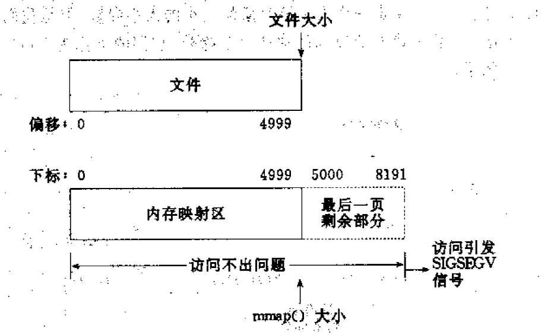

此时：

（1）读/写前5000个字节（0~4999），会返回操作文件内容。

（2）读字节5000\~8191时，结果全为0。写5000~8191时，进程不会报错，但是所写的内容**不会写入原文件**中 。

（3）读/写8192以外的磁盘部分，会返回一个SIGSECV错误。

**CASE 2**：偏移为0、映射大小（15000）大于文件大小（5000）、映射大小超过整数页 

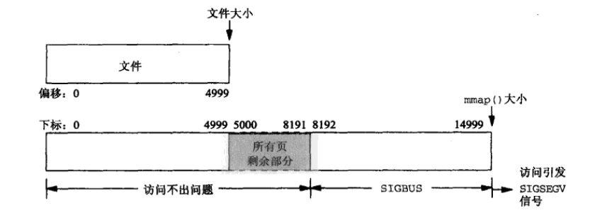

（1）进程可以正常读/写被映射的前5000字节(0~4999)，写操作的改动会在一定时间后反映在原文件中。

（2）对于5000~8191字节，进程可以进行读写过程，不会报错。但是内容在写入前均为0，另外，写入后不会反映在文件中。

（3）对于8192~14999字节，进程不能对其进行读写，会报SIGBUS错误。

（4）对于15000以外的字节，进程不能对其读写，会引发SIGSEGV错误。

**CASE 3**：文件初始大小为0，映射了1000页，映射区为`ptr`

（1）如果在映射建立之初，就对文件进行读写操作，由于文件大小为0，并没有合法的物理页对应，访问会返回`SIGBUS`错误。

（2）如果，每次操作`ptr`读写前，先增加文件的大小，那么`ptr`在文件大小内部的操作就是合法的。

### [`sendfile()`](https://zhuanlan.zhihu.com/p/308054212)

将磁盘文件直接由内核缓冲区传递到内核中的网卡缓冲区，适用于**文件数据到网卡**的传输过程，并且用户程序对数据**没有修改**的场景；

**一般IO：**硬盘–>内核缓冲–>用户缓冲–>内核socket缓冲–>网络协议栈（四次模态切换、两次DMA拷贝、两次CPU拷贝）

**`sendfile`：**硬盘–> 内核缓冲–>内核socket缓冲–>网络协议栈（两次模态切换、两次DMA拷贝、一次CPU拷贝）


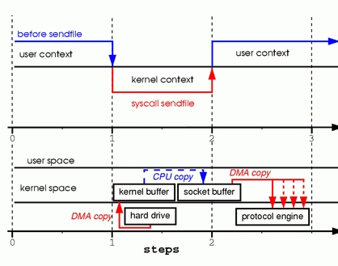

#### 函数原型

```c
#include <sys/sendfile.h>
ssize_t sendfile(int out_fd, int in_fd, off_t *offset, size_t count);
```

##### 参数

**`out_fd`**：已经打开的接受输出的**任意类型的文件描述符**。

**`in_fd`**：已经打开的产生输入的文件描述符。该文件描述符必须**指向支持类似`mmap`映射操作的具体文件**，**不能是socket类型**。

**`offset`**：指示 `sendfile()`从in_fd开始读取的位置。函数返回后，该值会被更新为`sendfile()`最后读取的字节位置处。

**`count`**：此次期望传输的文件数。

##### 返回值

如果成功就返回写到`out_fd`中的字节数；失败返回-1，并设置`error`信息

#### 支持DAM聚合拷贝`sendfile`

**复制到socket缓冲区中的只有记录数据位置和长度的描述符而没有实际的数据**，DMA模块将数据直接从内核缓冲区传递给协议引擎，从而又消除了一次复制。


### `splice()`

`splice`需要在内核缓冲区和内核的socket缓冲区之间**建立管道连接**避免CPU拷贝。适用于**任意两个文件描述符中移动数据**（两个文件描述符中**至少有一个是管道**设备），并且用户程序对数据**没有修改**的场景；

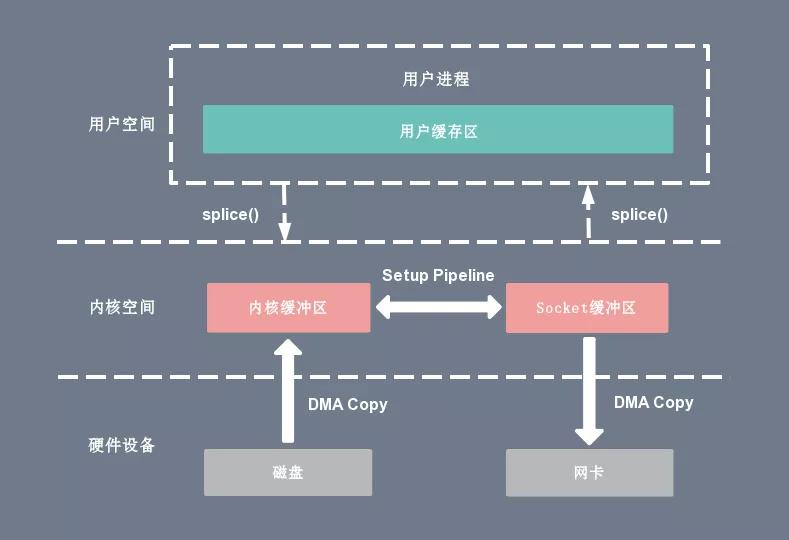

#### 函数原型

其功能是（逻辑上）从fd_in**移动**到 fd_out 中，如传入非 NULL 的off_in/off_out则会指定消费或者复制端的 offset，并会禁止对于文件当前 offset 的处理。

```c
#include <fcntl.h>
#include <unistd.h>

int pipe(int pipefd[2]);
int pipe2(int pipefd[2], int flags);

ssize_t splice(int fd_in, loff_t *off_in, int fd_out, loff_t *off_out, size_t len, unsigned int flags);
```

##### 参数

**`fd_in、fd_out`**：待读取 \ 写入的文件描述符（**至少一个是`pipe`**）。

**`off_in、off_out`**：开始读出 \ 写入的起始地址，管道描述符对应的偏移必须是NULL。

**`len`**：需要移动的数据长度

**`flag`**：控制数据的移动方式（支持`SPLICE_F_MOVE、SPLICE_F_NONBLOCK、SPLICE_F_MORE、SPLICE_F_GIFT`的位组合）

##### 返回值

**成功**：返回成功移动的字节数，为0且数据源为管道则管道中未被填入数据

**失败**：返回-1，并设置error

## 内存分配 

 从操作系统角度来看，进程分配内存主要由**`brk()`和`mmap()`**两个系统调用完成，这两种内存分配调用分配的都是**以页为基本单位的虚拟内存**，其物理内存的分配发生在第一次访问已分配的虚拟地址空间产生缺页中断时，OS会负责分配物理内存，然后建立虚拟内存和物理内存之间的映射关系。

`brk()、sbrk()、mmap()`完成的都是以页为基本单位的大粒度内存分配，更小粒度的内存分配由具体的调用器（如`malloc()`、STL分配器等）负责实现。

### `brk()/sbrk()`

该函数负责在**堆空间**分配大小**小于等于`M_TRIM_THRESHOLD(128KB)`**的内存，在分配虚拟内存时将**`brk`指针**（指向堆的顶部）向高地址方向增加指定的大小。

```c
int brk( const void *addr );//设置brk为addr
void* sbrk ( intptr_t incr );//incr为申请的地址的大小，返回新的brk
```

#### 内存释放

**`brk`指针始终指向指向堆的顶部**，只有当高地址内存释放完后，`brk`才能回撤同时触发物理内存的回收。但如果堆空间里的可用空闲内存空间超过`M_TRIM_THRESHOLD(128KB)`时也会**触发内存紧缩**（虚拟和物理），否则里面的可用地址也可以被**重用**。

### `mmap()/munmap()`

该函数通过创建**私有匿名的映射段**，在**MMS段**分配大小**大于`M_TRIM_THRESHOLD(128KB)`**的内存。

```c
void *mmap(void *addr, size_t length, int prot, int flags, int fd, off_t offset);//分配
int munmap(void *addr, size_t length);//释放
```

#### 内存释放

可以单独释放

### [其他分配函数](https://www.jianshu.com/p/e42f4977fb7e)

|                       函数                        | 模态 |   空间连续性   |          空间          |       分配速度       |
| :-----------------------------------------------: | :--: | :------------: | :--------------------: | :------------------: |
|                     `kmalloc`                     | 内核 | 虚拟物理都连续 | 内核（低端内存）小内存 |         最快         |
|                     `vmalloc`                     | 内核 |  连续虚拟地址  | 内核（高端内存）大内存 |     稍慢（改PT）     |
| [`malloc`](https://zhuanlan.zhihu.com/p/57863097) | 用户 |  内部有内存池  |       用户堆空间       | 最慢（改PT、切模态） |

```c
void *kmalloc(size_t size, int flags);
void kfree(const void *ptr);

void *vmalloc(unsigned long size);
void vfree(void *addr);

void *malloc(size_t size);//底层依赖mmap、munmap、brk、sbrk
void free(void *ptr);
```

# 进程通信

| 通信方式 |                用于空间与内核的局限                |
| :------: | :------------------------------------------------: |
|   管道   |       管道通信局限于父进程和子进程间的通信。       |
| 消息队列 | 消息队列在硬中断和软中断中不可以无阻塞地接收数据。 |
|  信号量  |      信号量无法在内核空间和用户空间之间使用。      |
| 内存共享 |            内存共享依赖信号量通信机制。            |
|  套接字  |    套接字在硬、软中断中不可以无阻塞地接收数据。    |

## 管道

## 共享内存

实际上，进程之间在共享内存时，并不总是读写少量数据后就解除映射，有新的通信时，再重新建立共享内存区域。而是保持共享区域，直到通信完毕为止，这样，数据内容一直保存在共享内存中，并没有写回文件。共享内存中的内容往往是在解除映射时才写回文件的。因此，采用共享内存的通信方式效率是非常高的。

## Socket

## 消息队列

## 信号量

# 内存布局

## 内存管理层次

Linux对内存的管理划分成三个层次，分别是Node、Zone、Page。对这三个层次简介如下：

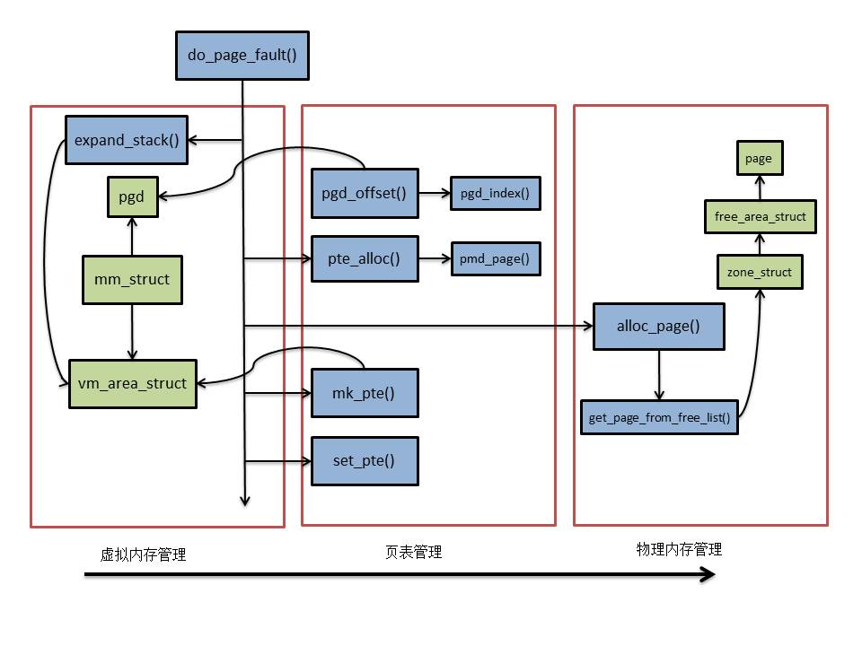

|       层次       |                             说明                             |
| :--------------: | :----------------------------------------------------------: |
| Node（存储节点） | CPU被划分成多个节点，每个节点都有自己的一块内存，可以参考NUMA架构有关节点的介绍 |
|  Zone（管理区）  | 每一个Node（节点）中的内存被划分成多个管理区域（Zone），用于表示不同范围的内存 |
|   Page（页面）   | 每一个管理区又进一步被划分为多个页面，页面是内存管理中最基础的分配单位 |

下面以扩展用户堆栈为例，解释3个层次的关系。

调用函数时，会涉及堆栈的操作，当访问地址超过堆栈的边界时，便引起page fault，内核处理页面失效的过程中，涉及到内存管理的3个层次。

Ø 调用expand_stack()修改vm_area_struct结构，即扩展堆栈区的虚拟地址空间；

Ø 创建空白页表项，这一过程会利用mm_struct中的pgd(页全局目录表基址)得到页目录表项(pgd_offset())，然后计算得到相应的页表项(pte_alloc())地址；

Ø 调用alloc_page()分配物理页面，它会从指定内存管理区的buddy system中查找一块合适的free_area，进而得到一个物理页面；

Ø 创建映射关系，先调用mk_pte()产生页表项内容，然后调用set_pte()写入页表项。

Ø 至此，扩展堆栈基本完成，用户进程重新访问堆栈便可以成功。

可以认为，结构体pgd和vm_area_struct，函数alloc_page()和mk_pte()是连接三者的桥梁。

## 物理地址布局


### ZONE_DMA（0~16M）

由于**DMA不经过MMU直接使用物理内存**地址访问内存，而且**需要连续的缓冲区**，所以必须为DMA划分一段连续的物理地址空间。因此内核在物理内存中开辟专门的ZONE_DMA区域**专门供I/O设备的DMA**使用。此区域也被称为**内存空洞**，CPU对该区域地址的**访问请求不会到达内存而会被自动转发到相应的IO设备**。

### ZONE_NORMAL（16M~896M）

内核**能够直接使用**。

### [ZONE_HIGHMEM（896M~结束）](https://www.zhihu.com/question/280526042)

内核**不能直接使用**此区域的内容，对此区域的访问需要临时建立映射关系，

## 物理地址与虚拟地址

由于开启了分页机制，**内核需要访问全部物理地址空间**的话，必须先建立映射关系，然后通过虚拟地址来访问。在32bit Linux中内核简化了分段机制（Intel由于历史原因必须支持分段），将最高的1GB虚拟内存空间作为内核空间（内核对应的虚拟地址空间对应的物理内存会**常驻内存**，不会被OS换出到磁盘等设备，**所有的进程共享内核空间地址**），对内核空间的访问将受到硬件保护(0级才可访问)，低3GB虚拟内存空间作为用户空间（包含代码段、全局变量、BSS、函数栈、堆内存、映射区等）供用户进程使用（3级可访问）。


## [内核空间布局](https://blog.csdn.net/qq_38410730/article/details/81105132)

内核为了能够访问所有的物理地址空间，就要**将全部物理地址空间映射到的内核线性空间**中。于是内核将0~896M的物理地址空间**一对一映射**到自己的线性地址空间（对应`ZONE_DMA`和`ZONE_NORMAL`区域）中，这样它便可以随时访问里的物理页面。而由于内核的虚拟地址空间的限制，内核按照常规的映射方式不能访问到896MB之后的全部物理地址空间（即**`ZONE_HIGHMEM`**区域），在32位Linux下，内核采取了**动态映射**的方法，即按需的将`ZONE_HIGHMEM`里的物理页面映射到内核地址空间的最后128M线性地址空间里，使用完之后释放映射关系，循环使用这128M线性地址空间以映射到其他所有物理页面。[来源](https://blog.csdn.net/ibless/article/details/81545359) [来源](https://blog.csdn.net/farmwang/article/details/66976818?utm_source=debugrun&utm_medium=referral)


### 直接/线性映射区域（`896MB`）

在此段（`normal memory`）申请地址需要使用**`kmalloc()`**函数，该函数会在直接映射区开辟出虚拟连续且物理上都连续（可以更好的利用内存访问的局部性、**分配更快**（由于页表的原因）……[其他优点](https://zhuanlan.zhihu.com/p/68501351)）的地址空间。

#### 低16MB

对应着物理地址空间中的**`ZONE_DMA`区域**。

#### 中880MB

此段对应着物理地址空间中的**`ZONE_NORMAL`区域**，内核会将**频繁使用的数据**（内核代码段、内核数据段、内核`BSS段、GDT、IDT、PGD、mem_map`数组等）放置在此段**直接使用**。

### 动态映射区域（`128MB`）


此段内也叫**高端内存**（若**机器安装的物理内存超过内核虚拟地址空间范围**，就会存在高端内存，高端内存只和逻辑地址有关系）。在高端内存最前面留有用来和`normal memory`做间隔的8MB区域，这部分间隔不作任何地址映射，相当于一个做**安全保护的内存空洞**（防止不正确的越界内存访问，因为此处没有进行任何形式的映射，如果进入到空洞地带，将会触发处理器产生一个异常），**事实上所有的这样的内存空洞都是用来作安全防护的**。

通过借助128MB的逻辑地址空间和**动态映射**的方法可以使Linux内核**使用到超出内核虚拟地址空间（1GB）的物理内存**，内核对这一块的地址进行访问时必须**借助页表**才能得到真正的物理地址。具体的动态映射方式有三种，这三种动态映射的方式分别使用三段不同的虚拟地址空间。


#### `vmalloc`区（**`120MB`**）：

即`VMALLOC_START`和`VMALLOC_END`之间的区域。在此区域的内存分配使用**`vmalloc()`**，将得到连续的虚拟地址空间，每一块被分配的空间都有一个对应的**`vm_struct`**结构进行管理。

#### 持久映射区（**`PKMap：4MB`**）：

在可持久内核映射区，可通过调用函数`kmap()`在物理页框与内核虚拟页之间建立长期映射。这个空间通常为4MB，最多能映射1024个页框，数量较为稀少，所以为了加强页框的周转，应及时调用函数`kunmap()`将不再使用的物理页框释放。

#### 固定映射区/临时映射区（**`FixMap：4MB`**）：

该段虚拟地址空间会被分配给多个CPU核心，每个CPU占用一块空间，在每个CPU占用的空间内部又会根据映射的目的再次分为多个小空间。对这一段内存的分配和使用借助**`kmap_atomic()`**完成。

## [用户空间段布局](https://www.cnblogs.com/fuzhe1989/p/3936894.html)

|  段分布  |                             内容                             | 分配方式 |           大小           | 运行态 |
| :------: | :----------------------------------------------------------: | :------: | :----------------------: | :----: |
|  保留段  |     0x08048000(x86下)：为了便于**检查空指针**的一段空间      |   静态   |         固定大小         |  用户  |
|  代码段  |    程序指令、**字符串常量**、虚函数表（**只读**、可共享）    |   静态   |        编译时确定        |  用户  |
|  数据段  |                  初始化的全局变量和静态变量                  |   静态   |        编译时确定        |  用户  |
|   BSS    |            未初始化的全局变量和静态变量（全为0）             |   静态   |        编译时确定        |  用户  |
|  映射段  |              动态链接库、共享文件、匿名映射对象              |   动态   |           动态           |  用户  |
|    堆    | 动态申请的数据、有**碎片**问题、[`brk()`函数](https://blog.csdn.net/shuzishij/article/details/86574927) |   动态   |       和栈共享上限       |  用户  |
|    栈    | 局部变量、函数参数与返回值、函数返回地址、调用者环境信息（如寄存器值） |   静态   | 和堆共享上限、**可设置** |  用户  |
| 内核空间 |      储操作系统、驱动程序、**命令行参数和环境变量**等……      |  动+静   |           定长           |  内核  |


Linux通过将每个段的起始地址赋予一个随机偏移量**`random offset`**来打乱内存布局（否则进程内存布局缺乏变化，容易被试探出内存布局）以加强安全性。

**代码段、数据段**：大小和内容在程序被编译后就被固定了在了目标文件之中，通常都被存储在预分配的连续内存之中。

**BSS段（Block Started by Symbol）**：大小在编译时固定（目标文件仅记录所需的大小，无实际数据），**实际数据只存在于内存之中**，内存中的内容由OS全部初始化为0。

**映射段（Memory Mapping Segment）**：Linux中通过`mmap()`系统调用，Windows中通过`creatFileMapping()/MapViewOfFile()`**动态创建**的区域。内核通过使用该区域（**内存映射**）可以避免内核空间和用户空间的文件拷贝，直接将文件内容直接映射到内存以实现**快速IO**。常被用来加载动态库、创建[匿名映射](https://www.jianshu.com/p/b24265a3a222)。在C库函数中，如果一次申请内存大于`M_MMAP_THRESHOLD(128K)`字节时，库函数会**自动使用映射段创建匿名映射**。

**栈**：Linux进程在运行过程中遇到栈满时会自动试图增加栈大小（上限是`RLIMIT_STACK(8MB)`），如果无法增加才会出现段错误。而只有[动态栈增长](http://lxr.linux.no/linux+v2.6.28.1/arch/x86/mm/fault.c#L692)（由`alloca()`完成）访问到未分配区域是合法的（白色区域）其它方式访问到未映射区域时都会引发一次页错误，进而导致段错误。

## [用户与内核的通信](https://www.write-bug.com/article/2143.html)

| 方式              | 依赖fs    | 不足                       | 优势                                                         |
| ----------------- | --------- | -------------------------- | ------------------------------------------------------------ |
| 内核启动参数      |           | 单向向内核、数据量小       | 在启动内核时就传递数据改变内核的启动方式                     |
| 模块参数和`sysfs` | `sysfs`   | 数据量小                   | 可在内核运行时传递数据，并可以动态的进行更改                 |
| `Sysctl`          | `procfs`  | 数据量小                   | 可在内核运行的任何时刻获取和改变内核的配置参数               |
| 系统调用          |           | 添加额外的系统调用要重编译 | 只需要调用系统调用函数即可进行数据传递                       |
| `Netlink`         |           | `netlink`接口变化速度太快  | 使用方式类似于`socket`的使用方式，支持大量数据传输、异步通信、多播 |
| `Procfs`          | `procfs`  | 不便于传输超页大小数据     | 方便的通过操作文件的方式进行数据传输。                       |
| `seq_file`        | `procfs`  | 单向向用户                 | 改进`procfs`数据量小的缺点使内核输出大文件信息更容易         |
| `debugfs`         | `debugfs` | 仅用于简单类型变量         | 专门设计用来内核开发调试使用，方便内核开发者向用户空间输出调试信息。 |

### 系统调用传参

用户进行系统调用时必须向内核传递一些参数，对于非指针的基础数据类型可以通过寄存器的拷贝直接实现，而对于特殊数据结构或者内存块内数据的传递需要借助指针实现，然而内核空间和用户空间**不能简单地使用指针传递数据**（尤其是有MMU的结构下），内核必须小心处理来自用户空间的指针，OS对于指针类型的数据的传递专门定义了``copy_to_user()、copy_from_user()`方法，该方法包含**验证和拷贝**两个步骤：

**验证**：是否是合法的用户空间地址、该地址是否已经分配了物理地址（处理缺页）。

**拷贝**：避免其他进程在运行的过程中修改了地址指向的用户空间的数据。

理论上，内核空间可以直接使用用户空间传过来的指针，即使要做数据拷贝的动作，也可以直接使用`memcpy`，事实上，在没有`MMU`的体系架构上，`copy_form_user`最终的实现就是利用了`memcpy`。但对于大多数有`MMU`的平台，情况就有了一些变化：用户空间传过来的指针是在虚拟地址空间上的，它指向的虚拟地址空间很可能还没有真正映射到实际的物理页面上。用户空间的缺页导致的异常会透明的被内核予以修复(为缺页的地址空间提交新的物理页面)，访问到缺页的指令会继续运行仿佛什么都没有发生一样。内核空间必须被显示的修复，这是由内核提供的缺页异常处理函数的设计模式决定的（其背后的思想后：在内核态中，如果程序试图访问一个尚未提交物理页面的用户空间地址，内核必须对此保持警惕而不能像用户空间那样毫无察觉。如果内核访问一个尚未被提交物理页面的空间，将产生缺页异常，这个时候内核会调用`do_page_fault`，因为异常发生在内核空间，`do_page_fault`的处理逻辑将调用`search_exception_tables`在`__ex_table`中查找异常指令的修复指令），正因为这样，`copy_from_user`的实现才会看起来有些复杂，当然性能方面提升也是它的复杂度提升的一个原因。[来源](https://www.cnblogs.com/rongpmcu/p/7662749.html)

## 段的管理

进程的多个段的连续地址空间构成多个独立的内存区域。Linux内核使用**`vm_area_struct`结构**（包含区域起始和终止地址、指向该区域支持的系统调用函数集合的**`vm_ops`指针**）来表示一个独立的虚拟内存区域，一个进程拥有的多个`vm_area_struct`将被链接接起来方便进程访问。

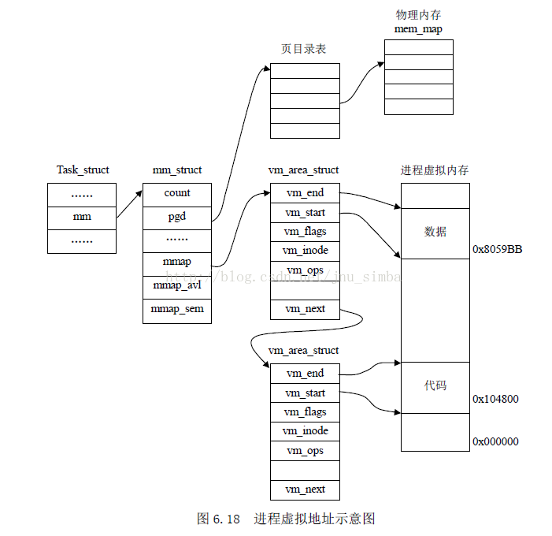