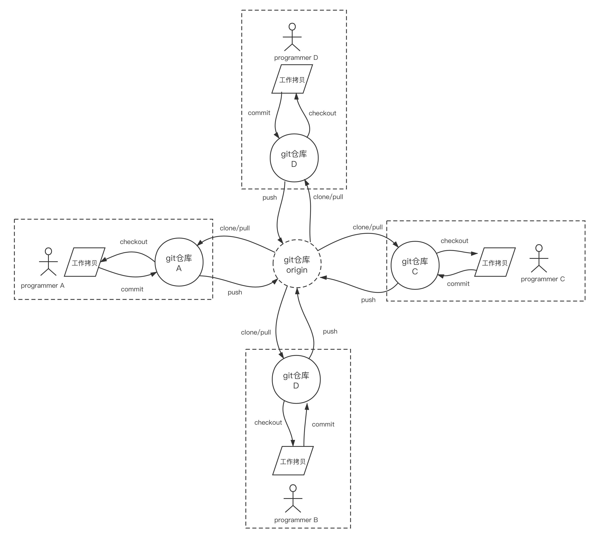
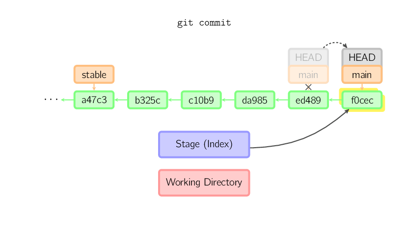
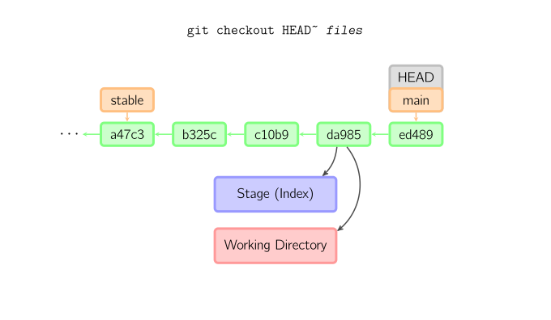
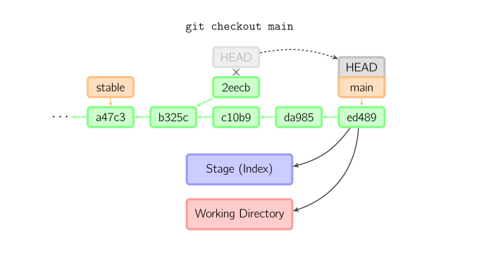
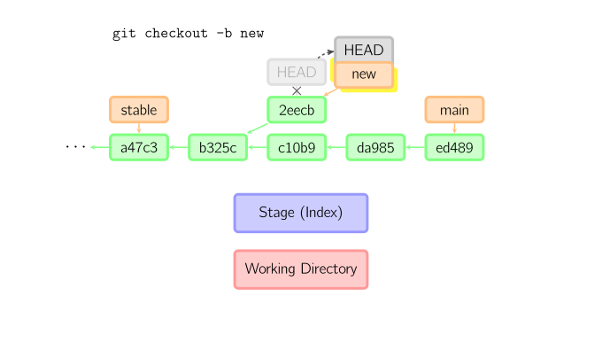
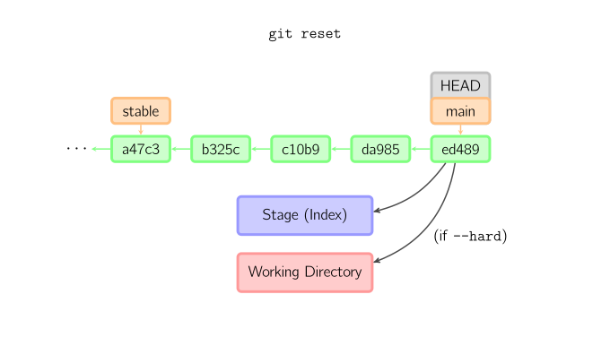
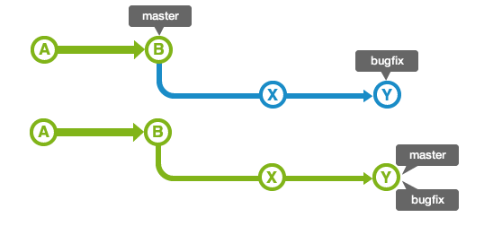
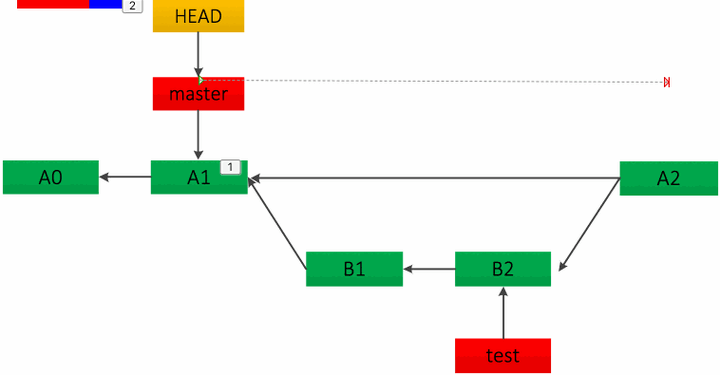
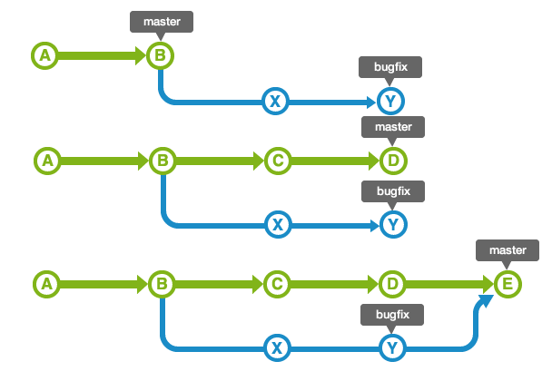

<!-- vim-markdown-toc GFM -->

* [编译链接GCC/G++](#编译链接gccg)
    * [符号修饰与函数签名](#符号修饰与函数签名)
        * [函数签名](#函数签名)
            * [GCC C++修饰规则](#gcc-c修饰规则)
* [编译配置CMake/Make](#编译配置cmakemake)
* [调试GDB](#调试gdb)
    * [前提](#前提)
    * [查看内存](#查看内存)
* [版本管理Git/GitHub](#版本管理gitgithub)
    * [概述](#概述)
    * [比较`diff`](#比较diff)
    * [本地归档`commit`](#本地归档commit)
    * [分支切换`checkout`](#分支切换checkout)
        * [分支跳转](#分支跳转)
        * [匿名分支](#匿名分支)
            * [创建](#创建)
            * [提交到匿名分支](#提交到匿名分支)
            * [记录匿名分支](#记录匿名分支)
    * [分支回溯`reset`](#分支回溯reset)
    * [分支合并](#分支合并)
        * [`merge`](#merge)
            * [无分叉合并](#无分叉合并)
                * [快速合并`fast-forward`](#快速合并fast-forward)
                * [非快速合并](#非快速合并)
                    * [`no-ff`](#no-ff)
                    * [`squash`](#squash)
            * [带分叉合并](#带分叉合并)
        * [`rebase`](#rebase)
        * [`Cherry Pick`](#cherry-pick)
    * [常见问题](#常见问题)
    * [其他资料](#其他资料)
* [富文本Markdown](#富文本markdown)
* [编辑器VIM](#编辑器vim)
* [论文写作Latex](#论文写作latex)

<!-- vim-markdown-toc -->

# 编译链接GCC/G++

## 符号修饰与函数签名

### 函数签名

函数签名（Function Signature）包含了一个函数的信息（函数名、参数类型、所在的类和名称空间及其他信息），用于识别不同的函数。

#### GCC C++修饰规则

所有的符号都**以Z开头**，对于嵌套的名字（在名称空间或在类里面的）后面紧跟N，然后是各个名称空间和类的名字，每个名字前是名字字符串长度，再**以E结尾**。对于一个函数来说，它的**参数列表紧跟在E后面**，对于int类型来说，就是字母"i"。

```c++
N::C::func(int);//函数签名为：_ZN1N1C4funcEi，可以使用c++filt解析函数签名
boost::detail::get_tss_data(void const*);//_ZN5boost6detail12get_tss_dataEPKv
boost::detail::get_tss_data(void const*, int, float const*);//_ZN5boost6detail12get_tss_dataEPKviPKf
```

C++中的**全局变量和静态变量**也有同样的机制，值得注意的是，**变量的类型并没有被加入到修饰后名称中**，所以不论这个变量是整形还是浮点型甚至是一个全局对象，它的名称都是一样的。

由于不同的编译器采用不同的名字修饰方法，必然会导致由不同编译器编译产生的目标文件无法正常相互链接，这是导致不同编译器之间不能互操作的主要原因之一。

# 编译配置CMake/Make

# 调试GDB

## 前提

并非所有的程序都可以直接调试，`gdb`程序的前提是即将调试的程序中必须包含有**调试符号信息**。因此在程序编译生成时必须指定生成**`debug`版本的程序**。使用`gdb -p pid`可以**调试运行中进程**、`gdb`也可以用来**分析`core`文件**。

## 查看内存

+ x/<\[查看单位数n\]\[显示格式f\]\[每单位字节数u\]> <待查看起始地址>

1. n：整数
2. f：x十六进制;d十进制;u十六进制显示无符号整型;o八进制;t二进制;a十六进制;c字符;f浮点数;
3. u： b 表示单字节， h 表示双字节， w 表示四字 节， g 表示八字节

|          作用          |              命令              |
| :--------------------: | :----------------------------: |
|         看代码         |   `list 文件名:行号|函数名`    |
|         加断点         |    `b  文件名:行号|函数名`     |
|       加条件断点       | `b 文件名:行号|函数名 if expr` |
|      查看断点信息      |  `info breakpoint <断点编号>`  |
|       查看行信息       |    `info line 文件名:行号`     |
|         删断点         |      `delete <断点编号>`       |
|     开始运行至断点     |             `run`              |
|    开始运行至`main`    |            `start`             |
|    开始运行直至条件    |      `until 文件名:行号`       |
|  单步调试（进函数体）  |             `step`             |
|        单步调试        |             `next`             |
|      查看/设置值       |       `print var<=val>`        |
|       查看值类型       |          `whatis var`          |
|     查看值详细类型     |          `ptype var`           |
|   继续执行至下一断点   |           `continue`           |
|     运行直到某一行     |          `until 行号`          |
| 运行直到当前函数栈结束 |            `finish`            |
|     查看函数调用栈     |          `backtrace`           |
|       进入某个栈       |          `frame 栈号`          |
|      查看线程信息      |         `info threads`         |
|      进入某个线程      |        `thread 线程号`         |

# 版本管理Git/GitHub

git是由linus为了方便linux内核协作开发而设计的一个分布式版本管理的工具，其**只支持对文本内容的更改的跟踪**。其内部的组织的数据结构实现形似一个链表，链表中的每个节点代表着一个版本。



## 概述


## 比较`diff`


## 本地归档`commit`

提交时，git用暂存区域的文件创建一个新的提交，并把此时的节点设为父节点，然后把当前分支指向新的提交节点。



当前分支是某次提交的祖父节点分离出的stable分支、在main分支的祖父节点stable分支进行一次提交。


git会使用与当前提交相同的父节点进行一次新提交，旧的提交会被取消。


## 分支切换`checkout`

给定某个文件名（或者打开-p选项，或者文件名和-p选项同时打开）时，git会从指定的提交中拷贝文件到暂存区域和工作目录；如果命令中没有指定提交节点，则会从暂存区域中拷贝内容。注意**当前分支不会发生变化**。



### 分支跳转

当不指定文件名，而是给出一个（本地）分支时，那么*HEAD*标识会移动到那个分支（即**切换分支**），然后暂存区域和工作目录中的内容会和*HEAD*对应的提交节点一致。新提交节点（下图中的a47c3）中的所有文件都会被复制（到暂存区域和工作目录中）；只存在于老的提交节点（ed489）中的文件会被删除；不属于上述两者的文件会被忽略，不受影响。


### 匿名分支

#### 创建

如果既没有指定文件名，也没有指定分支名，而是一个标签、远程分支、SHA-1值或者是像*main~3*类似的东西，就得到一个**匿名分支**，称作*detached HEAD*（被分离的*HEAD*标识）。


#### 提交到匿名分支

在匿名分支上的提交操作可以正常进行但不会更新任何已命名的分支。但是一旦此后切换到别的分支，那么该提交节点就只能通过指定一长串hash值才能够再次访问到，但一般人不可能记得住，所以这个匿名分支就存在虽然数据存在但不知道引用到数据的风险。




#### 记录匿名分支

将匿名分支命名，用于以后再次访问到匿名分支。



## 分支回溯`reset`

reset命令把当前分支指向另一个位置，并且有选择的变动工作目录和索引。


|       选项        | HEAD | 暂存区 | 工作区 |
| :---------------: | :--: | :----: | :----: |
| `--mixed`（默认） |  变  |  不变  |   变   |
|     `--soft`      |  变  |  不变  |  不变  |
|     `--hard`      |  变  |   变   |   变   |

如果给了文件名(或者 `-p`选项), 那么工作效果和带文件名的[checkout](http://marklodato.github.io/visual-git-guide/index-zh-cn.html#checkout)差不多，除了索引被更新。


## 分支合并

|   方式   |  影响  |
| :------: | :----: |
| `merge`  | 非线性 |
| `rebase` |  线性  |

### `merge`

merge 命令把不同分支合并起来，不同分支的索引在合并前必须和当前提交相同。

#### 无分叉合并

##### 快速合并`fast-forward`

带合并的分支在当前分支的下游（即**没有分叉时**）**默认**会发生快速合并：




##### 非快速合并

###### `no-ff`

当不想使用快速合并时，可以指定merge参数`–no-tf`关闭快速合并，此时git会为两个分支创造同一个后继节点，该后继节点称为新的`HEAD`。



###### `squash`

在当前分支新建一个提交节点，但不会保留对合入分支的引用


#### 带分叉合并



### `rebase`

把两个父分支合并进行一次提交


### `Cherry Pick`

复制"一个提交节点并在当前分支做一次完全一样的新提交。


## 常见问题

```shell
# 1. 中文文件名乱码:
git config --global core.quotepath false

# 2. 多个远程分支，修改.git/config
[remote "github"]
	url = git@github.com:linbird/Londa.git
	fetch = +refs/heads/*:refs/remotes/origin/*
[remote "gitee"]
	url = git@gitee.com:linbird/Londa.git
	fetch = +refs/heads/*:refs/remotes/gitee/*
```
## 其他资料

[猴子都能懂的git入门](https://backlog.com/git-tutorial/cn/)

[这才是真正的 Git——分支合并](https://zhuanlan.zhihu.com/p/192972614)

# 富文本Markdown

# 编辑器VIM
# 论文写作Latex
