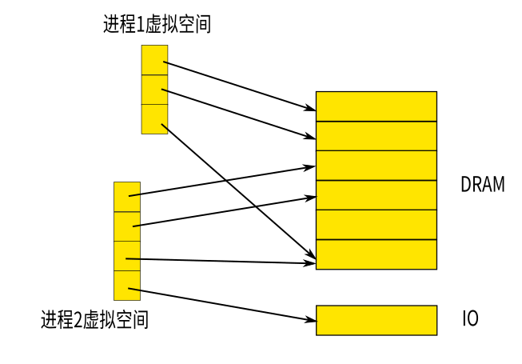
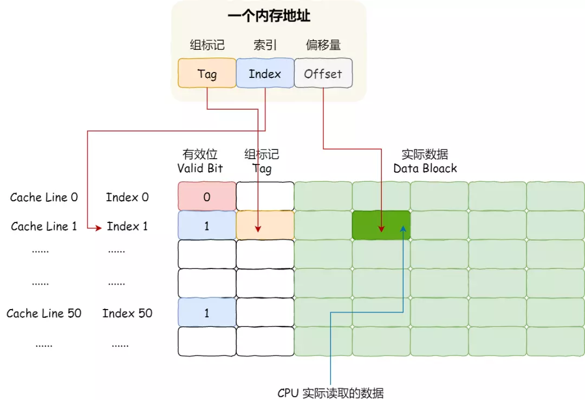
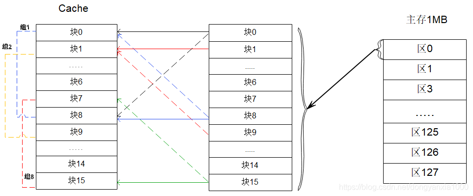
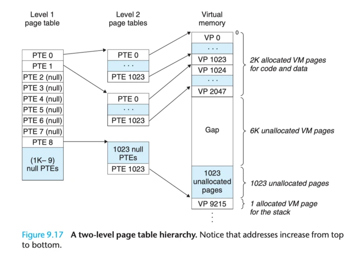
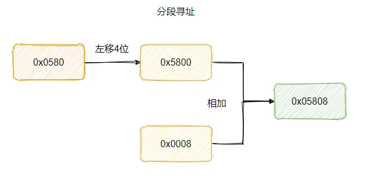
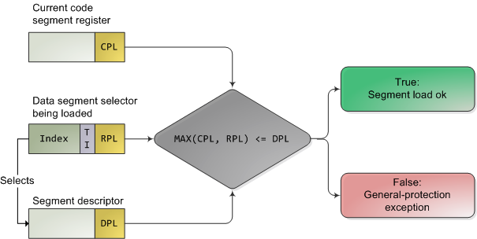
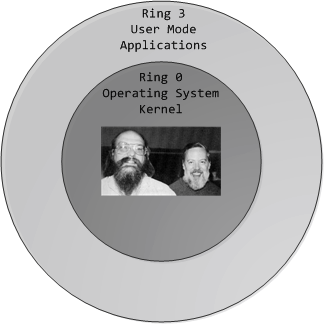
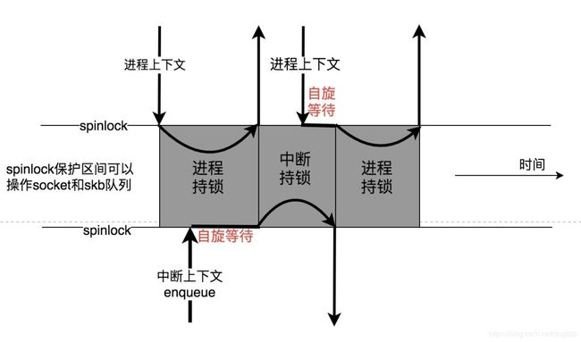

`<!-- vim-markdown-toc GFM -->

+ [进程管理](#进程管理)
    * [进程](#进程)
    * [线程](#线程)
        - [内核线程/守护进程](#内核线程守护进程)
            + [轻量级进程](#轻量级进程)
            + [优点](#优点)
            + [缺点](#缺点)
        - [用户线程](#用户线程)
            + [用户线程的实现](#用户线程的实现)
                * [运行时系统](#运行时系统)
                * [内核控制线程](#内核控制线程)
            + [优点](#优点-1)
            + [缺点](#缺点-1)
        - [线程实现模型](#线程实现模型)
            + [用户线程:内核线程 = 1:1](#用户线程内核线程--11)
                * [优点](#优点-2)
                * [缺点](#缺点-2)
            + [混合线程模型](#混合线程模型)
            + [**混合线程模型** 用户线程:内核线程 = N : 1](#混合线程模型-用户线程内核线程--n--1)
                * [优点](#优点-3)
                * [弊端](#弊端)
            + [**混合线程模型** 用户线程:内核线程 = N : M](#混合线程模型-用户线程内核线程--n--m)
                * [优点](#优点-4)
                * [弊端](#弊端-1)
        - [线程调度](#线程调度)
        - [线程同步（锁）](#线程同步锁)
            + [互斥锁](#互斥锁)
            + [读写锁](#读写锁)
            + [条件变量](#条件变量)
            + [自旋锁](#自旋锁)
            + [内存屏障](#内存屏障)
    * [现代OS下的调度](#现代os下的调度)
    * [协程](#协程)
        - [优点](#优点-5)
+ [内存管理](#内存管理)
    * [分页管理](#分页管理)
    * [分段管理](#分段管理)
+ [文件管理](#文件管理)
    * [基本概念](#基本概念)
        - [超级块](#超级块)
        - [索引节点 INode](#索引节点-inode)
        - [文件](#文件)
    * [进程对文件的管理](#进程对文件的管理)
+ [Linux Kernel](#linux-kernel)
    * [设计哲学](#设计哲学)
        - [一切皆文件](#一切皆文件)
    * [系统调用](#系统调用)
    * [虚拟文件系统VFS](#虚拟文件系统vfs)
        - [VFS数据结构](#vfs数据结构)
            + [超级块对象](#超级块对象)
            + [索引节点对象](#索引节点对象)
            + [目录项对象](#目录项对象)
            + [文件对象](#文件对象)
            + [NOTE](#note)
        - [tmpfs](#tmpfs)
        - [sysfs](#sysfs)
        - [debugfs](#debugfs)
        - [procfs](#procfs)
        - [sockfs](#sockfs)
        - [devfs](#devfs)
    * [调度管理](#调度管理)
        - [Linux的任务管理](#linux的任务管理)
        - [Linux线程](#linux线程)
            + [共享的资源](#共享的资源)
            + [线程独有](#线程独有)
        - [多线程编程模式](#多线程编程模式)
            + [leader-follow 模型（主从）](#leader-follow-模型主从)
            + [producer-consumer模型（生产者消费者）](#producer-consumer模型生产者消费者)
            + [高并发索引模型](#高并发索引模型)
        - [相关问题](#相关问题)
+ [内核态与用户态](#内核态与用户态)
    * [内存布局](#内存布局)
    * [用户态与内核态](#用户态与内核态)
        - [核心态](#核心态)
        - [用户态](#用户态)
        - [NOTE](#note-1)
    * [上下文切换](#上下文切换)

<!-- vim-markdown-toc -->

# 进程管理

## 进程

+ 一个包含线程集和资源集的动态实体（程序运行时的产物），是**资源管理及分配的最小单元**

+ **NOTE**：用户进程同时具备内核空间与用户空间，在进行系统调用时用户进程会由用户内存空间陷入内核内存空间。

### 进程状态

* 挂起：此时进程不占用内存空间，此时进程所使用的空间在硬盘而非物理内存上。其中就绪挂起状态的进程一旦进入内存就可以运行。

## 线程

+ 程序**执行的最小单元**

|      |
| ---- |

|                      |             内核线程             |                   用户线程                   |
| :------------------: | :------------------------------: | :------------------------------------------: |
|      OS内核感知      |              可感知              |                    无感知                    |
| 管理主体(建立和销毁) |             操作系统             | 线程库而非内核支持（创建、同步、调度和管理） |
|      处理器分配      | 进程的多个线程可以获得多个处理机 |                   单处理器                   |
|      OS调度单位      |               线程               |       内核调度进程、进程自定义线程调度       |
|        工作态        |            只在内核态            |        用户态和内核态(执行系统调用时)        |

### 内核线程/守护进程

+ 每一个内核线程都是内核部分代码的一个运行实体，相当于以一个特化的部分，每个内核线程都有其特定的任务

+ 内核为每一个内核线程维护一个内核控制块TCB，通过TCB感知和调度内核线程。

+ 内核线程是内核调度的基本单位，是“独立运行在内核空间的标准进程”。每一个内核线程都可以在全系统内进行资源的竞争。

+ 内核线程没有自己的地址空间，与内核使用同一张页表

+ 以下是一些特殊的内核线程（Linux下）

   | 内核线程 |                           任务                           |
   | :------: | :------------------------------------------------------: |
   |   `init`   | 运行文件系统上的一系列”init”脚本，并启动shell进程；pid=1 |
   | `kthreadd` |    内核的守护线程，在内核正常工作时永远不退出；pid=2     |
   |`kswapd`|在内存不足时将内存页写回磁盘|
   | `kflushd、pdflush` |周期性的将脏数据写回磁盘|

#### 优点

+ 在多处理器系统中，内核能够同时调度同一进程中多个线程并行执行到多个处理器中；
+ 如果进程中的一个线程被阻塞，内核可以调度同一个进程中的另一个线程；
+ 内核支持线程具有很小的数据结构和堆栈，内核线程之间的切换快、开销小；
+ 内核本身也可以使用多线程的方式来实现（如Linux的kswapd线程负责在内存不足时将内存页写回磁盘、kflushd、pdflushd线程负责周期性的将脏数据写回磁盘）。

#### 缺点

+ 即使CPU在同一个用户进程的多个线程之间切换，也需要陷入内核，因此其速度和效率不如用户级线程。
+ 当线程进行切换的时候，由用户态转化为内核态。切换完毕要从内核态返回用户态?????????

### 轻量级进程

建立在内核之上并有**内核支持的用户线程**，**每个LWP跟内核线程一对一映射的，一个进程可有一个或多个 LWP**。只能由**内核管理**并像普通进程一样被调度。

LWP与普通进程的区别也在于它只有一个**最小的执行上下文和调度程序所需的统计信息**。一个进程代表程序的一个实例，而 LWP 代表程序的执行线程，因为一个执行线程不像进程那样需要那么多状态信息，所以 LWP 也不带有大量的信息。

### 用户线程

+ 不需要内核支持而在用户空间中实现的线程，用户进程利用线程库提供创建、同步、调度和管理线程的函数来控制用户线程。其内部的活动对于内核是透明的。
+ 每个进程里的**线程表**由运行时系统管理。当一个线程转换到就绪状态或阻塞状态时，在该线程表中存放重新启动该线程所需的信息

#### 用户线程的实现

用户线程运行在一个中间系统上面。目前中间系统实现的方式有两种，即运行时系统（Runtime System）和内核控制线程。

##### 运行时系统

+ “运行时系统”实质上是用于**管理和控制线程的函数集合**，包括创建、撤销、线程的同步和通信的函数以及调度的函数。
+ 这些函数都驻留在用户空间作为用户线程和内核之间的接口。
+ 当线程需要系统资源时不能使用系统调用，而是将请求传送给运行时，由后者通过相应的系统调用来获取系统资源。

##### 内核控制线程

+ 系统构建若干个轻型进程（LWP）形成线程池，LWP可以通过系统调用来获得内核提供的服务，而进程中的用户线程可通过复用来关联到线程池中的LWP，从而得到内核的服务。

  

#### 优点

1. 可以在不支持线程的OS上实现线程
2. 不需要内核干涉，少了进出内核态的消耗，管理（创建、切换、销毁）线程的代价比进程小得多
3. 进程可以定制自己的线程的调度策略（进程内部没有时钟中断，所以不能用轮转调度的方式），管理灵活度高
4. 能够利用的表空间和堆栈空间比内核级线程多
5. 不需要陷阱，不需要上下文切换，也不需要对内存高速缓存进行刷新，使得线程调用非常快捷

#### 缺点

1. 同一进程同时只有一个线程运行，同一进程的多线程无法利用多处理机并行
2. 操作系统内核不知道多线程的存在，因此一个线程阻塞将使得整个进程（包括它的所有线程）阻塞。

### 线程实现模型

内核态的系统线程专⻔负责执⾏，⽽⽤户态的线程负责存储状态（线程栈状态、寄存器相关的信息、局部变量等）。内核将若干个内核态的线程构成内核态线程池pool，⽤户态只需要创建抽象的专⻔⽤来存储状态的这种⽤户态线程，当用户态线程需要执⾏的时候，将它绑定到⼀个系统线程上由系统线程去执⾏，当执⾏完了以后将系统线程释放回Pool⾥而不需要消灭这个系统线程。[参考来源](https://www.jianshu.com/p/49e3e47d41f0)

#### 用户线程:LWP = 1:1

+ 操作系统调度器管理、调度并分派这些线程。运行时库为每个用户级线程请求一个内核级线程。

+ 一个用户线程在其生命周期内被映射/绑定到一个内核线程、每个用户线程都对应一个内核线程作为调度实体(反过来不一定成立，一个内核线程**不一定有**对应的用户线程)。

+ 内核会对每个线程进行调度，所以线程在用户空间的切换就涉及到了多个内核态的线程的切换。

+ 创建方法：一般一直使用API或者通过系统调用(Linux:clone、Windows:CreateThread)创建的线程为一对一模型。

##### 优点

1. 一个线程因某种原因阻塞时其他线程的执行不受影响
2. 多线程的程序在多处理机上能够充分利用多个处理机，提高程序的表现。

##### 缺点

1. 内核支持的内核线程数量有限，许多操作系统限制了内核线程的数量。
2. OS在内核线程之间的调度时开销比较大

#### 混合线程模型

+ 用户线程库和内核都可以参与线程的管理，用户线程由运行时库调度器管理，内核线程由操作系统调度器管理。
+ 准备就绪的用户线程由运行时库分派并标记为可执行，操作系统选择可执行的用户线程并将它映射到线程池中的可用内核线程。

#####  用户线程:LWP = N : 1

+ 将多个用户线程映射到一个内核线程，线程的创建、调度、同步的所有细节全部由进程的用户空间线程库来处理。

##### 优点

1. 对用户线程的数量几乎无限制。
2. 线程之间的切换由用户态的代码来进行，相对一对一模型其线程切换速度要快许多；

##### 弊端

1. 如果其中一个用户线程阻塞将导致其绑定的内核线程阻塞，绑定到该内核线程的其他用户线程也会阻塞。
2. 在多处理器系统上，处理器数量的增加对多对一模型的线程性能不会有明显的增加，因为所有的用户线程都映射到一个处理器上了。

##### 用户线程:LWP = N : M

+ 将多个用户线程映射到多个内核线程上。
+ 是实现原生协程的关键

##### 优点

1. 一个用户线程的阻塞不会导致所有线程的阻塞，因为此时还有别的内核线程被调度来执行；
2. 对用户线程的数量没有限制；

##### 弊端

1. 多处理机下的性能提升不如1:1模型提升大

## 协程

+ 协程更多的是一种暂停的概念。在一个线程中可以通过协调器来暂停继续不同的协程而避免使用线程的上下文切换，从而实现不同协程的交替运行。以上所有操作都在用户态执行，开销小。

### 优点

1. 协程由用户自己进行调度，因此减少了上下文切换，提高了效率。
2. 线程的默认Stack大小是1M，而协程更轻量，接近1K。因此可以在相同的内存中开启更多的协程。
3. 由于在同一个线程上，因此可以避免竞争关系而使用锁。
4. 适用于被阻塞的、IO频繁且需要大量并发的场景。

## 调度算法

在同一进程中，线程的切换不会引起进程切换。在不同进程中进行线程切换,如从一个进程内的线程切换到另一个进程中的线程时，会引起进程切换。

### FCFS 先来先服务

非抢占式调度算法，对长作业有利，适用于 CPU 繁忙型不适用于 I/O 繁忙型系统。

### SJF 最短作业优先

### 高响应比优先

权衡了短作业和长作业，每次进行进程调度时，先计算响应比（$(T_{等待}+T_{要求服务})/T_{要求服务}$），然后把响应比优先级最高的进程投入运行。

### RR 时间片轮转

抢占式调度算法，简单公平，关键在于时间片长度的选择（一般为20-50ms）

### HPF 最高优先级优先

其中优先级可以分为动态优先级和静态优先级，既可以抢占式调度（出现高优先级则停止此进程）也可以非抢占式调度。

### MFQ 多级反馈队列

* **多级**：有多个不同优先级的队列，优先级越高时间片越短。

* **反馈**：若有新进程进入高优先级队列，则处理机被抢占执行高优先级队列中的进程

  

1. 新的进程会被放入到第一优先级队列的末尾，按**先来先服务**的原则排队等待被调度。如果当前优先队列队头的进程在该优先级队列规定的时间片没运行完成，则将其转入到下一优先级队列的末尾，以此类推，直至完成；

2. **当较高优先级的队列为空，才调度较低优先级的队列中的进程运行**。如果进程运行时，有新进程进入较高优先级的队列，则停止当前运行的进程并将其移入到原队列末尾，接着让较高优先级的进程运行；

对于短作业可能可以在第一级队列很快被处理完。对于长作业，如果在第一级队列处理不完，可以移入下次队列等待被执行，虽然等待的时间变长了，但是运行时间也会更长，所以该算法很好的**兼顾了长短作业，同时有较好的响应时间。**

## 同步（锁）

### 互斥锁

### 读写锁

### 条件变量

### 自旋锁

### 内存屏障

# 内存管理

## 虚拟内存

不管是用户空间还是内核空间，使用的地址都是虚拟地址。

虚拟内存管理采用**按需分配 + 缺页异常**机制来管理页表项和分配对应的物理内存页。进程申请了虚拟地址空间后可能不会马上占用物理内存空间，只有进程实际访问内存的时候，当一个虚拟地址对应的页表项不存在时，才会由内核的请求分页机制先创建页表结构，再分配物理内存页，再修改页表，建立页表项的映射关系。

进程的虚拟地址空间由多个虚拟内存区域（即不同性质的段）构成。Linux内核使用**`vm_area_struct`结构**（包含区域起始和终止地址、指向该区域支持的系统调用函数集合的**`vm_ops`指针**）来表示一个独立的虚拟内存区域，一个进程拥有的多个`vm_area_struct`将被连接起来方便进程访问。

## 内存管理单元 MMU

MMU有时称作分页内存管理单元（PMMU，因为目前普遍采用了分页思想），是为了满足OS复杂的地址管理而产生的一个与软件密切相关的**硬件**。它透明的向上层提供虚实地址转换、内存保护、CPU缓存控制等功能。

### [地址转换](https://zhuanlan.zhihu.com/p/65348145)

#### 物理地址空间

在**X86**系统里面包含有Memory 空间、IO 空间、PCI 的配置空间**多个寻址空间**（在 RISC 处理器中所有的外设、内存、寄存器都在统一的寻址空间 ）。物理空间的大小和地址总线的长度相关，可以远远大于DRAM的实际大小。

##### [IO地址空间](https://blog.csdn.net/Buyi_Shizi/article/details/51094736)

X86一个特有的与内存空间独立的空间，I/O 地址空间和 CPU 的物理地址空间是两个不同的概念。对于 x86PC 架构一共有 65536 个 8bit 的 I/O 端口，组成 64KI/O 地址空间，编号从 0~0xFFFF。连续两个 8bit 的端口可以组成一个 16bit 的端口，连续 4 个组成一个 32bit 的端口。

**可以通过利用IO空间Port I/O 和内存空间MMIO两种方式操作数据**。当外部寄存器或内存映射到IO空间时只能使用对应的IO端口操作函数操作数据例（如`inb(), inbw(), inl(); outb(), outw(), outl()`等），而MMIO可以使用 CPU 访问内存的指令进行。gg

##### [MMIO & PortIO](https://www.eefocus.com/mcu-dsp/400488)

|             `PortIO (X86)`             |                `MMIO `                 |
| :------------------------------------: | :------------------------------------: |
|        不占用 CPU 的物理地址空         |         占用 CPU 的物理地址空          |
| 顺序访问、下一指令必须等待上一指令完成 | 通过` uncahce memory `的特性保证顺序性 |
|           使用专用IO端口函数           |            使用CPU访存指令             |

#### 虚拟地址空间

虚拟地址的空间**和[指令集的地址长度有关，不一定和物理地址长度一致](https://www.cnblogs.com/doggod/p/13403622.html)**，大多数的64位处理器（数据总线一定64b）地址总线都小于64位。

#### 转换

每个进程有自己的虚拟空间，这些虚拟空间可以映射到物理内存的不同或者相同的位置。进程使用的是虚拟地址空间之内的地，CPU在执行时产生的地址信号（虚存VA）再被发送到实际的物理硬件之前会被CPU 芯片中的**内存管理单元（MMU）**截获，MMU会负责**把VA翻译成物理地址（PA）**然后物理部件上以获取数据。

### 内存保护

MMU会检查PT中VA对应的PTE中的访问权限（PTE中的一个域），如果访问不符合限定就中止转换并抛出代表异常的信号。

### MMU与OS的配合

1. 系统初始化代码会在内存中**生成页表**，然后把页表地址**设置给MMU对应寄存器**，使MMU知道页表在物理内存中的什么位置，以便在需要时进行查找。
2. 之后通过专用指令**启动MMU**，之后MMU硬件开始自动完成查表和虚实地址转换，程序中所有内存地址都变成虚地址。
3. OS初始化完成后创建**第一个用户进程**，此过程中也要创建页表，并把页表地址赋值给PCB中的某指针成员。
4. 用户**创建子进程**时会**拷贝父进程的页表**，并在随后的运行过程中逐渐更新页表项。即**每个进程都有自己的页表**。

## 多级cache

为了弥补CPU与内存（由DRAM构成）两者之间的速度差异，就在CPU内部引入了CPU Cache（也称高速缓存，由SRAM构成）。Cache通常分为大小不等的三级缓存，其中L1 Cache 通常会分为**数据缓存和指令缓存**， **L3 Cache由多个核心共享**。

#### Cache管理

CPU**以Cache Line而非字节**作为Cache的基本管理单位，在读取数据的时候CPU永远**先访问 Cache**，当 Cache 中找不到数据时才会去访问内存（顺序加载内存地址开始的一个Cache Line长度），并把内存中的数据读入到 Cache 中，再从 CPU Cache读取数据，CPU从Cache读取数据时又以**字Word**为基本单位，因此访问地址中必然包含**偏移量Offset**字段（索引字在Line中的位置）。操作系统为了方便对内存和Cache进行管理，会以**内存块**（大小等于Cache Line）为基本单位管理内存，建立内存块与Cache行的映射关系。

#### 直接映射

把内存块的地址始终映射在一个 CPU Line的地址（多使用地址取模）。此时内存块和Cache Line构成**多对一**的关系，因此需要在Cache Line中加入组**标记Tag**（区别同一Cahe Line对应的不同内存块），此外还需要加入**有效位Valid**（数据是否是有效）。

#### 全相联映射

主存中任何一块都可以映射到Cache中的任何一块位置上，此时内存块和Cache Line构成**多对多**的关系（设计复杂，适合小容量Cache）。

#### 组相联映射

主存和Cache都**分组**，主存中一个**组内的块数**与Cache中的**分组数**相同，组间采用直接映射，组内采用全相联映射。

## 分页管理

### 管理基础

**页Page**是VA到PA映射过程中的最小单位（一般为4K），整个虚拟和物理内存空间都切成若干个页；**页表PT**是为了辅助MMU完成地址映射的软件构造出的记录集合；集合中的每一个条目（一般4B）为代表映射规则的**页表项PTE**，整个**页表保存在片外内存DRAM**；为了避免每次转换都要访问片外内存以加快地址转换，MMU在内部置有SRAM来缓存页表访问记录，这个缓存表称为**页表缓存TLB**。

**多级页表**：多级页表最终的映射粒度是页，但是每一级页表的映射单位是下一级页表映射的范围总和，这样既可以减少页表的大小，将地址的查询分级进行（减少查找空间以加速查找），又可以灵活控制每一级的映射粒度。多级页表的关键在于并**不需要为一级页表中的每一个 PTE  都分配一个二级页表**，而只需要为进程当前使用到的地址做相应的分配和映射。因此，对于大部分进程来说，它们的一级页表中有大量空置的 PTE，那么这部分 PTE 对应的二级页表也将无需存在，这是一个相当可观的内存节约，事实上对于一个典型的程序来说，理论上的 4GB  可用**虚拟内存地址空间绝大部分都会处于这样一种未分配的状态**；更进一步，在程序运行过程中，只需要把一级页表放在主存中，虚拟内存系统可以在实际需要的时候才去创建、调入和调出二级页表，这样就可以确保只有那些最频繁被使用的二级页表才会常驻在主存中，此举亦极大地缓解了主存的压力。

### 页寻址

1. 处理器生成一个虚拟地址 VA，通过总线发送到 MMU；

2. MMU 通过虚拟页号得到页表项的地址 PTEA，通过内存总线从 CPU 高速缓存/主存读取这个页表项 PTE；

3. CPU 高速缓存或者主存通过内存总线向 MMU 返回页表项 PTE；

4. MMU 先把页表项中的物理页框号 PPN 复制到寄存器的高三位中，接着把 12 位的偏移量 VPO 复制到寄存器的末 12 位构成 15 位的物理地址，即可以把该寄存器存储的物理内存地址 PA 发送到内存总线，访问高速缓存/主存；

5. CPU 高速缓存/主存返回该物理地址对应的数据给处理器

   

### 页面置换（请求分页）

在 MMU 进行地址转换时，如果页表项的有效位是 0，则表示该页面并没有映射到真实的物理页框号 PPN，则会引发一个**缺页中断**，CPU 陷入操作系统内核，接着操作系统就会通过页面置换算法选择一个页面将其换出  (swap)，以便为即将调入的新页面腾出位置，如果要换出的页面的页表项里的修改位已经被设置过，也就是被更新过，则这是一个**脏页** (Dirty  Page)，需要写回磁盘更新该页面在磁盘上的副本，如果该页面是"干净"的，也就是没有被修改过，则直接用调入的新页面覆盖掉被换出的旧页面即可。**缺页时未必发生页面置换，若还有可用的空闲内存空间就不用进行页面置换**。

#### 缺页中断

4. 检查返回的页表项 PTE 发现其有效位是 0，则 MMU 触发一次缺页中断异常，然后 CPU 转入到操作系统内核中的缺页中断处理器；
5. 缺页中断处理程序检查所需的虚拟地址是否合法，确认合法后系统则检查是否有空闲物理页框号 PPN 可以映射给该缺失的虚拟页面，如果没有空闲页框，则执行页面置换算法寻找一个现有的虚拟页面淘汰，如果该页面已经被修改过，则写回磁盘，更新该页面在磁盘上的副本；
6. 缺页中断处理程序从磁盘调入新的页面到内存，更新页表项 PTE；
7. 缺页中断程序返回到原先的进程，**==重新执行引起缺页中断的指令==**，CPU 将引起缺页中断的虚拟地址重新发送给 MMU，此时该虚拟地址已经有了映射的物理页框号 PPN，因此会按照前面命中的流程走一遍，最后主存把请求的数据返回给处理器。

#### 置换算法

|       算法        |              说明              |     优点     |               缺点                |
| :---------------: | :----------------------------: | :----------: | :-------------------------------: |
|    最佳置换OPT    |       无法实现、仅做基准       |     最优     |              乌托邦               |
|   先进先出FIFO    |   每次淘汰最早进入内存的页面   |     简单     | 性能差、违背局部性、造成**Belay** |
|   第二次机会SC    |           FIFO的改进           |              |          需要记录访问位           |
|       Clock       |            SC的改进            |              |       未考虑页面是否被修改        |
| 最近最久未使用LRU | 需要记录每个页面的上次访问时间 |   接近OPT    | 需硬件支持、未考虑页面是否被修改  |
|    最近未用NRU    |   加入修改位，LRU算法的近似    | 延后脏页写回 |           考虑页面修改            |
|        NFU        |       LRU的一种软件实现        |              |        未考虑最近访问特征         |
|   Aging老化算法   | NFU的改进，非常近似于LRU的算法 |              |                                   |

**Belay现象**：如果对一个进程未分配它所要求的全部页面，有时就会出现分配的**页面数增多但缺页率反而提高**的异常现象。

**抖动**：如果分配给进程的存储块数量小于进程所需要的最小值，进程的运行将很**频繁地产生缺页中断并换入换出**，这种频率非常高的页面置换现象称为抖动。

##### SC（Second Chance）

对FIFO的改进，考虑到了页面是否被访问。在将页面换出内存前先检查其访问位，如果为0则直接换出，为1（最近有被使用，可能还会被使用）则置为0后将该页面**插入到链表尾部**。再检查下一个页面，直到发现某页的使用位为0。

##### Clock

对SC算法的改进，将内存中的页面组织成**环形链表**，避免将页面插入到链表尾部。表头指向最先进入内存的页面。当页面被装入内存时**初始化**其对应页表项的访问位为0，当该页面被访问时访问位设为1。发生缺页中断时，遍历链表直到找到访问位为0的页面淘汰该页面，遍历过程中访问位为1的设置为0。该算法**最多遍历两次**就可以找到被淘汰的页面。

##### LRU （Least Recently Used）

最近最久未使用（多译为最近最少使用），理论基础是访问的局部性原理（在前面几条指令频发访问的页面很可能在后面的若干指令也可能会被访问）。

##### NRU （Not Recently Used）

使用访问位+修改位，是LRU算法的粗糙的近似实现。在其他在条件相同时优先淘汰没有被修改过的页面，**从而来避免I/O操作**。该方法最多经过四轮可以找到需要淘汰的页。

1. 从当前位置开始扫描第一个（0,0）的页用于替换，本轮扫描不修改任何标志位。淘汰的是**最近没有访问且没有修改**的页面。

2. 若第一轮扫描失败，则重新扫描，查找第一个（0,1）的页用于替换。本轮将所有扫描的过的页访问位设为0。淘汰的是**最近没有访问但修改**的页面。

3. 若第二轮扫描失败，则重新扫描，查找第一个（0,0）的页用于替换。本轮扫描不修改任何标志位。淘汰的是**最近访问但没有修改**的页面。

4. 若第三轮扫描失败，则重新扫描，查找第一个（0,1）的页用于替换。淘汰的是**最近访问且修改**的页面。

#####  NFU（Not Frequently Used）

LRU算法的一种软件实现。该算法将每个页面和一个**计数器**相关联，每次时钟中断时，操作系统扫描所有页面的R位（0 or 1）并把它们累加到计数器，该**计数器就大致体现了页面的被访问的频率程度**。在发生缺页中断时就置换计数器值最小的算法。但是计数器反映的是过去整个时间的访问频率而非最近时间段的访问频率。

##### Aging

对NFU算法的改进。在将页面的R位的值加到计数器之前现将页面的计数器向右移一位，然后把页面的R位的值加到计数器的最左一位上。过改动后的计数器就能够反映过去n个时钟周期里页面的访问频率。每次淘汰计数器值最小的页。

## 分段管理

分段[最初不是用来作内存管理](https://segmentfault.com/a/1190000038810428)，而是Intel 8086为了通过16b的寄存器访问到20b的地址空间而做出的规定（将16b地址的的前12b做段基址，段基址左移四位加后4b构成20b地址），而段这一说法也就来源于这种方式下对内存的访问必须是一段一段的。

此时的分段地址之间并没有隔离，后来考虑到安全问题，Intel引入了**CPU保护模式**，在访问地址时，CPU会判断当前的程序是否有权访问改地址。OS利用CPU提供的该功能将程序的内存空间划分成为若干个段，每个段（如代码段、数据段、BSS段、堆、栈）都有不同的属性（段基址、段限长、段属性），利用段来保护程序。

### 相关数据设计

#### GDT 全局描述符表

整个系统中可以置于内存**任何位置**的**唯一**表，其中的表项被称为**段描述符**，GDT在内存中的地址会被设置进**GDTR**（每一个CPU核心都有一个）中。

#### 段描述符

用于描述每一个段的具体信息，其中的2bit的**DPL**（descriptor privilege level，描述符特权级）记录此段锁代表的程序在CPU中的特权级。

#### 段选择子

段选择子包括描述符索引（index）、TI、特权级（PL）三部分。描述符索引表示所需要的段的描述符在描述符表的位置，由这个位置再根据在GDTR中存储的描述符表基址就可以找到相应的描述符。段选择子中的1bit的TI值表示到哪里寻找断描述符（0在GDT，1在LDT）。2bit的特权级（PL）则代表选择子的特权级（共4个），不同段的特权级有不同的说法。

### 工作机制

1. OS在启动：初始化**GDT**（表项为**段描述符**），将GDT地址设置进**GDTR**（全局描述符表寄存器  ）。  
2. 程序启动时：设置**段选择子**进段寄存器。
3. 程序访存时：通过GDTR找到GDT，根据段选择子中索引到GDT中具体的**段描述符**。
4. 权限控制：将断描述符中的要访问特权级别与当前程序所拥有的特权级别作比较。

### 权限保护

每当一个程序试图访问某一个段时，就将该程序所拥有的特权级（段选择子中的DPL字段）与要访问的特权级（段描述符中的级别）进行比较，以决定能否访问该段。系统约定，CPU只能访问同一特权级或级别较低特权级的段。（更详细的请参考[此处](https://blog.csdn.net/drshenlei/article/details/4265101)）

事实上**段保护功能几乎没什么用**，因为现代的内核使用扁平的地址空间（将基地址设成0，逻辑地址与线性地址一致），用户模式的段可以访问整个线形地址空间。真正有用的**内存保护发生在分页单元**中，即从线形地址转化为物理地址的时候。一个内存页就是由一个页表项（page table entry）所描述的字节块。页表项包含两个与保护有关的字段：一个超级用户标志（supervisor flag），一个读写标志（read/write flag）。超级用户标志是内核所使用的重要的x86内存保护机制。当它开启时，内存页就不能被ring 3访问了。尽管读写标志对于实施特权控制并不像前者那么重要，但它依然十分有用。当一个进程被加载后，那些存储了二进制镜像（即代码）的内存页就被标记为只读了，从而可以捕获一些指针错误，比如程序企图通过此指针来写这些内存页。这个标志还被用于在调用fork创建Unix子进程时，实现写时拷贝功能（[copy on write](http://en.wikipedia.org/wiki/Copy-on-write)）。

# 文件管理

## 基本概念

### 超级块

存放于磁盘的特定扇区中用于存储文件系统的控制信息（文件系统的状态、类型、大小、区块数、索引节点数等）的数据结构。

### 索引节点 INode

用于存储文件的元数据（诸如文件的大小、拥有者、创建时间、磁盘位置等和文件相关的信息）的一个数据结构。

### 文件

一组在逻辑上具有完整意义的信息项的系列。

## 进程对文件的管理

进程通过Task_Struct结构中的files_struct域来了解它当前所打开的文件对象，所谓文件描述符就是文件在进程的已打开的文件对象数组中的下标索引，文件对象通过内部域f_dentry找到文件目录项对象，通过文件对象的f_op域得到该文件支持的标准方法。

+ 超级块、Task_Struct等结构的关系如下：
mmap()

# 上下文

所谓的**上下文**指的是一个运行环境(对于计算机就是一系列的变量值)。

## 进程上下文

当前进程上下文均保存在**进程的任务数据结构**中，一个进程的上下文环境具体可以分为**用户级上下文，寄存器上下文和系统级上下文**三大的部分。

|     层级     |                             内容                             |
| :----------: | :----------------------------------------------------------: |
| 用户级上下文 |             正文、数据、用户堆栈以及共享存储区等             |
| 寄存器上下文 | 通用寄存器、程序寄存器(IP)、处理器状态寄存器(EFLAGS)、栈指针(ESP)等 |
| 系统级上下文 | 进程控制块task_struct、内存管理信息(mm_struct、vm_area_struct、pgd、pte)、内核栈等 |

## 中断上下文

为了快速响应硬件的事件，对同一个 CPU 来说**中断处理比进程拥有更高的优先级**，硬件通过触发中断信号，此时**中断处理会打断进程的正常调度和执行**，转而进入内核空间调用中断处理程序（一般都短小精悍且**不会阻塞**，以便尽可能快的执行结束），响应设备事件。

这个过程中传递的硬件中断参数和内核需要保存的一些其他环境（主要是保存被打断执行的**部分进程环境**使进程在中断结束后得以恢复）就被称作**中断上下文**（只包括内核态中断服务程序执行所必需的状态，包括 CPU 寄存器、内核堆栈、硬件中断参数等）。

## 上下文切换

CPU在执行任务时必须依赖外部环境信息（上下文），而每个CPU单元某一时间点只能处于一个确切的环境下，OS通过分时复用不断执行多个进程，造成宏观上的并行。CPU每次执行不同的任务时，它所处的环境也会发生改变，这个改变的过程就是上下文切换，通过上下文切换CPU得以正确运行。

### 模式上下文切换

用户态代码进行系统调用时发生的用户态-内核态-用户态的切换过程，这一过程改变了运行的特权模式，主要的切换内容为**寄存器上下文的切换**。

### 进程上下文切换

进程是由内核来管理和调度的，因此进程的切换**只发生在内核态**。进程一旦被调度将会发生整个进程**三种上下文的整体切换**（保存上一进程、加载下一进程），进程切换过程中OS必须切换虚地址空间（页表的加载等），在新进程的运行过程中不断刷新替换TLB中的旧内容（**缓存失效**会加大访存时间），这一过程的代价相当大（几十纳秒到数微秒）。

### 线程上下文切换

由于线程很多资源（虚拟内存和全局变量等资源）都是共享进程的，所以切换时只需要切换线程的私有数据，切换代价比进程切换小得多。

### 中断上下文切换

中断上下文切换只**发生在内核态**，中断时，内核不代表任何进程运行、不涉及到进程的用户态、一般只访问系统空间。所以，即便中断过程打断了一个正处在用户态的进程，也不需要保存和恢复这个进程的虚拟内存、全局变量等用户态资源。

## 上下文与运行态

核心态代码（系统调用、中断处理程序等）拥有完全的底层资源控制权限，可以执行任何CPU指令，访问任何内存地址。用户态不能直接访问底层硬件和内存地址，用户态运行的程序必须委托系统调用来访问硬件和内存。

内核态和用户态限定的当前代码所能执行的指令集合和访问地址空间，上下文决定了代码执行时的环境。由此二者可以确定CPU上任何一个任务所属的状态只可能时以下三种之一：

| 状态 / 空间 |     上下文     |    栈使用    |                本体                |
| :---------: | :------------: | :----------: | :--------------------------------: |
|   内核态    | 处于进程上下文 | 用进程内核栈 |         代表某个特定的进程         |
|   内核态    | 处于中断上下文 | 用进程内核栈 | 与任何进程无关，处理某个特定的中断 |
|   用户态    | 处于进程上下文 | 用进程用户栈 |          代表某个用户进程          |

当一个进程通过**系统调用、中断、软中断**（如缺页异常）从用户态陷入内核态，此时会**使用当前进程的内核栈**代表进程执行（**多个进程共享内核空间**，但是每个进程进入内核的上下文不同，因此**每个进程都有自己的内核栈**），整体处于进程上下文中。