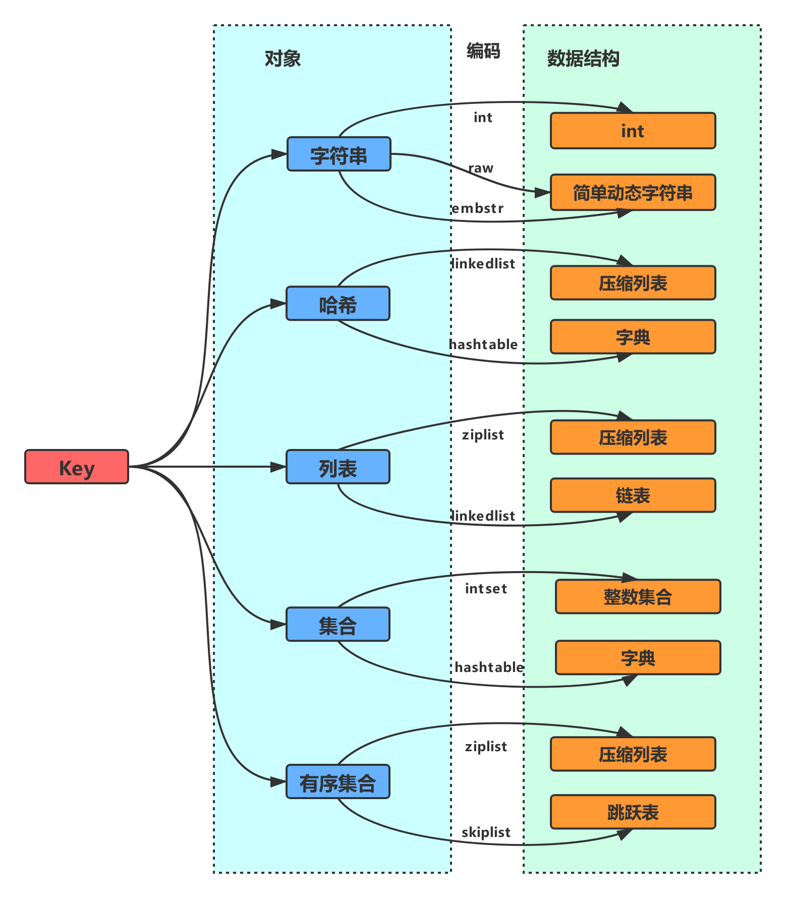
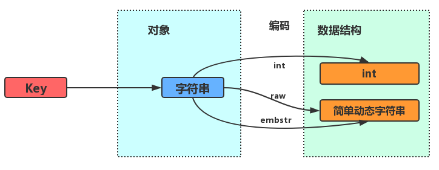
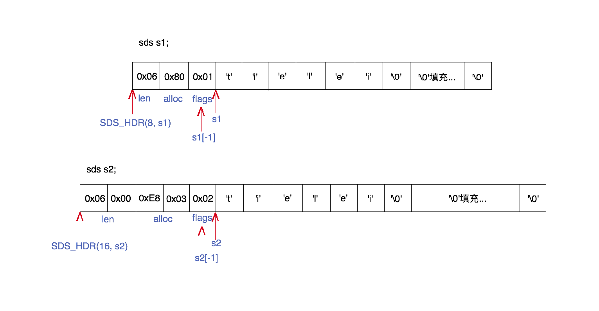

# Redis

## 总述


## 对象系统

`Redis`没有直接自身的数据结构来直接实现键值对数据库，而是基于这些数据结构创建了一个对象系统。对象系统中每种对象通过`redisObject`来表示，每个`redisObject`可以使用不同的底层数据结构，通过`redisObject::encoding`可以自由改进内部编码而对外的数据结构和命令没有影响（**底层结构对上层应用透明**），在**不同的场景下可以使用不同的内部编码**方式发挥各自的优势，从而优化对象在不同场景下的使用效率。

```c
typedef struct redisObject {
    unsigned type:4;// 类型（5种有效类型）
    unsigned encoding:4;// 编码（10种有效编码）
    unsigned lru:REDIS_LRU_BITS;// 对象最后一次被访问的时间
    int refcount;// 引用计数，用于内存回收与对象共享
    void *ptr;// 指向实际值的指针
} robj;
```



|                             |     `string`      |  `list`  | `set` | `zset` |   `hash`    |
| :-------------------------: | :---------------: | :------: | :---: | :----: | :---------: |
|         `quicklist`         |         ❌         |    ✅     |   ❌   |        |      ❌      |
|        `linkedlist`         |         ❌         | ❗️3.2版前 |   ❌   |        |      ❌      |
|          `ziplist`          |         ❌         | ❗️3.2版前 |   ❌   |   ✅    | ✅用于小对象 |
|         `hashtable`         |         ❌         |          |   ✅   |        |      ✅      |
|          `intset`           |         ❌         |          |   ✅   |        |      ❌      |
|         `skiplist`          |         ❌         |          |   ❌   |   ✅    |      ❌      |
|            `int`            | ✅`long`以内的整数 |          |   ❌   |        |             |
|            `raw`            |   ✅字符串`>32B`   |          |   ❌   |        |             |
| `embstr`(特殊的嵌入式的sds) |  ✅字符串`<=32B`   |          |   ❌   |        |             |

## 键key

**非二进制安全**的字符串类型，其值不能太长且可读性要强，

```c
//查询
keys pattern  //返回匹配的key
randomkey  //从当前数据库随机返回一个key
type key  //返回key数据类型
exists key  //检查key是否存在


//删除，修改
flushdb //删除当前库中的key
flushall //删除所有库中的key
delkey [key...]  //删除某个或者多个key-value
move key num  //将当前数据库中的key移到数据库num中
rename key newkey //改名，newkey存在时则将会覆盖
renamenx key newkey  //当且仅当newkey不存在的时候才执行

//时间相关
expire key second  //设置key的过期时间、秒
expireat key timestamp  //设置key的过期时间、时间戳
pexpire key milliseconds  //设定多少毫秒内过期
pexpireat key timestamp-milliseconds  //设置为时间戳，毫秒级
ttl key  //查看给定键距离过期时间还有多少秒
pttl key  //查看给定键距离过期时间还有多少毫秒
persist key  //移除过期时间

//返回查询key的属性
object refcount|encoding|idletime key  //返回key，引用次数|内部存储编码|空转时间
#可编为多种方式编码：
#1、字符串可存为raw（一般字符串）、int（小数字）
#2、列表可存为ziplist、linkedlist
#3、集合可存为inset（数字小集合）、hashtable
#4、散列可存为zipmap（小散列）、hashtable
#5、有序集合可存为ziplist（小有序集合）、skiplist（任何大小）

//排序
sort source-key [by pattern] [limit offset count] [get pattern…] [asc|desc] [alpha] [store dest-key]
#1、source-key：排序的key
#2、by pattern：表示可以通过外部权重进行排序（即外部key，需要与排序key有关联）。例如：链表key为list-userid（1,2,3,4…），则外部key名为，goods_1、goods_2…，则by pattern为（by goods_*）
#3、limit offset count：表示排序后返回的数据行
#4、get pattern…：获取外部数据（参数与by pattern一样）
#5、asc|desc：升序|降序
#6、alpha：采用字符排序，默认是数字排序
#7、store dest-key：表示将结果存入dest-key中
```

## 值value数据类型

### `string`字符串

**二进制安全**的字符串类型，`string`**可以包含任何数据**（图片或者序列化的对象），最大**上限是1GB**。 

```c
strlen key  //字符串长度

//写
set key value //设置key-value对/
mset key1 value1 key2 value2...//同时写多个
setnx key value  //当且仅当key不存在时才设置
setrange key-name offset value  //将value代替从offset开始的字符串,超过的长度使用0代替

//读
get key  //获取key值
getset key value  //获取旧值设置新值
mget key1 key2...//同时读多个
setex key seconds value  //设置k-v对时并且设置过期时间
getrange key-name start end  //返回次字符串的start到end之间的字符

//修改
append key value  //追加值
incr、decr、incrby、decrby、incrbyfloat  //对值作运算

//比特位操作
getbit key-name offset  //将字符串看做是二进制位串，并返回位串中的偏移量offset的二进制位的值
setbit key-name offset value  //将字符串看做是二进制位串，并将位串中偏移量offset的二进制值设置为value
bitcount key-name [start end]  //统计二进制位串里面值为1的数量
bitop and|or|xor|not dest-key key1 key2…  //对多个key执行并或异或非，并将结果存入到dest-key
```



`embstr`（短字符串）和`raw`（长字符串）编码都会使用`SDS`来保存值，但不同之处在于`embstr`会通过一次内存分配函数来分配一块连续的内存空间（**减少内存分配与释放的次数，利用连续内存存储最大化CPU缓存的作用**）来保存`redisObject`和`SDS`。而`raw`编码会通过调用两次内存分配函数来分别分配两块空间来保存`redisObject`和`SDS`。


### `list`列表

按插入顺序排序的**双端无环链表**，每个列表最多可以存储$2^{32}-1$个元素。用户可以从序列两端推入或者弹出元素，在插入时，**如果该键并不存在，Redis将为该键创建一个新的链表。如果链表中所有的元素均被移除，那么该键也将会被从数据库中删除**。

```c
llen key-name  //返回key-name链的长度

//插入
lpush/rpush key element //将element插入到列表key的头部/尾部，不存在则创建
lpushx/rpushx key element //当key存在时才将element插入到列表key的头部/尾部
lset key index value  //将key中下标为index更新值为value。index超过则报错
linsert key befort|after val value  //在key中位于val值前或者后，插入value值。key或者val不存在，则返回错误

//删除
lpop/rpop key // 将key-element从列表头部/尾部移除
lrem key count value  count=0 // 删除全部一样的；count>0从左边检索删除count个；count<0从右边检索，删除count个
ltrim key-name start end  //保持start到end所有元素，其他删除

//查找
lrange key start end  //返回偏移量中的值，负数为倒数
lindex key offset  //返回偏移量为offset中的值，负数为倒数

//超时操作
blpop/brpop key-name[key-name2…] timeout  //多少秒内阻塞并等待可弹出元素出现

rpoplpush key-name1 key-name2  //从key-name1中弹出最右边的元素，推入key-name2最左边，并返回value元素
brpoplpush key-name value timeout  //阻塞式
```

### `hash`哈希

在redis中，哈希类型是指Redis键值对中的值本身又是一个键值对结构，形如`value=[{field1，value1}，...{fieldN，valueN}]`。.png)

```c
hlen key  　　//返回散列包含键值对的数量

//写
hset key field value  　　//设置散列值
hsetnx key field value  //当且仅当field不存在时设置
hmset key field value field2 value2….  //设置多个

//读
hget key field //获取值
hmget key field field2…  //获取多个
hgetall key //由于redis是单线程操作，假若hgetall返回的数据量大耗时大，将会导致其他客户端的请求得不到响应

//删
hdel key field field2… 　　// 删除一个或者多个值

//查
hexists key-name filed  //检查field是否存key-name中
hkeys key/hvals key  //返回key中的field、返回key中的value

//数值操作
hincrby key-name field num  //给key-name中field的值（必须是数字）增加num
hincrbyfloat key-name key incre
```

### `set`集合

通过**hash表实现string类型元素的不重复无序集合**，

```c
scard key  //返回集合里包含的元素数量

//增
sadd key member[member2…]  //添加一个或者多个member

//删
srem key member[member2…]  //移除一个或者多个member
spop key  //随机移除集合中的一个元素，并返回
smove key-name1 key-name2 value  //将value元素从key-name1中移到key-name2中

//查
smembers key  //返回key中所有的member
sismember key member  //判断member是否在key中
srandmember key  //随机返回一个member，不删除
srandmember key-name n  //随机返回集合里的n个元素。n负数可重复，正数不出现重复

//集合操作
sdiff key-name1 [key-name2…]  //差集
sdiffstore dest-key key-name1[key-name2...] //差集存入dest-key中
sinter key-name1[key-name2…]  //返回交集
sinterstore dest-key key-name1[key-name2...]  //交集存入dest-key中
sunion key-name1[key-name2…]  //返回并集
sunionstore dest-key key-name1[key-name2…]  //并集存入dest-key中
```

### [`zset`有序集合](https://www.cnblogs.com/hunternet/p/12717643.html)

**string类型的元素构成的不重复有序集合**，为了有序需要将每个元素**给定分数属性**（分数可以重复），排序时先按照分数后按照字典序排序。

```c
zcrad key  //返回有序集合里的成员数量

//增
zadd key score member //给有序集合key添加member

//删
zrem key member[member2…]  　　//移出一个或者多个成员
zremrangebyrank key-name start stop   //移出所有有序集合排名介于start和stop之间的元素
zremrangebyscore key-name min max   //移出所有有序集合score介于min和max之间的元素

//查询
zcount key-name min max  　　//返回分值介于min和max之间的成员数量
zscore key member  　　　　//返回成员的分值

//分值操作
zincrby key increment member  　　//将member成员分值加上increment
zrange key start stop [withscores]  　　//成员按分值从小到大排列，返回有序集合给定排名范围
zrevrange key start stop [withscores]  　　//成员按分值从大到小排列，返回有序集合给定排名范围

//基于分值的查询
zrank key member  　　//分值从小到大排序，返回member有序集合的排名
zrevrank key member  //分值从大到小排序，返回member有序集合的排名
zrangebyscore key-name min max [withscores][limt offset count]   　　//返回有序集合中介于min和max之间的所有成员、从小到大
zrevrangebyscore key-name max min [withscores][limt offset count]   //返回有序集合中介于max和min之间的所有成员、从大到小

zinterstore dest-key key-count key-name1[key-name2…] [weights weight1 weight2…] [aggregate sum|min|max]   //先对应分值乘以weights，再取交集，分值对应aggregate，默认sum。结果存入dest-key中
zunionstore dest-key key-count key-name1[key-name2…] [weights weight1 weight2…] [aggregate sum|min|max]
```

有序集合可以由 [ziplist (压缩列表)](http://blog.laoyu.site/2019/redis/Redis数据结构——压缩列表/) 或 [skiplist (跳跃表)](https://blog.laoyu.site/2019/redis/Redi数据结构——跳跃表/) 组成。当有序集合较小**（元素个数小于128且每个元素长度小于64B）时使用`ziplist`**，否则采用`skiplist`。

## 编码方式

### 双向无环链表`linkedlist`

```c
typedef  struct listNode{
       struct listNode *prev;//前置节点
       struct listNode *next;//后置节点
       void *value; //节点的值，void*指针可以保存各种类型的值(多态)
}listNode;//单个链表节点

typedef struct list{
     listNode *head;//表头节点
     listNode *tail;//表尾节点
     unsigned long len;//链表所包含的节点数量
     void (*free) (void *ptr);//节点值复制函数
     void (*free) (void *ptr);//节点值释放函数
     int (*match) (void *ptr,void *key);//节点值对比函数
}list;//链表
```


### [跳表`skiplist`](https://redisbook.readthedocs.io/en/latest/internal-datastruct/skiplist.html)

经典的跳表要求每一层链表的元素的个数成倍数关系，为了保持着这种关系，在插入删除时需要调整整个跳表的没一层。为了避免这一问题**`skiplist`不要求上下相邻两层链表之间的节点个数有严格的对应关系**，而是为每个节点随机出一个层数(level)。

```c
typedef struct zskiplistNode {
     struct zskiplistLevel{
           struct zskiplistNode *forward;//前进指针
           unsigned int span;//前进跨度
     }level[];//多层链
     struct zskiplistNode *backward;//后退指针
     double score;//分值
     robj *obj;//成员对象
} zskiplistNode;//跳表单个节点

typedef struct zskiplist{
     structz skiplistNode *header, *tail;//表头节点和表尾节点
     unsigned long length;//表中节点的数量
     int level;//表中层数最大的节点的层数
}zskiplist;
```


#### 操作

**查找**：从高层开始向下层下阶梯式查找（如果待查节点大于当前层当前节点而小于当前层下一节点就到当前层的下一层中查找）。

**插入**：首先确定插入的顶层层数K（有其[概率计算公式](http://zhangtielei.com/posts/blog-redis-skiplist.html)），然后将元素插入到所有小于等于K的所有层。

**删除**：在各个层中找到包含指定值的节点，然后将节点从链表中删除即可，如果删除以后只剩下头尾两个节点，则删除这一层。

#### 对比

|  插入  |            内存占用            |    插入删除    |          范围查找          | 有序性 |  查找  |
| :----: | :----------------------------: | :------------: | :------------------------: | :----: | :----: |
| 平衡树 |         每节点2个指针          |  子树结构调整  | 支持、一般平衡树上实现复杂 |  有序  | log(n) |
| 哈希表 |           开链法指针           | 哈希冲突与标记 |           不支持           |  无序  |   1    |
|  跳表  | 节点平均指针可变（典型为1.33） |     修改少     |       支持、实现简单       |  有序  | log(n) |

### [简单动态字符串`sds`](https://www.cnblogs.com/hunternet/p/9957913.html)

`sds`只是redis提供的一个统一的接口，实际的数据存储在`sdshdr*`的结构中，根据要存储的字符串的长度会选用不同的`sdshdr`，再通过宏去访问不同的数据。

```c
//__attribute__ ((packed))，是为了让编译器以紧凑模式来分配内存
struct __attribute__ ((__packed__)) sdshdr5 {
    unsigned char flags; 
    char buf[];
};

struct __attribute__ ((__packed__)) sdshdr8|16|32|64 {
    uint8|16|32|64_t len; //字符串的真正长度（不包含NULL结束符）
    uint8|16|32|64_t alloc; //字符串的最大容量（不包含NULL结束符）
    unsigned char flags; //最低3个bit用来表示header的类型，其他bit无意义
    char buf[];//字节数组（总长度为alloc+1,多出来的一个字节为\0）
};

typedef char *sds;//所有的sdshdr（存储实际数据）对外都表现为sds
```



**空间管理**：**空间预分配**（每次多申请：以新申请的长度L=1M为界，小于时多分配L长，大于时多分配`SDS_MAX_PREALLOC=1M`）、**惰性空间释放**（先记录空闲而不释放）。

**二进制安全**：`SDS`的`buf`字节数组**保存二进制数组而非字符**，`SDS API`都会**以二进制的方式来处理**buf数组里的数据，**使用len属性的值而不是空字符来判断字符串是否结束**。

其他优点：无缓冲区溢出、减少了内存重分配次数、部分兼容C字符串。

### 哈希表`Dict`

```c
typedef struct dict{
	void *type;//类型特定函数,指向dictType结构体
	void *privdata;//私有数据
	dictht ht[2];//哈希表，ht[0]保存当前的数据，ht[1]用于rehash
	int trehashidx; //rehash 索引 当rehash不在进行时 值为-1
}dict;

typedef struct dictType {
    unsigned int (*hashFunction)(const void *key);//对key进行哈希值计算的哈希算法
    void *(*keyDup)(void *privdata, const void *key);//对key进行深拷贝
    void *(*valDup)(void *privdata, const void *obj);//对value进行深拷贝
    int (*keyCompare)(void *privdata, const void *key1, const void *key2);//定义两个key的比较操作
    void (*keyDestructor)(void *privdata, void *key);//key的析构函数
    void (*valDestructor)(void *privdata, void *obj);//value的析构函数
} dictType;//为不同类型的hash节点提供hash操作的支持函数

typedef struct dictht{
     dictEntry **table;//哈希表数组/桶数组
     unsigned long size;//哈希表桶大小
     unsigned long sizemask;//哈希表桶大小掩码，用于计算索引值，总是等于 size-1
     unsigned long used;//该哈希表已有总节点的数量
}dictht;//散列表

typedef struct dictEntry{
     void *key;//键
     union{
          void *val;
          uint64_tu64;
          int64_ts64;
     }v;//值
     struct dictEntry *next;//指向下一个哈希表节点，使用链地址发解决哈希冲突形成链表
}dictEntry;//每一个桶/散列表节点
```

`dict::type`：指向`dictType`结构的指针，每个`dictType`提供了用于操作特定类型键值对的函数，`Redis`会为用途不同的字典设置不同的类型特定函数。

`dict::privdata`：保存了需要传给给那些类型特定函数的可选参数。


####  `rerehash`重新散列

当哈希表保存的键值对太多或者太少时需要对哈希表进行相应的扩展（**依据负载因子**的大小）或者收缩，每次扩容或者收缩会先创建原**桶大小两倍或一半**的新哈希表，然后对原有元素重哈希到新的哈希表上，最后释放原有空间（**申请新->填充->释放旧**）。

**重哈希的操作发生在字典的内部**，`dicht[1`]用于`rehash`、`dicht[0]`保存当前的数据，当`rehash`完成后，原有的散列表数据占用的内存空间将被释放。

##### 渐近式`rehash`：

**优化大哈希表**的重哈希，在进行渐进式`rehash`期间，字典的删除查找更新等操作可能会在两个哈希表上进行，第一个哈希表没有找到，就会去第二个哈希表上进行查找。但是进行增加操作，一定是在新的哈希表上进行的。

### 整数集合`intset`

保存类型为`int16_t、int32_t、int64_t`的**不重复有序整数值**构成的集合，他们占据的是一整块的连续的内存空间。

```c
typedef struct intset{
     uint32_t encoding;//contents元素的编码方式
     uint32_t length;//集合包含的元素数量
     int8_t contents[];//保存由小到大元素的数组，保存的实际数据类型由encoding决定。
}intset;
```

#### 升级

当新增的元素类型比保存的原有元素的类型要长时需要对保存元素的数组升级，一旦升级就**不可降级**。升级首先需要根据待插入数据**确定新的编码格**式，然后由新编码格式需要**计算新增的内存空间**，最后**从后往前调整数据**。

### [压缩列表`ziplist`](https://segmentfault.com/a/1190000017328042)

将任意多个节点（`entry`）数据（二进制整数或者字节数组）按照特殊编码**存储在某一个连续内存块**（而非采用了压缩算法）构成的顺序型(`sequential`)数据结枃，该结构并**不擅长对内部做修改**操作，但提供了对表两端的访问方法，可以快速的在头尾进行操作。


```c
typedef struct ziplist{//小端存储
     uint32_t bytes; /*ziplist分配的内存大小*/
     uint32_t tail_offset;/*达到尾部的偏移量，以字节为单位*/
     uint16_t length; /*存储元素实体个数*/
     unsigned char* content[]; /*存储内容实体元素，内部有其自己的结构*/
     unsigned char end; /*尾部标识0xFF=255*/
}ziplist;//一个压缩列表

typedef struct zlentry {//为了能逆序遍历，每个entry需要保存前边元素的一些信息
    unsigned int prevrawlensize;//前一个元素的总长度（变长编码）
    unsigned int len;//当前元素的有效数据长度以及数据类型（变长编码）
    unsigned char *data;/*元素实际内容*/
}zlentry;//抽象描述
```

| `prevrawlen`字节数 |         场景         |                 编码方式                  |
| :----------------: | :------------------: | :---------------------------------------: |
|         1B         | 前驱元素总长`<=254B` |               直接存储长度                |
|         5B         | 前驱元素总长`>254B`  | 第一字节为0XFE(254)，后四字节存储真正长度 |

| len字节数 |            len值             |                          data                          |
| :-------: | :--------------------------: | :----------------------------------------------------: |
|    1B     | 前两bit为00，6bit表示长度值  |                         字符串                         |
|    2B     | 前两bit为00，14bit表示长度值 |                         字符串                         |
|    5B     | 前两bit为00，后4B表示长度值  |                         字符串                         |
|    1B     |             0xC0             |                    2个字节的int16_t                    |
|    1B     |             0xD0             |                    4个字节的int32_t                    |
|    1B     |             0xE0             |                    8个字节的int64_t                    |
|    1B     |             0xF0             |                    3个字节长的整数                     |
|    1B     |             0xFE             |                     1个字节的整数                      |
|    1B     |          0xF1-0xFD           | 无data字段，实际数据存在len中，值为后4bit值减1(即0-12) |

该编码方式只适用于少量小对象，当`ziplist`变大时，每次插入或修改引发的`realloc`操作会有更大的概率造成内存拷贝或者**连锁更新**，从而降低性能。一旦发生内存拷贝，**内存拷贝的成本**也相应增加，因为要拷贝更大的一块数据。当ziplist数据项过多的时候，在它上面查找指定的数据项就会性能变得很低，因为`ziplist`上的**查找需要进行遍历**。

```c
hash-max-zipmap-entries 512  //entry的总数不能大于512，否则就采用hashmap/链表/跳跃表结构存储
hash-max-zipmap-value 64 //每个entry值的长度不能大于64个字节,
list-max-ziplist-entries 512
list-max-ziplist-value 64
zset-max-ziplist-entries 128
zset-max-ziplist-value 64
```

### 快速列表`quicklist`

由于链表的**附加空间太高**，链表节点的内存分配容易造成**碎片**，Redis3.2版本开始对列表数据结构进行了改造，使用 `quicklist` 代替了 `ziplist` 和 `linkedlist`。`quicklist` 实际上是 `zipList` 和 `linkedList` 的混合体，它将 `linkedList` 按段切分，每一段使用 `zipList` 来紧凑存储，多个 `zipList` 之间使用双向指针串接起来。

```c
typedef struct quicklistNode {
    struct quicklistNode *prev; //上一个node节点
    struct quicklistNode *next; //下一个node
    unsigned char *zl; 
    unsigned int sz; 
    unsigned int count : 16; 
    unsigned int encoding : 2;   /* RAW==1 or LZF==2 */
    unsigned int container : 2;  /* NONE==1 or ZIPLIST==2 */
    unsigned int recompress : 1; /* was this node previous compressed? */
    unsigned int attempted_compress : 1; /* node can't compress; too small */
    unsigned int extra : 10; /* more bits to steal for future usage */
} quicklistNode;
```


## CLI

### 服务相关

```c
select db_index  //选择数据库，一共有16个数据库，默认在数据库0
dbsize  //返回当前数据库key数量
quite  //关闭与服务器连接退出客户端
ping  //用于测试与服务器端连接是否生效，返回pong
echo message  //打印消息，测试用
info //获取统计信息
monitor //监视
config get|set|resetstat|rewrite //获取/修改配置信
```

## 事务

## 持久化

### Snapshotting(快照RDB)

每隔一段时间将数据集以二进制压缩文件的形式转存到磁盘上，该动作既可以手动触发也可以自动触发。在Redis启动的时候，**优先使用AOF**恢复数据库，不开启AOF时只要检测到RDB文件的存在，就会**自动加载RDB文件**。

```shell
#自动触发
save x y#x秒内有超过y个key被更改就启动bgsave

#手动触发
save#阻塞当前Redis服务器，直到RDB过程完成为止
bgsave#创建一个子进程(而不是线程)进行RDB文件创建，父进程继续处理命令。
```

快照**基于COW**实现了数据的正确性（T时刻开始耗费t时间完成的快照数据是库在T时刻的状态，而非T+x时刻的状态）。

### Append-only file(AOF)

在日志尾部追加每一条操作命令

```shell
```

https://blog.csdn.net/a147bb/article/details/106813604

https://www.cnblogs.com/yuhangwang/p/5817930.html