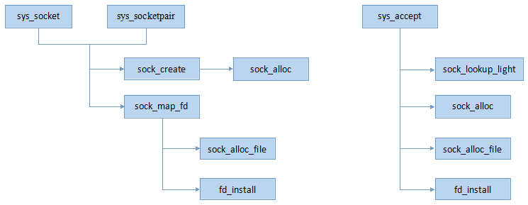
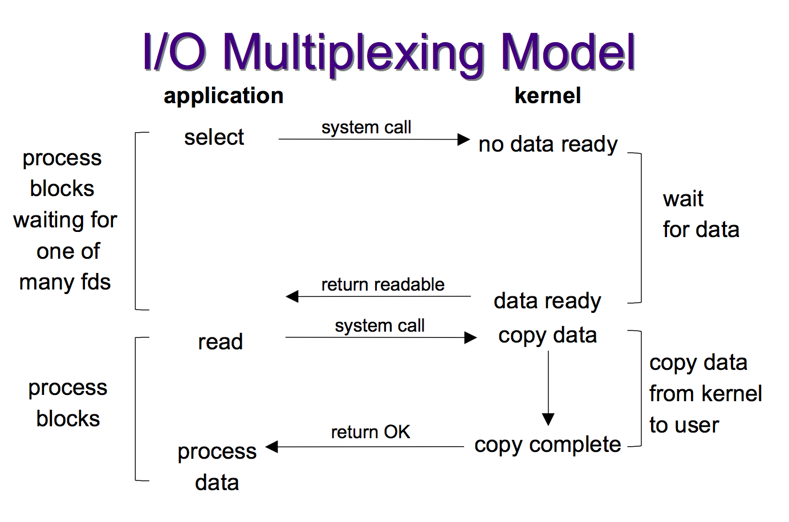
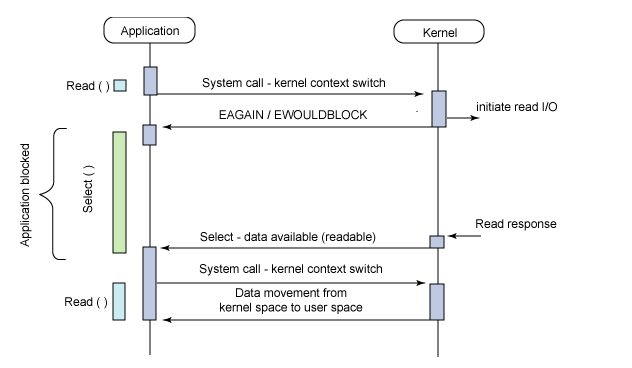
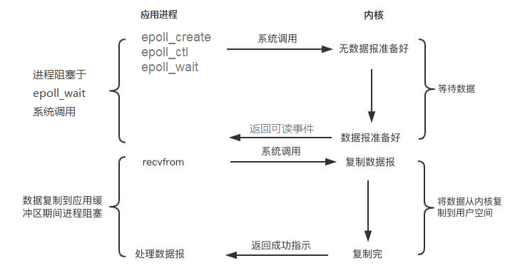
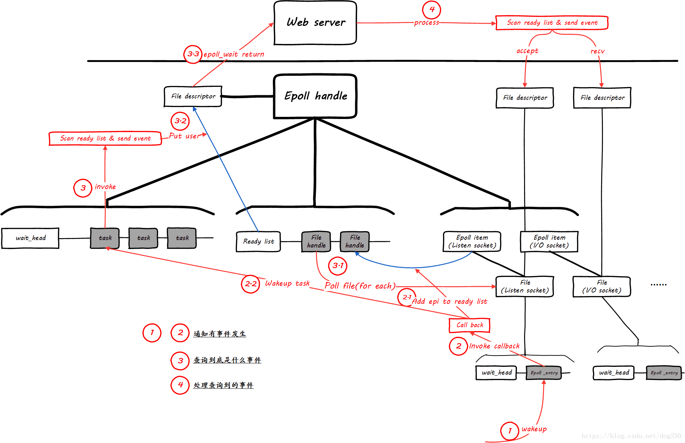
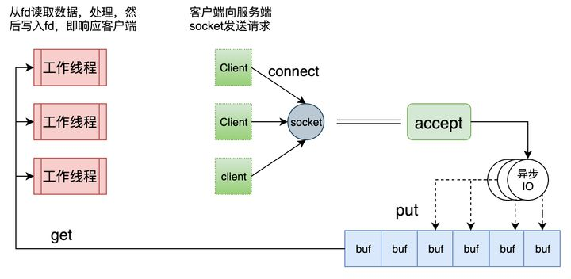

<!-- vim-markdown-toc GFM -->

+ [套接字](#套接字)
    * [socket文件与Linux设计哲学](#socket文件与linux设计哲学)
    * [套接字类型](#套接字类型)
        - [本地套接字 Unix Socket](#本地套接字-unix-socket)
        - [网络套接字 BSD Socket](#网络套接字-bsd-socket)
    * [套接字实现](#套接字实现)
        - [sockfs文件系统](#sockfs文件系统)
        - [socket初始化](#socket初始化)
        - [socket创建](#socket创建)
        - [socket操作](#socket操作)
        - [socket销毁](#socket销毁)
+ [重要系统调用](#重要系统调用)
    * [socket()](#socket)
    * [bind()](#bind)
    * [listen()](#listen)
    * [connect()](#connect)
    * [accept()](#accept)
    * [close()](#close)
+ [IO模型](#io模型)
    * [阻塞式IO](#阻塞式io)
    * [非阻塞是IO](#非阻塞是io)
    * [IO多路复用/事件驱动](#io多路复用事件驱动)
        - [Posix:select](#posixselect)
            + [优点](#优点)
            + [缺点](#缺点)
        - [BSD:kqueue](#bsdkqueue)
        - [Linux:poll](#linuxpoll)
            + [优点](#优点-1)
            + [缺点](#缺点-1)
        - [Linux:epoll（高效）](#linuxepoll高效)
            + [工作模式](#工作模式)
                * [边缘触发ET(高速)](#边缘触发et高速)
                * [电平触发LT(默认)](#电平触发lt默认)
            + [优点](#优点-2)
    * [信号驱动IO(不常用)](#信号驱动io不常用)
    * [异步IO](#异步io)
        - [Windows:IOCP](#windowsiocp)
+ [IO模式](#io模式)
    * [Reactor](#reactor)
        - [步骤](#步骤)
    * [Proactor](#proactor)
        - [步骤](#步骤-1)

<!-- vim-markdown-toc -->

# 套接字

+ 套接字Socket是连接应用程序和网络驱动程序的桥梁，套接字Socket在应用程序中创建，通过绑定与网络驱动建立关系。此后，应用程序送给套接字Socket的数据，由套接字Socket交给网络驱动程序向网络上发送出去。计算机从网络上收到与该套接字Socket绑定IP地址和端口号相关的数据后，由网络驱动程序交给Socket，应用程序便可从该Socket中提取接收到的数据。

## socket文件与Linux设计哲学

+ Linux设计的一条基础哲学即一切皆文件，但是socket文件的实现与该原则有所违背，它的操作接口和标准文件接口非常不同

1. 创建socket必须用socket调用而不是open，socket在打开之前不能存在。
2. bind，connect，accept等都是独立的系统调用，没有标准文件操作与之对应。

+ 由于socket、管道等设计Linux的设计哲学由**一切皆文件退化为一切皆文件描述符**。

1. 一切皆文件： 文件属于Unix/Linux目录树，编址于统一命名空间。
2. 一切皆文件描述符： 文件描述符属于进程打开文件表，进程内可见。

## 套接字类型

### 本地套接字 Unix Socket

+ 本地套接字一般用于本机的IPC（进程间通行），其名字是Linux文件系统中的文件名（可以找到最终的实体文件），一般放在/tmp或/usr/tmp目录。

### 网络套接字 BSD Socket

+ 网络套接字的名字是与客户连接的特定网络有关的服务标识符（端口号或访问点）。这个标识符允许Linux将进入的针对特定端口号的连接转到正确的服务器进程，在文件系统中只有其描述符和描述符的已断开的文件链接。

## 套接字实现

+ linux以属于**sockfs文件系统**的特殊文件实现套接口，创建一个套接口就是在sockfs中创建一个特殊文件并建立起为实现套接口功能的相关数据结构。

### sockfs文件系统

+ linux的所有文件操作通过VFS实现了统一抽象，sockfs实现了VFS中的4种主要对象（超级块super block、索引节点inode、目录项对象dentry和文件对象file）。执行文件IO系统时VFS就将请求转发给sockfs，sockfs调用具体的协议实现IO。
+ socketfs作为伪文件系统被编译进内核(因为要支持整个TCP/IP协议栈)而非一个模块，它在系统启动到关闭期间总是被装载着的。

### [socket初始化](http://www.cppblog.com/qinqing1984/archive/2015/05/03/210521.html)

+ 内核引导时初始化网络子系统，进而调用sock_init（创建inode缓存，注册和挂载sockfs）

### [socket创建](http://www.cppblog.com/qinqing1984/archive/2015/05/03/210521.html)

+ 创建方法：`socket、accept、socketpair`三种系统调用。先构造inode，再构造对应的file，最后安装file到当前进程中（即关联映射到一个未用的文件描述符）。


### [socket操作](http://www.cppblog.com/qinqing1984/archive/2015/05/03/210522.html)

+ 既可以调用文件IO，也可以调用BSD Sockets API。基于文件方式的IO操作主要经过了VFS这一抽象层。

1. 以read为例的文件IO调用图：
2. 以recv为例的socket式IO调用： 

### [socket销毁](http://www.cppblog.com/qinqing1984/archive/2015/05/03/210522.html)

+ close是用户空间销毁socket的**唯一方法**，![./img/NP/sockfs_close_calltree.PNG]

# 重要系统调用

+ 网络中进程标识：三元组<IP、Protocal、Port>

## socket()

+ `int socket(int domain, int type, int protocol)`
+ socket返回的socket描述字存在于协议族（AF_XXX）空间中，但没有一个具体的地址。

1. 协议族 domain：决定了socket的地址类，其中`AF_UNIX`(使用Unix Socket)决定了要用一个绝对路径名作为地址。
2. socket类型 type

| 流套接字（SOCK_STREAM） | 数据报套接字（SOCK_DGRAM） |                原始套接字（SOCK_RAW）                |
| :---------------------: | :------------------------: | :--------------------------------------------------: |
|           TCP           |            UDP             | 允许读写内核没有处理的IP数据包实现低层协议的直接访问 |

3. 协议 protocol：传输协议(`IPPROTO_TCP、IPPTOTO_UDP、IPPROTO_SCTP、IPPROTO_TIPC`等)

+ **NOTE**：type与protocal参数不能随意组合，其取值不是两部分的笛卡尔积。

## bind()

+ `int bind(int sockfd, const struct sockaddr *addr, socklen_t addrlen)`
+ 作用：将描述符sockfd绑定一个名字/本地协议地址，

1. addr：指向要绑定给sockfd的协议地址，其地址结构根据地址创建socket时的地址协议族的不同而不同。

## listen()

+ `int listen(int sockfd, int backlog)`
+ 服务端开启监听，此时的socket变为被动类型等待客户的连接请求

1. sockfd：要监听的socket描述字
2. backlog：可以排队的最大连接个数

## connect()

+ `int connect(int sockfd, const struct sockaddr *addr, socklen_t addrlen)`
+ 客户端向addr标识的断点发出请求（主动类型）

1. 参数和bind函数相同

## accept()

+ `int accept(int sockfd, struct sockaddr *addr, socklen_t *addrlen)`
+ 取接收请求，此后完成连接的建立，可以类同于普通文件的操作进行网络I/O；

1. sockfd：服务端的socket描述符，即监听套接字
2. addr：用于返回客户端的协议地址，由**内容由内核自动创建**

+ 一个服务器通常通常仅仅只创建一个监听socket描述字，它在该服务器的生命周期内一直存在。内核为每个由服务器进程接受的客户连接创建了一个已连接socket描述字，当服务器完成了对某个客户的服务，相应的已连接socket描述字就被关闭。

## close()

+ `int close(int fd)`
+ 该socket标记为以关闭，然后立即返回到调用进程。该描述字不能再由调用进程使用。
+ **NOTE**：close操作只是使相应socket描述字的**引用计数-1**，只有当引用计数为0的时候，才会触发TCP客户端向服务器发送终止连接请求。

# IO模型

+ 当一个用户态的函数试图进行IO时，由于用户态不能直接操纵IO，所以当一个read()函数发起读请求时，实际上发生了两件事。一是read()请求系统调用sys_read()，内核等待IO的数据就绪(获取并将数据拷贝到内核缓冲区)，另一个阶段是内核在数据就绪后将数据由内核态的空间拷贝到用户态空间供用户操纵数据。

## 阻塞式IO


+ Linux的**Socket在默认情况下都是阻塞的**，它会阻塞等待内核准备数据、阻塞等待内核数据拷贝到用户空间。

## 非阻塞是IO


+ Linux下通过`fcntl(int fd,
  ...)`将默认阻塞的Socket变为非阻塞模式，此时进程在调用IO时会立即获得返回值：如果IO就绪就成功返回，否则返回`EWOULDBLOCK`错误。在函数返回错误后线程需要不断的**轮询**检查IO是否就绪(反复循环检查会推高CPU的占用率)。

## IO多路复用/事件驱动



+ 用户在单个线程里同时监听多个套接字，通过 select 或 poll 轮询所负责的所有socket，当某个socket的数据就绪后就通知用户进程。此时系统调用第一次阻塞在select等函数上，第二次阻塞在由内核向用户拷贝数据上。

### Posix:select

+ 此时进程**被select函数阻塞**，select所管理的socket此时时非阻塞的。linux提供了四个宏来设置需要监听的文件描述符集合，所要监听的文件描述符集合fd_set类似于一个**位图**，select中间的三个文件描述符集合参数既是输入也是输出，程序用宏检测文件描述符集合中发生响应事件的文件描述符。
+ select监测的文件描述符范围为[0,nfds)，其中有部分可能是无效监听。
+ 在编程中需要将select置于循环结构中来循环处理新的链接



```cpp
FD_ZERO(int fd, fd_set *fds);
FD_SET(int fd, fd_set *fds);
FD_ISSET(int fd, fd_set *fds);
FD_CLR(int fd, fd_set *fds);
int select(int nfds, fd_set *readfds, fd_set *writefds, fd_set *excptfds, struct timeval *timeout);
```

#### 优点

1. 可以使用单线程(占用资源少)实现对多个文件描述符集合的监测，同时服务多个文件描述符。
2. 跨平台支持

#### 缺点

1. select在确定是哪个文件描述符发生了相应的事件时需要对文件描述符集合进行轮询，当文件描述符集合中要监听的**最大文件描述符**比较大时这会消耗大量的资源。
2. select将事件的检测和事件的响应处理放在一个框架里处理，当响应比较复杂时会造成等待时间过长。
3. select监听的文件描述符上限为1024(linux/posix_types.h:#define \__FD\__SETSIZE 1024)
4. 每次调用select都需要将fdset在内核与用户态之间拷贝

### BSD:kqueue

### Linux:poll

* poll和select在本质上没有什么差别，都是轮询多个fd的状态，如果设备就绪则在设备等待队列中加入一项并继续遍历，如果遍历完所有fd后没有发现就绪设备，则挂起当前进程，直到设备就绪或者主动超时，被唤醒后它又要再次遍历fd。

```cpp
struct pollfd {
    int fd; /* 文件描述符 */
    short events; /*  事件掩码：等待的事件，由用户设置 */
    short revents; /* 操作结果事件掩码：实际发生了的事件，由内核在调用返回时设置 */
};
/*
events域:
　　POLLIN 　　　　　　　　有数据可读。
　　POLLRDNORM 　　　　  有普通数据可读。
　　POLLRDBAND　　　　　 有优先数据可读。
　　POLLPRI　　　　　　　　 有紧迫数据可读。
　　POLLOUT　　　　　　      写数据不会导致阻塞。
　　POLLWRNORM　　　　　  写普通数据不会导致阻塞。
　　POLLWRBAND　　　　　   写优先数据不会导致阻塞。
　　POLLMSGSIGPOLL 　　　　消息可用。
revents域：
    vents域的所有可能值
	POLLER　　   指定的文件描述符发生错误。
	POLLHUP　　 指定的文件描述符挂起事件。
	POLLNVAL　　指定的文件描述符非法。
*/
int poll (struct pollfd *fds, unsigned int nfds, int timeout);
/*
返回值与错误码：
	成功：
        超时前无事件发生：0
        有事件：发生的事件个数
	失败：
        返回-1，并设置errno
            EBADF　　       一个或多个结构体中指定的文件描述符无效。
            EFAULTfds　　 指针指向的地址超出进程的地址空间。
            EINTR　　　　  请求的事件之前产生一个信号，调用可以重新发起。
            EINVALnfds　　参数超出PLIMIT_NOFILE值。
            ENOMEM　　     可用内存不足，无法完成请求。
*/
```

#### 优点

1. 使用数组机制传递需要监听的文件描述符(第一个参数为数组首地址，第二个参数为数组长度)，突破了select文件描述符有限的缺点

#### 缺点

1. 任然需要使用轮询遍历的方式确定那个文件描述符发生了相应的事件
2. 在数据交互时文件描述符数组被整体复制于内核态和用户态之间，开销随监视的描述符增大而增大

### Linux:epoll（高效）

+ 通过监听、回调的机制避免了对文件描述符的遍历

+ 使用一个文件描述符管理多个描述符，将用户关心的文件描述符的事件存放到内核的一个事件表中

+ 适用于**连接较多，活动数量较少**的情况。

  

  


#### 实现原理
内核维护数据结构eventpoll用来管理所要监视的fd，该数据结构中核心在于一颗红黑树（每个节点为epitem结构，用来快速的查找和修改要监视的fd）和一个列表（收集已经发生事件的epitem）。[具体分析过程1](https://blog.csdn.net/baiye_xing/article/details/76352935) [具体分析过程2](https://blog.csdn.net/dog250/article/details/80837278)


  1. 初始化数据结构，创建并返回一个epoll文件描述符（epollfd本身并不存在一个真正的文件与之对应, 所以内核需要创建一个"虚拟"的文件, 并为之分配真正的struct file结构）。
      ```cpp
      //其返回值时一个文件描述符，所以在使用完epoll后需要调用close()关闭。
      //size参数只是为了保持兼容(之前的fd使用hash表保存，size表示hash表的大小)，无意义。
      int epoll_create(int size);
      /*********************以下是具体实现**********************/
      
      struct eventpoll {// 简化后的epoll结构，对应于一个epoll描述符
          spinlock_t lock;  
          struct mutex mtx;  
          wait_queue_head_t wq;// 阻塞在epoll_wait的task的睡眠队列
          struct list_head rdllist;// 已就绪的需要检查的epitem 列表，该list上的文件句柄事件将会全部上报给应用
          struct rb_root rbr;// 存放加入到此epoll句柄的epitem的红黑树容器
          struct file *file;// 该epoll结构对应的文件句柄，应用通过它来操作该epoll结构
      };
      
      // 以下是简单的创建过程，非可执行代码
      SYSCALL_DEFINE1(epoll_create, int, size);//展开SYSCALL_DEFINE1宏，调用到sys_epoll_create1(0);
      SYSCALL_DEFINE1(epoll_create1, int, flags){//最终执行的epoll_create1()
          struct eventpoll *ep = NULL;//主描述符
      	int error = ep_alloc(&ep); //分配一个struct eventpoll
      	error = anon_inode_getfd("[eventpoll]", &eventpoll_fops, ep, O_RDWR | (flags & O_CLOEXEC));//创建一个匿名fd
      	//eventpoll_fops指向该虚拟文件支持的operations函数表，epoll只实现了poll和release(即close)操作，其它文件系统操作由VFS处理。
          //ep作为一个私有数据保存在struct file的private指针里，目的在于实现fd->file->eventpoll的查找过程
          return error;
      }
      // eventpoll初始化函数
      static int __init eventpoll_init(void){} 
      ```
      
2. 为epoll句柄添加epitem；注册睡眠entry的回调

   ```cpp
   // 事件注册函数
   // op通过EPOLL_CTL_ADD，EPOLL_CTL_DEL，EPOLL_CTL_MOD三个宏表示对fd对应的监听事件的增删改
   // event为具体要检测的事件
   int epoll_ctl(int epfd, int op, int fd, struct epoll_event *event)；
   /*********************以下是具体实现**********************/
   
   struct epoll_event {
     __uint32_t events;  /* Epoll events */
     epoll_data_t data;  /* User data variable */
   };
   /*
   events可以是以下几个宏的集合：
       EPOLLIN ：表示对应的文件描述符可以读（包括对端SOCKET正常关闭）；
       EPOLLOUT：表示对应的文件描述符可以写；
       EPOLLPRI：表示对应的文件描述符有紧急的数据可读（这里应该表示有带外数据到来）；
       EPOLLERR：表示对应的文件描述符发生错误；
       EPOLLHUP：表示对应的文件描述符被挂断；
       EPOLLET： 将EPOLL设为边缘触发(Edge Triggered)模式，这是相对于水平触发(Level Triggered)来说的。
       EPOLLONESHOT：只监听一次事件，当监听完这次事件之后，如果还需要继续监听这个socket的话，需要再次把这个socket加入到EPOLL队列里
   */
   
   struct eppoll_entry {  
       struct list_head llink; // List struct epitem::pwqlist  
       struct epitem *base; // 所有者  
       wait_queue_t wait; // 添加到wait_queue 中的节点
       wait_queue_head_t *whead; // 文件wait_queue 头  
   };
   
   struct epitem {// 已简化，对应于一个加入到epoll的文件
       struct rb_node rbn;// 该字段链接入epoll句柄的红黑树容器
       struct list_head rdllink;// 当该epitem有事件发生时，该字段链接入“就绪链表”，准备上报给用户态
       struct epoll_filefd {// 该字段封装实际的文件(已展开)：红黑树的key
           struct file *file;
           int fd;
       } ffd;
       struct list_head pwqlist; // 当前文件的等待队列(eppoll_entry)列表，同一个文件上可能会监视属于不同的wait_queue中的多种事件，因此使用链表。
       struct eventpoll *ep;// 反向指向其所属的epoll句柄
       struct epoll_event event; // epoll_ctl 传入的用户数据
   };
   
   SYSCALL_DEFINE4(epoll_ctl, int, epfd, int, op, int, fd, struct epoll_event __user *, event) {  
   	int did_lock_epmutex = 0;  
       copy_from_user(&epds, event, sizeof(struct epoll_event));//从用户空间将epoll_event结构copy到内核空间.
       struct file *file = fget(epfd); //取得 epfd 对应的文件
       struct file *tfile = fget(fd); //取得目标文件
   	if (!tfile->f_op || !tfile->f_op->poll) { 
           goto error_tgt_fput;  
       }// 检查目标文件是否支持poll操作 
   	if (file == tfile || !is_file_epoll(file)) {  
           goto error_tgt_fput;  
       }// 检查参数的合理性（传入参数是否符合预期）
   	struct eventpoll *ep = file->private_data; // 取得内部结构eventpoll 
       if (op == EPOLL_CTL_ADD || op == EPOLL_CTL_DEL) { // 获取全局锁epmutex
           mutex_lock(&epmutex);  
           did_lock_epmutex = 1;  
       } 
   	if (op == EPOLL_CTL_ADD) {  
           if (is_file_epoll(tfile)) {  
               error = -ELOOP;  
               if (ep_loop_check(ep, tfile) != 0) {  // 目标文件也是epoll 检测是否有循环包含的问题 
                   goto error_tgt_fput;  
               }  
           } else  {  
               list_add(&tfile->f_tfile_llink, &tfile_check_list); // 将目标文件添加到epoll全局的tfile_check_list 中
           }  
       }
   	mutex_lock_nested(&ep->mtx, 0); // 接下来会修改eventpoll，加锁进入临界区
       struct epitem *epi = ep_find(ep, tfile, fd); // 以tfile 和fd 为key 在rbtree 中查找文件对应的epitem
       struct epoll_event epds;  
       switch (op) {  
       	case EPOLL_CTL_ADD:{
   			if (!epi) { // 没找到红黑树节点, 添加额外添加ERR HUP 事件  
               	epds.events |= POLLERR | POLLHUP;  
               	error = ep_insert(ep, &epds, tfile, fd);  
           	}
           	clear_tfile_check_list(); // 清空文件检查列表
           	break;  
           }case EPOLL_CTL_DEL:{
               if (epi) {  
                   error = ep_remove(ep, epi);  
               }
               break;
           }case EPOLL_CTL_MOD:{
               if (epi) {  
                   epds.events |= POLLERR | POLLHUP;  
                   error = ep_modify(ep, epi, &epds);  
               }
               break;
           }
       }
   	mutex_unlock(&ep->mtx);  
       error_tgt_fput:  
           if (did_lock_epmutex) {  
               mutex_unlock(&epmutex);  
           }
   }
   ```

3. 事件发生，唤醒相关文件句柄睡眠队列的entry，调用其回调

      ```cpp
      
      ```

4. 唤醒epoll睡眠队列的task，搜集并上报数据

      ```cpp
      int epoll_wait(int epfd, struct epoll_event * events, int maxevents, int timeout);
      // 等待epfd上的IO事件，这些事件保存在长为maxevents的events事件数组里
      ```

#### 工作模式

在源码中，两种模式的区别是一个if判断语句，通过`ep_send_events_proc()`函数实现，如果没有标上EPOLLET（即ET）且事件未被处理的fd会被重新放回`rdllist`，下次`epoll_wait`又会把rdllist里的fd拿来拷给用户。

##### 边缘触发ET(高速)

+ 只支持非阻塞socket(避免一个文件描述符的阻塞造成其它多个文件描述符长期得不到响应)
+ 仅当状态发生变化时才会通知，即对于一个事件只通知一次，如果用户一直没有对该事件作出处理(从而导致它再次变为非就绪态)，内核不会发送更多的通知。

##### 电平触发LT(默认)

+ 同时支持阻塞和非阻塞两种方式
+ 只要发生的事件还没有被处理，内核就会一直向用户进程通知该事件

#### 优点

+ 可以监听的文件描述符数量上限为最大可打开文件数目（`cat /proc/sys/fs/file-max`）

+ 使用队列而非轮询的方式来处理就绪的IO，队列里保留了就绪的IO，IO的效率不会随着监视fd的数量的增长而下降


### 惊群

当多个进程和线程在同时阻塞等待同一个事件时，如果这个事件发生，内核会唤醒所有的进程，但最终只可能有一个进程/线程对该事件进行处理，其他进程/线程会在失败后重新休眠，这种**性能浪费**（无效调度带来的无效上下文切换，对共享资源的保护）就是惊群。  

#### accept惊群

Linux2.6内核在**当有新的连接进入到accept队列的时候仅唤醒一个进程**解决了使用accept()时的惊群问题。

#### epoll惊群

epoll_wait返回后确实也还有***多个进程被唤醒只有一个进程能正确处理其他进程无事可做\***的情况发生，但这是因为使用方法不对而非惊群。

#### 解决方法

## 信号驱动IO(不常用)


+ 利用Linux的信号机制，用sigaction函数将SIGIO读写信号以及handler回调函数存在内核队列中。当设备IO缓冲区可写或可读时触发SIGIO中断，返回设备fd并回调handler。
+ 此方式下handler是在中断环境下运行，多线程不稳定而且要考虑信号的平台兼容性。再者SIGIO信号被POSIX定义为standard signals不会进入队列，所以同时存在多个SIGIO会只触发第一个SIGIO。

## 异步IO


+ 用户进程在发起异步IO的系统调用后会立即返回，当内核等待的数据就绪并由内核将数据拷贝到用户空间后，内核会向调用者发送信号通知IO操作已完成。由于进程以**信号**这种特殊的方式得知IO事件已经就绪，进程对这一信号的处理一般都不是立即处理。

### Windows:IOCP（优秀）

### Linux:AIO

Linux的AIO系列API只是模拟了异步操作的接口，但是内部还是用多线程来模拟，实则为**伪异步**。

## 总结

| IO方式              | 数据准备 | 数据拷贝 | 优点 | 缺点 |
| ------------------- | -------- | -------- | ---- | ---- |
| 同步阻塞            | 阻塞     | 阻塞     |      |      |
| 同步非阻塞          | 非阻塞   | 阻塞     |      |      |
| 事件驱动/IO多路复用 | 非阻塞   | 阻塞     |      |      |
| 信号驱动            | 非阻塞   | 阻塞     |      |      |
| 异步IO              | 非阻塞   | 非阻塞   |      |      |

| IO函数 |    平台     | 设计模式 | 数据结构 |   上限   |    fd拷贝     | 事件追踪 |
| :----: | :---------: | :------: | :------: | :------: | :-----------: | :------: |
| select | posix/Linux | Reactor  |  bitmap  |   1024   |     每次      | 轮询O(n) |
|  poll  |    Linux    | Reactor  |   数组   | 系统限制 |     每次      | 轮询O(n) |
| epoll  |    Linux    | Reactor  |  红黑树  | 系统限制 | 首次epoll_ctl |   O(1)   |
| kqueue |     BSD     | Reactor  |          |          |               |          |
|  IOCP  |   Windows   | Proactor |          |          |               |          |

## HSHA模型

半同步/半异步模式（Half-Sync/Half-Async）主要由异步IO层+队列层+同步处理层三层构成。一般为一个异步IO线程、多个同步工作线程、数据队列作为数据交换通道。



## HSHR模型

HSHA模式十分依赖异步IO，半同步/半反应堆（Half-Sync/Half-Reactor）用IO多路复用代替异步IO，对HSHA进行改造。

# IO模式

## Reactor

### 步骤

1. 应用向reactor注册多个监听设备以及回调函数
2. IO ready事件触发
3. reactor分发事件执行对应的回调函数
4. 应用在回调函数中进行IO操作。

## Proactor

### 步骤

* 与Reactor模式类似，区别在于proactor在IO ready事件触发后，完成IO操作再通知应用回调。