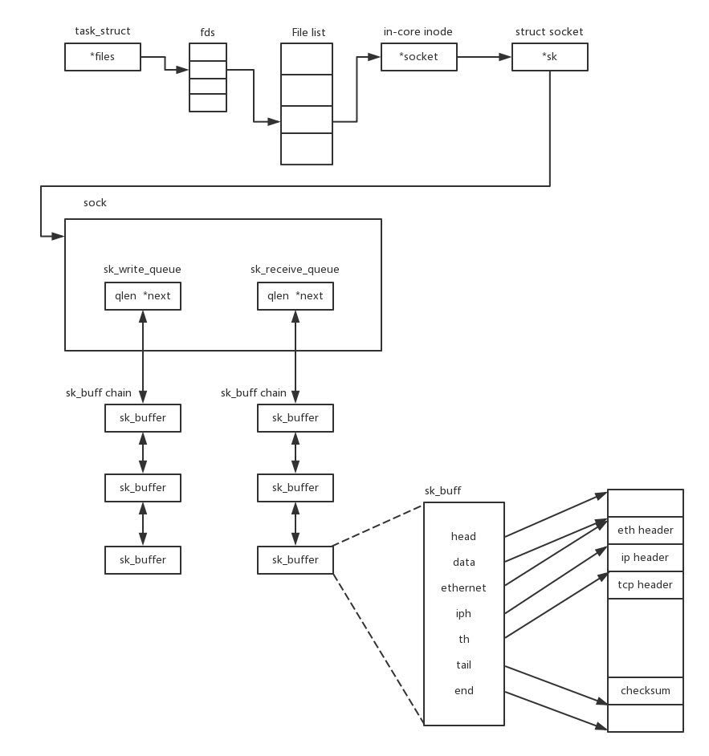
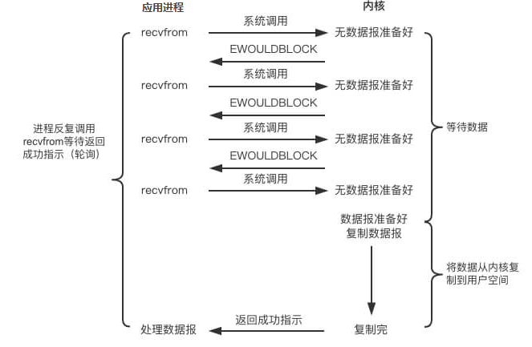
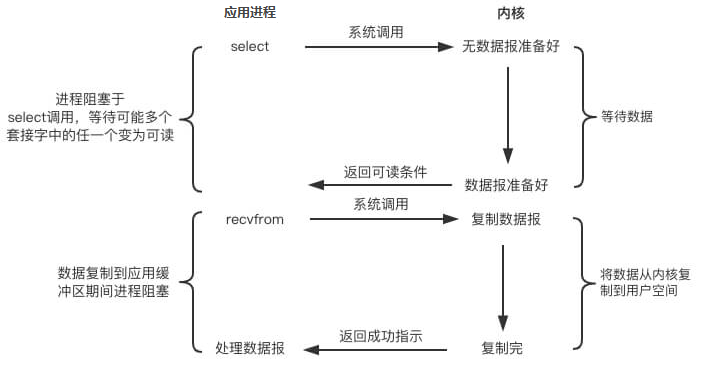
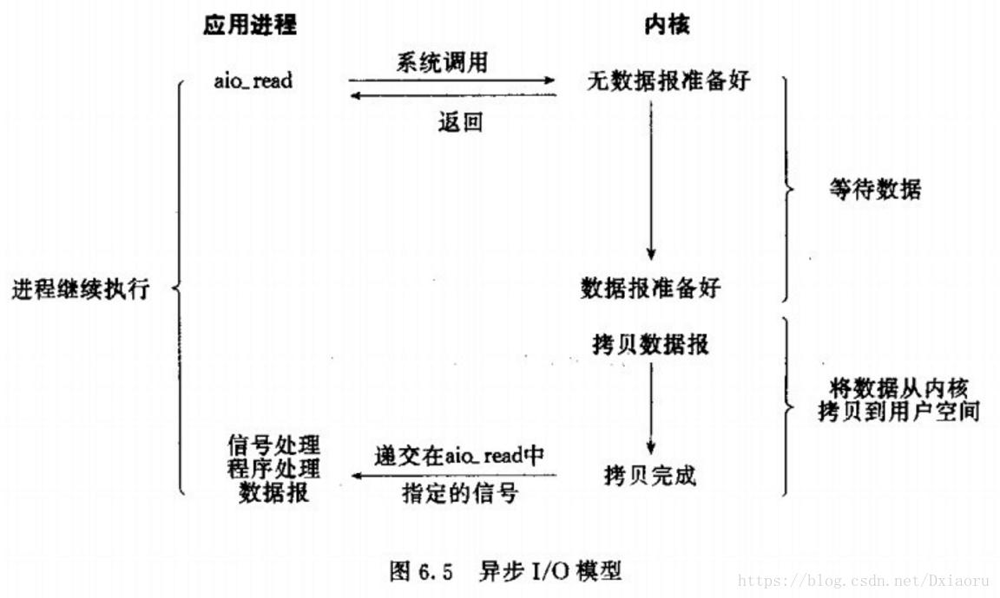

# 目录

<!-- vim-markdown-toc GFM -->

* [套接字](#套接字)
    * [socket文件与Linux设计哲学](#socket文件与linux设计哲学)
    * [套接字类型](#套接字类型)
        * [本地套接字 Unix Socket](#本地套接字-unix-socket)
        * [网络套接字 BSD Socket](#网络套接字-bsd-socket)
    * [套接字实现](#套接字实现)
        * [sockfs文件系统](#sockfs文件系统)
        * [socket初始化](#socket初始化)
        * [socket创建](#socket创建)
        * [socket操作](#socket操作)
        * [socket销毁](#socket销毁)
* [OS网络API](#os网络api)
    * [链接管理](#链接管理)
        * [`socket()`](#socket)
        * [`bind()`](#bind)
        * [`listen()`/`connect()`](#listenconnect)
        * [`accept()`](#accept)
        * [`close()`/`shudown()`](#closeshudown)
    * [读写](#读写)
        * [`read()`/`write()`](#readwrite)
        * [`send()`/`recv`](#sendrecv)
        * [`sendto`/`recvfrom`](#sendtorecvfrom)
        * [`sendmsg`/`recvmsg`](#sendmsgrecvmsg)
* [IO模型](#io模型)
    * [阻塞式IO](#阻塞式io)
    * [非阻塞是IO](#非阻塞是io)
    * [IO多路复用/事件驱动](#io多路复用事件驱动)
        * [Posix:select](#posixselect)
            * [优点](#优点)
            * [缺点](#缺点)
        * [BSD:kqueue](#bsdkqueue)
        * [Linux:poll](#linuxpoll)
            * [优点](#优点-1)
            * [缺点](#缺点-1)
        * [Linux:epoll（高效）](#linuxepoll高效)
            * [实现原理](#实现原理)
            * [工作模式](#工作模式)
                * [边缘触发ET(高速)](#边缘触发et高速)
                * [电平触发LT(默认)](#电平触发lt默认)
            * [优点](#优点-2)
        * [惊群](#惊群)
            * [accept惊群](#accept惊群)
            * [epoll惊群](#epoll惊群)
            * [解决方法](#解决方法)
    * [信号驱动IO(不常用)](#信号驱动io不常用)
    * [异步IO](#异步io)
        * [Windows:IOCP（优秀）](#windowsiocp优秀)
        * [Linux:AIO](#linuxaio)
    * [总结](#总结)
    * [HSHA模型](#hsha模型)
    * [HSHR模型](#hshr模型)
* [IO模式](#io模式)
    * [Reactor](#reactor)
        * [步骤](#步骤)
    * [Proactor](#proactor)
        * [步骤](#步骤-1)
* [其他](#其他)
    * [`SO_REUSEPORT`](#so_reuseport)
    * [`SO_REUSEADDR`](#so_reuseaddr)
* [推荐资料](#推荐资料)
                    * [UNIX网络编程 学习笔记 (一) 王鹏程 ](#unix网络编程-学习笔记-一-王鹏程-)

<!-- vim-markdown-toc -->

# 套接字

套接字Socket是连接应用程序和网络驱动程序的桥梁，套接字Socket在应用程序中创建，通过绑定与网络驱动建立关系。此后，应用程序送给套接字Socket的数据，由套接字Socket交给网络驱动程序向网络上发送出去。计算机从网络上收到与该套接字Socket绑定IP地址和端口号相关的数据后，由网络驱动程序交给Socket，应用程序便可从该Socket中提取接收到的数据。

## socket文件与Linux设计哲学

Linux设计的一条基础哲学即一切皆文件，但是socket文件的实现与该原则有所违背，它的操作接口和标准文件接口非常不同

1. 创建socket必须用socket调用而不是open，socket在打开之前不能存在。
2. bind，connect，accept等都是独立的系统调用，没有标准文件操作与之对应。

由于socket、管道等设计Linux的设计哲学由**一切皆文件退化为一切皆文件描述符**。

1. 一切皆文件： 文件属于Unix/Linux目录树，编址于统一命名空间。
2. 一切皆文件描述符： 文件描述符属于进程打开文件表，进程内可见。

## 套接字的数据结构

### 数据结构

|      数据结构      |        作用        | 大小 | 说明 |
| :----------------: | :----------------: | :--: | :--: |
|   `sockaddr_in`    |    IPV4地址信息    | 16B  |      |
|   `sockaddr_in6`   |    IPV6地址信息    | 28B  |      |
|     `sockaddr`     | 用于向系统调用传参 | 16B  |      |
| `sockaddr_storage` |                    | 128B |      |


#### `sockaddr_in`

```c
struct sockaddr_in{
    uint8_t        sin_len;//4.3BSD-Reno后为增加对OSI协议的支持添加，保存此结构体的长度，POSIX下无此成员
    sa_family_t    sin_family;  /*AF_INET*/
    in_port_t      sin_port;//16bit网络序端口号
    struct in_addr{
        in_addr_t    s_addr;//网络序32bit IPV4地址
    }sin_addr;
    char           sin_zero[8];//一般不使用，但总是设为0
};
```

#### `sockaddr_in6`

```c
struct sockaddr_in6{
    uint8_t         sin6_len;//套接字地址结构长度
    sa_family_t     sin6_family;  
    in_port_t       sin6_port; 
    uint32_t        sin6_flowinfo;//低序20位是流标，高序12位保留
    struct in6_addr{
    	unit8_t    s6_addr[16];//网络序128bit IPV4地址
}sin6_addr;
    uint32_t        sin6_scope_id; /*set of interfaces for a scope*/
};
```

#### `sockaddr`

处理套接字的函数（bind、connect等）的参数一般需要传递套接字的地址，然后对于不同协议簇的地址结构可能会不同，在传参时也就不同，为了统一传递一个地址结构，设计了`sockaddr`这样的通用套接字地址结构。因为套接字处理函数的参数为`struct sockaddr`类型，所以在传参时需要将`sockaddr_in、sockaddr_in6`强制类型转换为`sockaddr`。

```c
struct sockaddr{
    uint8_t        sa_len;
    sa_family_t    sa_family;
    char           sa_data[14]; /*protocol-specific address*/
};
```

#### `sockaddr_storage`

除了`ss_len`和`ss_family`之外，结构中的其它字段对用户来说是透明的，该结构必须类型强制转换成或复制到适合于`ss_family`字段所给出地址类型的套接字地址结构中，才能访问其他字段

```c
struct sockaddr_storage{
    uint8_t     ss_len; 
    sa_family_t ss_familt;
    /*implementation-dependent elements to provide:
    a)alignment sufficient to fulfill the alignmen requirements of
        all socket address types that the system supports.
    b)enough storage to hold any type of socket address that thw
        system supports.
    */
};
```

### 值-结构参数

#### 从进程到内核

`bind、connect、sendto`三个函数需要将进程数据传递到内核空间，这些函数的一个参数是指向某个套接字地址结构的**指针**，另一个`socklen_t`类型的参数是该结构的整数**大小**。

## 套接字类型

### 本地套接字 Unix Socket

本地套接字一般用于本机的IPC（进程间通行），其名字是Linux文件系统中的文件名（可以找到最终的实体文件），一般放在`/tmp`或`/usr/tmp`目录。

### 网络套接字 BSD Socket

网络套接字的名字是与客户连接的特定网络有关的服务标识符（端口号或访问点）。这个标识符允许Linux将进入的针对特定端口号的连接转到正确的服务器进程，在文件系统中只有其描述符和**描述符的已断开的文件链接**。

## 套接字实现

linux以属于**sockfs文件系统**的特殊文件实现套接口，创建一个套接口就是在sockfs中创建一个特殊文件并建立起为实现套接口功能的相关数据结构。

### sockfs文件系统

linux的所有文件操作通过VFS实现了统一抽象，sockfs实现了VFS中的4种主要对象（超级块super block、索引节点inode、目录项对象dentry和文件对象file）。执行文件IO系统时VFS就将请求转发给sockfs，sockfs调用具体的协议实现IO。socketfs作为伪文件系统被编译进内核(因为要支持整个TCP/IP协议栈)而非一个模块，它在系统启动到关闭期间总是被装载着的。



### [socket初始化](http://www.cppblog.com/qinqing1984/archive/2015/05/03/210521.html)

内核引导时初始化网络子系统，进而调用sock_init（创建inode缓存，注册和挂载sockfs）

### [socket创建](http://www.cppblog.com/qinqing1984/archive/2015/05/03/210521.html)

创建方法：`socket、accept、socketpair`三种系统调用。先构造inode，再构造对应的file，最后安装file到当前进程中（即关联映射到一个未用的文件描述符）。


### [socket操作](http://www.cppblog.com/qinqing1984/archive/2015/05/03/210522.html)

既可以调用文件IO，也可以调用BSD Sockets API。基于文件方式的IO操作主要经过了VFS这一抽象层。

1. 以read为例的文件IO调用图：
2. 以recv为例的socket式IO调用： 

### [socket销毁](http://www.cppblog.com/qinqing1984/archive/2015/05/03/210522.html)

close是用户空间销毁socket的**唯一方法**，

# OS网络API

网络中进程标识：三元组`<IP、Protocal、Port>`


## 链接管理

### `socket()`

```C++
int socket(int domain, int type, int protocol);
///@parameters:
///	domian:协议族,决定了socket的地址类.AF_UNIX要用绝对路径名作为地址
/// type:socket类型
///		SOCK_STREAM:TCP流套接字
///		SOCK_DGRAM:UDP数据报套接字
///		SOCK_RAW:原始套接字,允许读写内核没有处理的IP数据包实现低层协议的直接访问
///	protocal:传输协议(`IPPROTO_TCP、IPPTOTO_UDP、IPPROTO_SCTP、IPPROTO_TIPC`等)
///@Return value:
///	返回的socket描述字存在于协议族（AF_XXX）空间中，但没有一个具体的地址，是一个匿名描述符
```

**NOTE**：type与protocal参数不能随意组合，其取值不是两部分的笛卡尔积。

### `bind()`

```c++
int bind(int sockfd, const struct sockaddr *addr, socklen_t addrlen);
///@parameters:
///	sockfd:将要绑定到一个名字/本地协议地址的匿名描述符
///	addr:指向要绑定给sockfd的协议地址，其地址结构根据地址创建socket时的地址协议族的不同而不同
///@Return value:
///	函数返回码，0为成功
```

### `listen()`/`connect()`

```c++
int listen(int sockfd, int backlog);///被动等待请求
///@parameters:
///	sockfd:要监听的具名socket描述字
///	addr:该连接的全连接队列最大长度
///@Return value:
///	函数返回码，0为成功
```

```C++
int connect(int sockfd, const struct sockaddr *addr, socklen_t addrlen);///主动发起请求
///@parameters:
///	sockfd:建立连接时本端所用的具名socket描述字
///	addr:建立连接时对端的地址
///@Return value:
///	函数返回码，0为成功
```

### `accept()`

```C++
///取接收请求，此后完成连接的建立，可以类同于普通文件的操作进行网络I/O；
int accept(int sockfd, struct sockaddr *addr, socklen_t *addrlen);
///@parameters:
///	sockfd:建立连接时本端所用的具名socket监听套接字
///	addr:用于返回客户端的协议地址，其**内容由内核自动创建**
///@Return value:
///	成功则返回描述字，失败返回-1
```

  accept默认会**阻塞进程**直到有一个客户连接建立后返回，它返回的是一个新可用的**已连接套接字**。一个服务器通常通常仅仅只创建一个**监听描述字**，它在该服务器的生命周期内一直存在。内核为每个由服务器进程接受的客户连接创建了一个已连接描述字，当服务器完成了对某个客户的服务，相应的已连接描述字就被关闭。

### `close()`/`shudown()`

```c++
int close(int fd);///不阻塞
///@parameters:
///	fd:将被标记为已关闭的描述符。该描述字不能再由调用进程使用
///@Return value:
///	成功则返回描述字，失败返回-1
```

`close`操作只是使相应`socket`描述字的**引用计数-1**，只有当引用计数为0的时候，才会触发TCP客户端和服务器的四次握手终止连接请求。这在父子进程共享同一套接字时防止套接字被过早关闭。

```c++
int shutdown(int sockfd,int howto);
///@parameters:
///	sockfd:要操作的socket文件描述符
///	howto:
///		SHUT_RD：值为0，关闭连接的读这一半。
///		SHUT_WR：值为1，关闭连接的写这一半
///		SHUT_RDWR：值为2，连接的读和写都关闭
///@Return value:
///	成功则返回描述字，失败返回-1
```

`shutdown`会**切断进程共享的套接字的所有连接**，不管这个套接字的引用计数是否为零，那些试图读得进程将会接收到`EOF`标识，那些试图写的进程将会检测到`SIGPIPE`信号，同时可利用`shutdown`的第二个参数选择断连的方式。

## 读写

### `read()`/`write()`

### `send()`/`recv`

### `sendto`/`recvfrom`

### `sendmsg`/`recvmsg`

## 地址转换

### 主机序与网络序

```c
unsigned short ntohs(unsigned short);//  将16位的网络字节序转换为主机字节序
unsigned long ntohl(unsigned long);//    将32位的网络字节序转换为主机字节序
unsigned short htons(unsigned short );// 将16位的主机字节序转换为网络字节序
unsigned long  htonl (unsigned long);//  将32位的主机字节序转换为网络字节序
```

### inet_xxx()函数族

#### 不安全的函数

这些函数是不安全的（不可重入性），如`inet_ntoa()`函数返回的指针指向区域的数据必须被立即取走，此内存会在每次调用inet_nota函数的时候被覆盖掉，如果不及时拿走数据就会出现不可预料的错误。
```c
#include <sys/socket.h>
#include <netinet/in.h>
#include <arpa/inet.h>

int inet_aton(const char *cp, struct in_addr *inp);	//将点分4段式的IP地址转换为结构in_addr值
in_addr_t inet_addr(const char *cp);				//将字符串转换为结构in_addr值
in_addr_t inet_network(const char *cp);				//将字符串地址的网络部分转换为结构in_addr值
char *inet_ntoa(struct in_addr in);					//将结构in_addr转为字符串
struct in_addr inet_makeaddr(int net, int host);	//将网络地址和主机地址合成为IP地址，返回值是in_addr值
in_addr_t inet_lnaof(struct in_addr in);			//获得地址的主机部分
in_addr_t inet_netof(struct in_addr in);			//获得地址的网络部分
```

#### 安全的地址转换

```c
int inet_pton(int family, const char* strptr, void* addrptr);
//将点分十进制串转换成网络字节序二进制值，此函数对IPv4地址和IPv6地址都能处理。
const char* inet_ntop(int family, const void* addrptr, char* strptr, size_t len);
//将网络字节序二进制值转换成点分十进制串，此函数对IPv4地址和IPv6地址都能处理。
```

# IO模型

当一个用户态的函数试图进行IO时，由于用户态不能直接操纵IO，所以当一个read()函数发起读请求时，实际上发生了两件事。一是read()请求系统调用sys_read()，内核等待IO的数据就绪(获取并将数据拷贝到内核缓冲区)，另一个阶段是内核在数据就绪后将数据由内核态的空间拷贝到用户态空间供用户操纵数据。

## 阻塞式IO


Linux的**Socket在默认情况下都是阻塞的**，它会阻塞等待内核准备数据、阻塞等待内核数据拷贝到用户空间。

## 非阻塞是IO



Linux下通过`fcntl(int fd, ...)`将默认阻塞的Socket变为非阻塞模式，此时进程在调用IO时会立即获得返回值：如果IO就绪就成功返回，否则返回`EWOULDBLOCK`错误。在函数返回错误后线程需要不断的**轮询**检查IO是否就绪(反复循环检查会推高CPU的占用率)。

## IO多路复用/事件驱动


用户在单个线程里同时监听多个套接字，通过 select 或 poll 轮询所负责的所有socket，当某个socket的数据就绪后就通知用户进程。此时系统调用第一次阻塞在select等函数上，第二次阻塞在由内核向用户拷贝数据上。

### Posix:select

此时进程**被select函数阻塞**，select所管理的socket此时时非阻塞的。linux提供了四个宏来设置需要监听的文件描述符集合，所要监听的文件描述符集合fd_set类似于一个**位图**，select中间的三个文件描述符集合参数既是输入也是输出，程序用宏检测文件描述符集合中发生响应事件的文件描述符。

select监测的文件描述符范围为[0,nfds)，其中有部分可能是无效监听。

在编程中需要将select置于循环结构中来循环处理新的链接




```cpp
FD_ZERO(int fd, fd_set *fds);
FD_SET(int fd, fd_set *fds);
FD_ISSET(int fd, fd_set *fds);
FD_CLR(int fd, fd_set *fds);
int select(int nfds, fd_set *readfds, fd_set *writefds, fd_set *excptfds, struct timeval *timeout);
```

#### 优点

1. 可以使用单线程(占用资源少)实现对多个文件描述符集合的监测，同时服务多个文件描述符。
2. 跨平台支持

#### 缺点

1. select在确定是哪个文件描述符发生了相应的事件时需要对文件描述符集合进行轮询，当文件描述符集合中要监听的**最大文件描述符**比较大时这会消耗大量的资源。
2. select将事件的检测和事件的响应处理放在一个框架里处理，当响应比较复杂时会造成等待时间过长。
3. select监听的文件描述符上限为1024(linux/posix_types.h:#define \__FD\__SETSIZE 1024)
4. 每次调用select都需要将fdset在内核与用户态之间拷贝

### BSD:kqueue

### Linux:poll

poll和select在本质上没有什么差别，都是轮询多个fd的状态，如果设备就绪则在设备等待队列中加入一项并继续遍历，如果遍历完所有fd后没有发现就绪设备，则挂起当前进程，直到设备就绪或者主动超时，被唤醒后它又要再次遍历fd。

```cpp
struct pollfd {
    int fd; /* 文件描述符 */
    short events; /*  事件掩码：等待的事件，由用户设置 */
    short revents; /* 操作结果事件掩码：实际发生了的事件，由内核在调用返回时设置 */
};
/*
events域:
　　POLLIN 　　　　　　　　有数据可读。
　　POLLRDNORM 　　　　  有普通数据可读。
　　POLLRDBAND　　　　　 有优先数据可读。
　　POLLPRI　　　　　　　　 有紧迫数据可读。
　　POLLOUT　　　　　　      写数据不会导致阻塞。
　　POLLWRNORM　　　　　  写普通数据不会导致阻塞。
　　POLLWRBAND　　　　　   写优先数据不会导致阻塞。
　　POLLMSGSIGPOLL 　　　　消息可用。
revents域：
    vents域的所有可能值
	POLLER　　   指定的文件描述符发生错误。
	POLLHUP　　 指定的文件描述符挂起事件。
	POLLNVAL　　指定的文件描述符非法。
*/
int poll (struct pollfd *fds, unsigned int nfds, int timeout);
/*
返回值与错误码：
	成功：
        超时前无事件发生：0
        有事件：发生的事件个数
	失败：
        返回-1，并设置errno
            EBADF　　       一个或多个结构体中指定的文件描述符无效。
            EFAULTfds　　 指针指向的地址超出进程的地址空间。
            EINTR　　　　  请求的事件之前产生一个信号，调用可以重新发起。
            EINVALnfds　　参数超出PLIMIT_NOFILE值。
            ENOMEM　　     可用内存不足，无法完成请求。
*/
```

#### 优点

1. 使用数组机制传递需要监听的文件描述符(第一个参数为数组首地址，第二个参数为数组长度)，突破了select文件描述符有限的缺点

#### 缺点

1. 任然需要使用轮询遍历的方式确定那个文件描述符发生了相应的事件
2. 在数据交互时文件描述符数组被整体复制于内核态和用户态之间，开销随监视的描述符增大而增大

### Linux:epoll（高效）

+ 通过监听、回调的机制避免了对文件描述符的遍历

+ 使用一个文件描述符管理多个描述符，将用户关心的文件描述符的事件存放到内核的一个事件表中

+ 适用于**连接较多，活动数量较少**的情况。

  

  


#### 实现原理
内核维护数据结构eventpoll用来管理所要监视的fd，该数据结构中核心在于一颗红黑树（每个节点为epitem结构，用来快速的查找和修改要监视的fd）和一个列表（收集已经发生事件的epitem）。[过程分析1](https://blog.csdn.net/baiye_xing/article/details/76352935) [过程分析2](https://blog.csdn.net/dog250/article/details/80837278) [过程分析3](https://www.cnblogs.com/zengyiwen/p/7213f3303eca4bb08fd270f7d5772100.html) [过程分析4](https://icoty.github.io/2019/06/03/epoll-source/)


  1. 初始化数据结构，创建并返回一个epoll文件描述符（epollfd本身并不存在一个真正的文件与之对应, 所以内核需要创建一个"虚拟"的文件, 并为之分配真正的struct file结构）。
      ```cpp
      //其返回值时一个文件描述符，所以在使用完epoll后需要调用close()关闭。
      //size参数只是为了保持兼容(之前的fd使用hash表保存，size表示hash表的大小)，无意义。
      int epoll_create(int size);
      /*********************以下是具体实现**********************/
      
      struct eventpoll {// 简化后的epoll结构，对应于一个epoll描述符
          spinlock_t lock;
          struct mutex mtx;
          wait_queue_head_t wq;// 阻塞在epoll_wait的task的睡眠队列
          struct list_head rdllist;// 已就绪的需要检查的epitem 列表，该list上的文件句柄事件将会全部上报给应用
          struct rb_root rbr;// 存放加入到此epoll句柄的epitem的红黑树容器
          struct user_struct *user; // 此epoll文件描述符的拥有者
          struct file *file;// 该epoll结构对应的文件句柄，应用通过它来操作该epoll结构
      };
      
      // 以下是简单的创建过程，非可执行代码
      SYSCALL_DEFINE1(epoll_create, int, size);//展开SYSCALL_DEFINE1宏，调用到sys_epoll_create1(0);
      SYSCALL_DEFINE1(epoll_create1, int, flags){//最终执行的epoll_create1()
          struct eventpoll *ep = NULL;//主描述符
      	int error = ep_alloc(&ep); //分配一个struct eventpoll
      	error = anon_inode_getfd("[eventpoll]", &eventpoll_fops, ep, O_RDWR | (flags & O_CLOEXEC));//创建一个匿名fd
      	//eventpoll_fops指向该虚拟文件支持的operations函数表，epoll只实现了poll和release(即close)操作，其它文件系统操作由VFS处理。
          //ep作为一个私有数据保存在struct file的private指针里，目的在于实现fd->file->eventpoll的查找过程
          return error;
      }
      // eventpoll初始化函数
      static int __init eventpoll_init(void){}
      ```

2. 为epoll句柄添加epitem；注册睡眠entry的回调

   ```cpp
   // 事件注册函数
   // op通过EPOLL_CTL_ADD，EPOLL_CTL_DEL，EPOLL_CTL_MOD三个宏表示对fd对应的监听事件的增删改
   // event为具体要检测的事件
   int epoll_ctl(int epfd, int op, int fd, struct epoll_event *event)；
   /*********************以下是具体实现**********************/

   struct epoll_event {
     __uint32_t events;  /* Epoll events */
     epoll_data_t data;  /* User data variable */
   };
   /*
   events可以是以下几个宏的集合：
       EPOLLIN ：表示对应的文件描述符可以读（包括对端SOCKET正常关闭）；
       EPOLLOUT：表示对应的文件描述符可以写；
       EPOLLPRI：表示对应的文件描述符有紧急的数据可读（这里应该表示有带外数据到来）；
       EPOLLERR：表示对应的文件描述符发生错误；
       EPOLLHUP：表示对应的文件描述符被挂断；
       EPOLLET： 将EPOLL设为边缘触发(Edge Triggered)模式，这是相对于水平触发(Level Triggered)来说的。
       EPOLLONESHOT：只监听一次事件，当监听完这次事件之后，如果还需要继续监听这个socket的话，需要再次把这个socket加入到EPOLL队列里
   */

   struct eppoll_entry {
       struct list_head llink; // List struct epitem::pwqlist
       struct epitem *base; // 所有者
       wait_queue_t wait; // 添加到wait_queue 中的节点
       wait_queue_head_t *whead; // 文件wait_queue 头
   };

   struct epitem {// 已简化，对应于一个加入到epoll的文件
       struct rb_node rbn;// 该字段链接入epoll句柄的红黑树容器
       struct list_head rdllink;// 当该epitem有事件发生时，该字段链接入“就绪链表”，准备上报给用户态
       struct epoll_filefd {// 该字段封装实际的文件(已展开)：红黑树的key
           struct file *file;
           int fd;
       } ffd;
       struct list_head pwqlist; // 当前文件的等待队列(eppoll_entry)列表，同一个文件上可能会监视属于不同的wait_queue中的多种事件，因此使用链表。
       struct eventpoll *ep;// 反向指向其所属的epoll句柄
       struct list_head fllink; // 链表头，用于将此epitem挂到链表上
       struct epoll_event event; // epoll_ctl 传入的用户数据
   };

   SYSCALL_DEFINE4(epoll_ctl, int, epfd, int, op, int, fd, struct epoll_event __user *, event) {
   	int did_lock_epmutex = 0;
       struct epoll_event epds;
       copy_from_user(&epds, event, sizeof(struct epoll_event));//将epoll_event结构从用户空间copy到内核空间.
       struct file *file = fget(epfd); //取得 epfd 对应的文件
       struct file *tfile = fget(fd); //取得目标文件
   	if (!tfile->f_op || !tfile->f_op->poll) {
           goto error_tgt_fput;
       }// 检查目标文件是否支持poll操作
   	if (file == tfile || !is_file_epoll(file)) {
           goto error_tgt_fput;
       }// 检查参数的合理性（传入参数是否符合预期）
   	struct eventpoll *ep = file->private_data; // 取得内部结构eventpoll（参见上文链式查询）
       if (op == EPOLL_CTL_ADD || op == EPOLL_CTL_DEL) { // 获取全局锁epmutex
           mutex_lock(&epmutex);
           did_lock_epmutex = 1;
       }
   	if (op == EPOLL_CTL_ADD) {
           if (is_file_epoll(tfile)) {
               error = -ELOOP;
               if (ep_loop_check(ep, tfile) != 0) {  // 目标文件也是epoll 检测是否有循环包含的问题
                   goto error_tgt_fput;
               }
           } else  {
               list_add(&tfile->f_tfile_llink, &tfile_check_list); // 将目标文件添加到epoll全局的tfile_check_list 中
           }
       }
   	mutex_lock_nested(&ep->mtx, 0); // 接下来会修改eventpoll，加锁进入临界区
       struct epitem *epi = ep_find(ep, tfile, fd); // 以tfile 和fd 为key 在rbtree 中查找文件对应的epitem
       switch (op) {
       	case EPOLL_CTL_ADD:{
   			if (!epi) { // 没找到红黑树节点, 添加额外添加ERR HUP 事件
               	epds.events |= POLLERR | POLLHUP;
               	error = ep_insert(ep, &epds, tfile, fd);
           	}
           	clear_tfile_check_list(); // 清空文件检查列表
           	break;
           }case EPOLL_CTL_DEL:{
               if (epi) {
                   error = ep_remove(ep, epi);
               }
               break;
           }case EPOLL_CTL_MOD:{
               if (epi) {
                   epds.events |= POLLERR | POLLHUP;
                   error = ep_modify(ep, epi, &epds);
               }
               break;
           }
       }
   	mutex_unlock(&ep->mtx);
       error_tgt_fput:
           if (did_lock_epmutex) {
               mutex_unlock(&epmutex);
           }
   }

   struct ep_pqueue {
   	poll_table pt;
   	struct epitem *epi;
   };

   // ep_insert():向epollfd里面添加一个待监听的fd
   static int ep_insert(struct eventpoll *ep, struct epoll_event *event, struct file *tfile, int fd) {
   	long user_watches = atomic_long_read(&ep->user->epoll_watches);
       if (unlikely(user_watches >= max_user_watches)) {
           return -ENOSPC;
       }// ---------------NOTE: 此处有最大监听数量的限制-----------------
   	struct epitem *epi = kmem_cache_alloc(epi_cache, GFP_KERNEL));//创建epitem空间
       // epi其他数据成员的初始化……………………
       ep_set_ffd(&epi->ffd, tfile, fd);// 初始化红黑树中的key
       epi->event = *event; // 直接复制用户结构
       struct ep_pqueue epq;// 初始化临时的 epq
       epq.epi = epi;
       init_poll_funcptr(&epq.pt, ep_ptable_queue_proc);
       epq.pt._key = event->events;  // 设置事件掩码
   	int revents = tfile->f_op->poll(tfile, &epq.pt); //内部会调用上面传入的ep_ptable_queue_proc,在文件tfile对应的wait queue head 上注册回调函数, 并返回当前文件的状态
       spin_lock(&tfile->f_lock); // 自旋锁加锁
       list_add_tail(&epi->fllink, &tfile->f_ep_links);// 添加当前的epitem 到文件的f_ep_links 链表
       spin_unlock(&tfile->f_lock);
       ep_rbtree_insert(ep, epi);// 插入epi 到rbtree
   }
   ```

3. 事件发生，唤醒相关文件句柄睡眠队列的entry，调用其回调

      ```cpp
      static int ep_poll_callback(wait_queue_t *wait, unsigned mode, int sync, void *key){
          unsigned long flags;
          struct epitem *epi = ep_item_from_wait(wait);
          struct eventpoll *ep = epi->ep;
          // 这个lock比较关键，操作“就绪链表”相关的，均需要这个lock，以防丢失事件。
          spin_lock_irqsave(&ep->lock, flags);
          // 如果发生的事件我们并不关注，则不处理直接返回即可。
          if (key && !((unsigned long) key & epi->event.events))
              goto out_unlock;

          // 实际将发生事件的epitem加入到“就绪链表”中。
          if (!ep_is_linked(&epi->rdllink)) {
              list_add_tail(&epi->rdllink, &ep->rdllist);
          }
          // 既然“就绪链表”中有了新成员，则唤醒阻塞在epoll_wait系统调用的task去处理。注意，如果本来epi已经在“就绪队列”了，这里依然会唤醒并处理的。
          if (waitqueue_active(&ep->wq)) {
              wake_up_locked(&ep->wq);
          }

      out_unlock:
          spin_unlock_irqrestore(&ep->lock, flags);
          ...
      }
      ```

4. 唤醒epoll睡眠队列的task，搜集并上报数据

      ```cpp
      int epoll_wait(int epfd, struct epoll_event * events, int maxevents, int timeout);
      // 等待epfd上的IO事件，这些事件保存在长为maxevents的events事件数组里
      
      static int ep_poll(struct eventpoll *ep, struct epoll_event __user *events, int maxevents, long timeout){
          unsigned long flags;
          wait_queue_t wait;
          if (!ep_events_available(ep)) {// 当前没有事件才睡眠
              init_waitqueue_entry(&wait, current);
              __add_wait_queue_exclusive(&ep->wq, &wait);
              for (;;) {
                  set_current_state(TASK_INTERRUPTIBLE);
                  ...// 例行的schedule timeout
              }
              __remove_wait_queue(&ep->wq, &wait);
              set_current_state(TASK_RUNNING);
          }
          ep_send_events(ep, events, maxevents);// 往用户态上报事件，即那些epoll_wait返回后能获取的事件。
      }
      
      ep_scan_ready_list(){
          ready_list_for_each() {// 遍历“就绪链表”
              list_del_init(&epi->rdllink);// 将epi从“就绪链表”删除
              revents = ep_item_poll(epi, &pt);// 实际获取具体的事件，睡眠entry的回调函数只是通知有“事件”，具体需要每一个文件句柄的特定poll回调来获取。
              if (revents) {
                  if (__put_user(revents, &uevent->events) ||__put_user(epi->event.data, &uevent->data)) {// 如果没有完成，则将epi重新加回“就绪链表”等待下次。
                      list_add(&epi->rdllink, head);
                      return eventcnt ? eventcnt : -EFAULT;
                  }
                  if (!(epi->event.events & EPOLLET)) {// 如果是LT模式，则无论如何都会将epi重新加回到“就绪链表”，等待下次重新再poll以确认是否仍然有未处理的事件。这也符合“水平触发”的逻辑，即“只要你不处理，我就会一直通知你”。
                      list_add_tail(&epi->rdllink, &ep->rdllist);
                  }
              }
          }
          if (!list_empty(&ep->rdllist)) {// 如果“就绪链表”上仍有未处理的epi，且有进程阻塞在epoll句柄的睡眠队列，则唤醒它！(这将是LT惊群的根源)
              if (waitqueue_active(&ep->wq))
                  wake_up_locked(&ep->wq);
          }
      }
      ```

#### 工作模式

在源码中，两种模式的区别是一个if判断语句，通过`ep_send_events_proc()`函数实现，如果没有标上EPOLLET（即ET）且事件未被处理的fd会被重新放回`rdllist`，下次`epoll_wait`又会把rdllist里的fd拿来拷给用户。

##### 边缘触发ET(高速)

+ 只支持非阻塞socket(避免一个文件描述符的阻塞造成其它多个文件描述符长期得不到响应)
+ 仅当状态发生变化时才会通知，即对于一个事件只通知一次，如果用户一直没有对该事件作出处理(从而导致它再次变为非就绪态)，内核不会发送更多的通知。

##### 电平触发LT(默认)

+ 同时支持阻塞和非阻塞两种方式
+ 只要发生的事件还没有被处理，内核就会一直向用户进程通知该事件

#### 优点

+ 可以监听的文件描述符数量上限为最大可打开文件数目（`cat /proc/sys/fs/file-max`）

+ 使用队列而非轮询的方式来处理就绪的IO，队列里保留了就绪的IO，IO的效率不会随着监视fd的数量的增长而下降


### 惊群

当多个进程和线程在同时阻塞等待同一个事件时，如果这个事件发生，内核会唤醒所有的进程，但最终只可能有一个进程/线程对该事件进行处理，其他进程/线程会在失败后重新休眠，这种**性能浪费**（无效调度带来的无效上下文切换，对共享资源的保护）就是惊群。

#### accept惊群

Linux2.6内核在**当有新的连接进入到accept队列的时候仅唤醒一个进程**解决了使用accept()时的惊群问题。

#### epoll惊群

epoll_wait返回后确实也还有***多个进程被唤醒只有一个进程能正确处理其他进程无事可做\***的情况发生，但这是因为使用方法不对而非惊群。

#### 解决方法

reuseport

## 信号驱动IO(不常用)


利用Linux的信号机制，用sigaction函数将SIGIO读写信号以及handler回调函数存在内核队列中。当设备IO缓冲区可写或可读时触发SIGIO中断，返回设备fd并回调handler。

此方式下handler是在中断环境下运行，多线程不稳定而且要考虑信号的平台兼容性。再者SIGIO信号被POSIX定义为standard signals不会进入队列，所以同时存在多个SIGIO会只触发第一个SIGIO。

## 异步IO



用户进程在发起异步IO的系统调用后会立即返回，当内核等待的数据就绪并由内核将数据拷贝到用户空间后，内核会向调用者发送信号通知IO操作已完成。由于进程以**信号**这种特殊的方式得知IO事件已经就绪，进程对这一信号的处理一般都不是立即处理。

### Windows:IOCP（优秀）

### Linux:AIO

Linux的AIO系列API只是模拟了异步操作的接口，但是内部还是用多线程来模拟，实则为**伪异步**。

## 总结

| IO方式              | 数据准备 | 数据拷贝 | 优点 | 缺点 |
| ------------------- | -------- | -------- | ---- | ---- |
| 同步阻塞            | 阻塞     | 阻塞     |      |      |
| 同步非阻塞          | 非阻塞   | 阻塞     |      |      |
| 事件驱动/IO多路复用 | 非阻塞   | 阻塞     |      |      |
| 信号驱动            | 非阻塞   | 阻塞     |      |      |
| 异步IO              | 非阻塞   | 非阻塞   |      |      |

| IO函数 |    平台     | 设计模式 | 数据结构 |   上限   |    fd拷贝     | 事件追踪 |
| :----: | :---------: | :------: | :------: | :------: | :-----------: | :------: |
| select | posix/Linux | Reactor  |  bitmap  |   1024   |     每次      | 轮询O(n) |
|  poll  |    Linux    | Reactor  |   数组   | 系统限制 |     每次      | 轮询O(n) |
| epoll  |    Linux    | Reactor  |  红黑树  | 系统限制 | 首次epoll_ctl |   O(1)   |
| kqueue |     BSD     | Reactor  |          |          |               |          |
|  IOCP  |   Windows   | Proactor |          |          |               |          |

## HSHA模型

半同步/半异步模式（Half-Sync/Half-Async）主要由异步IO层+队列层+同步处理层三层构成。一般为一个异步IO线程、多个同步工作线程、数据队列作为数据交换通道。


## HSHR模型

HSHA模式十分依赖异步IO，半同步/半反应堆（Half-Sync/Half-Reactor）用IO多路复用代替异步IO，对HSHA进行改造。

# IO模式

## Reactor

### 步骤

1. 应用向reactor注册多个监听设备以及回调函数
2. IO ready事件触发
3. reactor分发事件执行对应的回调函数
4. 应用在回调函数中进行IO操作。

## Proactor

### 步骤

* 与Reactor模式类似，区别在于proactor在IO ready事件触发后，完成IO操作再通知应用回调。

# 其他

## [`setsockopt()/getsockopt()`](https://www.cnblogs.com/clschao/articles/9588313.html)

选项可能存在于多层协议中，当操作套接字选项时，选项位于的层和选项的名称必须给出

```c
///获取或者设置与某个套接字关联的选项。
int getsockopt(int sock, int level, int optname, void *optval, socklen_t *optlen);
int setsockopt(int sock, int level, int optname, const void *optval, socklen_t optlen);
///@Parameters:
///	sock:要设置的套接字
///	level:选项所在的协议层（SOL_SOCKET,IPPROTO_IP,IPPROTO_TCP）
///	optname:需要访问的选项名
///	optval:对于getsockopt()，指向返回选项值的缓冲。对于setsockopt()，指向包含新选项值的缓冲
///	optlen:对于getsockopt()，作为入口参数时，选项值的最大长度。作为出口参数时，选项值的实际长度。对于setsockopt()，现选项的长度
///@Return value
///	成功执行时，返回0。失败返回-1，并设置errno
```

## `SO_REUSEPORT`

**Linux kernel 3.9**之前一个`ip+port`组合只能被bind一次，因此只能有一个线程（或者进程）是listener，在高并发情况下，多个worker线程必须使用锁互斥使用listener造成性能低下。`SO_REUSEPORT`**支持多个进程或者线程同时绑定到同一个TCP/UDP端口（`IP:Port`）**，每个进程可以自己创建socket、bind、listen、accept相同的地址和端口，各自是独立平等的。让多进程监听同一个端口，各个进程中`accept socket fd`不一样，有新连接建立时，内核只会唤醒一个进程来`accept`，并且**保证唤醒的均衡性**。

```c
int opt_val = 1;
setsockopt(server_socket_fd, SOL_SOCKET, SO_REUSEPORT, &opt_val, sizeof(opt_val));
///在bind之前设置socketopt使套接字server_socket_fd启用SO_REUSEPORT（端口复用）
```

## `SO_REUSEADDR`

`SO_REUSEADDR`用于**重复绑定处于`TIME_WAIT`状态下的TCP套接字**，具体指以下四种情况：

1、当有一个有相同本地地址和端口的socket1处于TIME_WAIT状态时，而你启动的程序的socket2要占用该地址和端口，你的程序就要用到该选项。

2、SO_REUSEADDR允许同一port上启动同一服务器的多个实例(多个进程)。但每个实例绑定的IP地址是不能相同的。在有多块网卡或用IP Alias技术的机器可以测试这种情况。

3、SO_REUSEADDR允许单个进程绑定相同的端口到多个socket上，但每个socket绑定的ip地址不同。这和2很相似，区别请看UNPv1。

4、SO_REUSEADDR允许完全相同的地址和端口的重复绑定。但这只用于UDP的多播，不用于TCP（如果被捆绑的IP地址是一个多播地址，则SO_REUSEADDR和SO_REUSEPORT等效）。

```c
int opt = 1;
setsockopt(sockfd, SOL_SOCKET, SO_REUSEADDR, (const void *)&opt, sizeof(opt));
///在bind之前设置socketopt使TCP套接字server_socket_fd启用SO_REUSEADDR（地址复用）
```

# 推荐资料

###### [UNIX网络编程 学习笔记 (一) 王鹏程 ](https://wangpengcheng.github.io/2019/11/10/unix_network_programming_01/)

