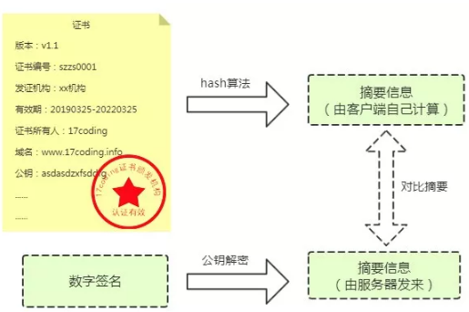
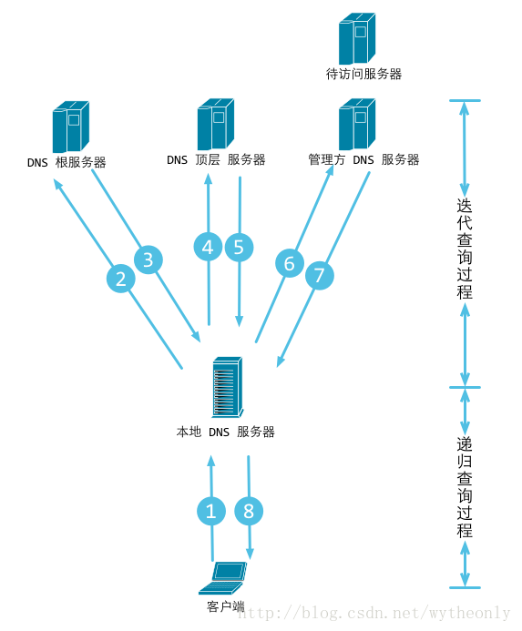
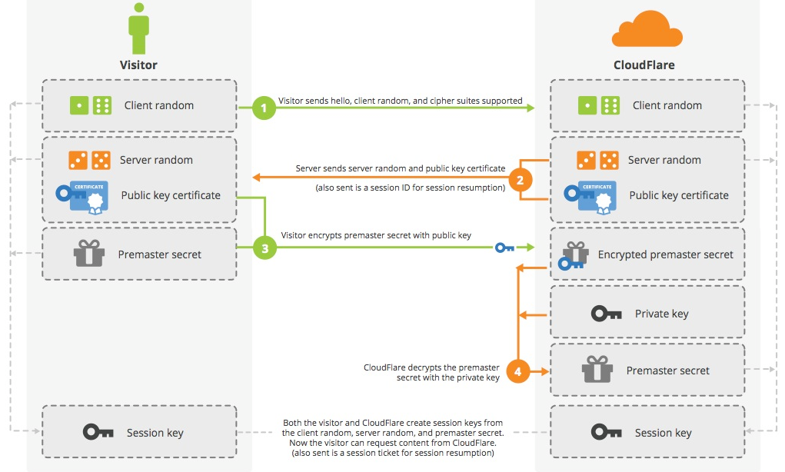
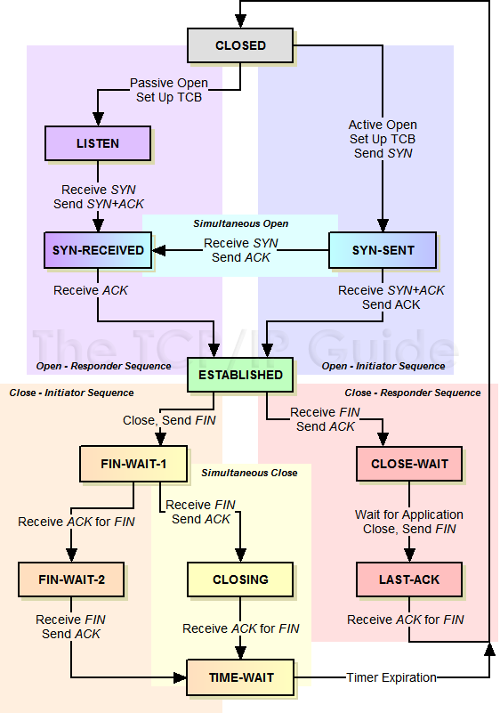
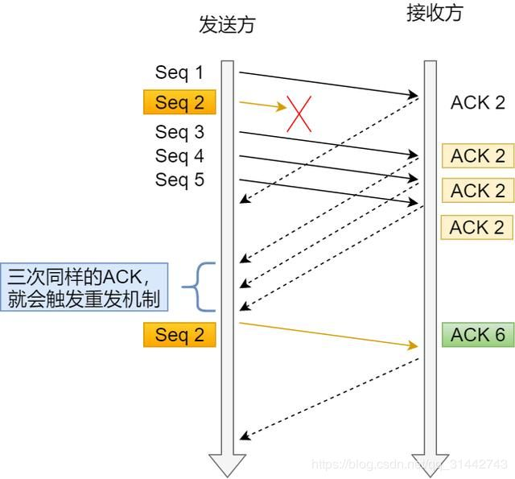
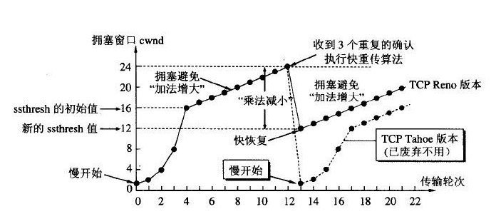
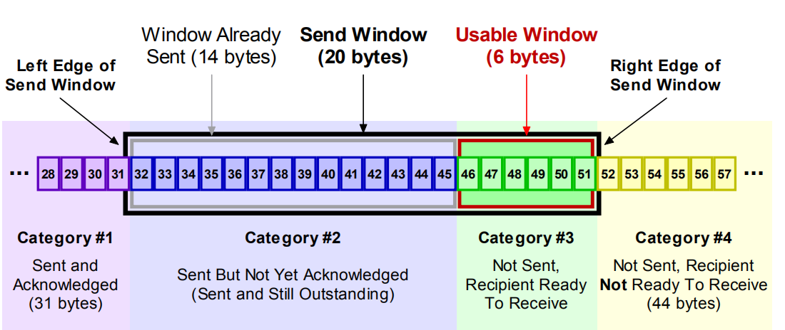
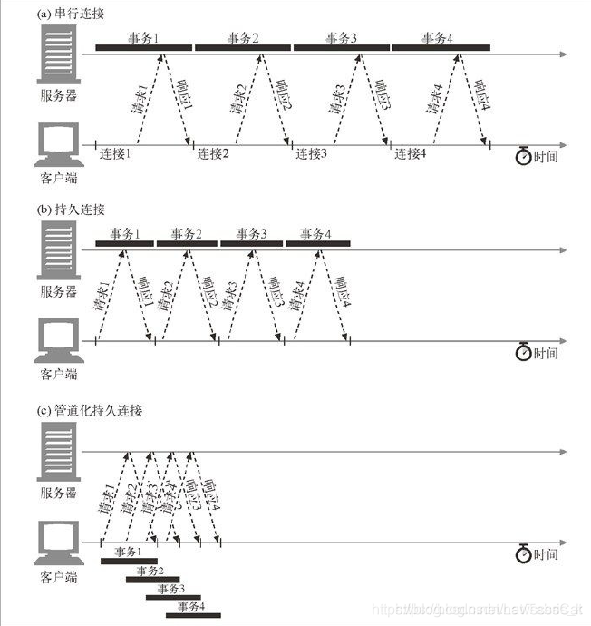
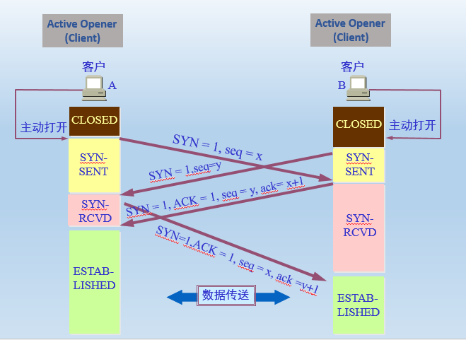
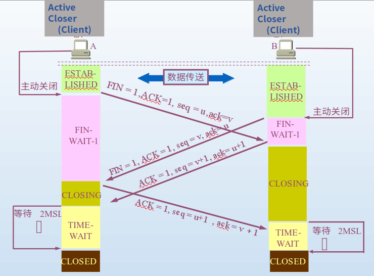

# 目录

<!-- vim-markdown-toc GFM -->

* [其它](#其它)
* [概览](#概览)
    * [OSI七层模型](#osi七层模型)
    * [TCP/IP四层模型](#tcpip四层模型)
    * [实际五层结构](#实际五层结构)
* [应用层](#应用层)
    * [SSH](#ssh)
    * [HTTP](#http)
        * [重要演化](#重要演化)
            * [HTTP/1.0](#http10)
            * [HTTP/1.1](#http11)
            * [HTTP/2.0](#http20)
                * [二进制传输（基础）](#二进制传输基础)
                * [多路复用](#多路复用)
                * [服务器推送](#服务器推送)
                * [Header压缩](#header压缩)
                * [QUIC](#quic)
        * [方法](#方法)
        * [状态码](#状态码)
        * [补丁](#补丁)
            * [应对无状态:Cookie;Session;HTTP/1.1持久连接](#应对无状态cookiesessionhttp11持久连接)
            * [分块传输](#分块传输)
            * [管道传输](#管道传输)
        * [其他](#其他)
            * [Token抵御CSRF（跨站请求伪造）攻击](#token抵御csrf跨站请求伪造攻击)
    * [HTTPS](#https)
        * [实现](#实现)
            * [混合加密](#混合加密)
            * [数字摘要](#数字摘要)
            * [数字签名](#数字签名)
        * [数字证书](#数字证书)
            * [申请](#申请)
            * [验证过程](#验证过程)
        * [缺点](#缺点)
    * [DNS](#dns)
        * [传输方式](#传输方式)
            * [UDP:53](#udp53)
            * [TCP:53（特殊情况使用）](#tcp53特殊情况使用)
        * [查询过程](#查询过程)
            * [迭代与递归查询](#迭代与递归查询)
                * [递归解析](#递归解析)
                * [迭代解析](#迭代解析)
            * [解析记录](#解析记录)
        * [DNS的安全问题](#dns的安全问题)
            * [DNSSEC](#dnssec)
            * [DNSCrypt](#dnscrypt)
            * [DNS over TLS（DoT）](#dns-over-tlsdot)
            * [DNS over HTTPS（DoH）](#dns-over-httpsdoh)
        * [NOTE](#note)
    * [DHCP （UDP）](#dhcp-udp)
        * [工作过程](#工作过程)
        * [缺点](#缺点-1)
    * [FTP](#ftp)
        * [工作模式（服务器的主被动）](#工作模式服务器的主被动)
            * [主动](#主动)
            * [被动](#被动)
* [传输层](#传输层)
    * [SSL（TLS）：四次握手](#ssltls四次握手)
        * [过程](#过程)
        * [证书信任链](#证书信任链)
        * [数字证书与服务器（单域名版SSL证书）](#数字证书与服务器单域名版ssl证书)
    * [TCP](#tcp)
        * [建立连接（三次握手）](#建立连接三次握手)
            * [原因/优点](#原因优点)
            * [连接异常](#连接异常)
                * [丢失SYN](#丢失syn)
                * [丢失SYN+ACK](#丢失synack)
                * [ACK丢失](#ack丢失)
            * [安全问题](#安全问题)
                * [随机初始化序列号`ISN`](#随机初始化序列号isn)
                * [序列号回绕](#序列号回绕)
                * [`SYN flood`攻击syn队列（第一次握手）](#syn-flood攻击syn队列第一次握手)
                    * [解决方法：](#解决方法)
                * [全连接队列满（第三次握手）](#全连接队列满第三次握手)
        * [TCP报文](#tcp报文)
            * [PSH与URG](#psh与urg)
                * [URG](#urg)
                * [PSH](#psh)
        * [可靠传输](#可靠传输)
            * [`ACK`确认](#ack确认)
                * [捎带/延迟确认](#捎带延迟确认)
                    * [`Delayed ACK`算法](#delayed-ack算法)
                * [累计确认](#累计确认)
                * [立即确认](#立即确认)
            * [重传](#重传)
                * [重传方式](#重传方式)
                    * [基于时间的超时重传](#基于时间的超时重传)
                    * [基于确认的快重传（Fast Retransmit）](#基于确认的快重传fast-retransmit)
                    * [自动重传（ARQ,auto repeat request）](#自动重传arqauto-repeat-request)
                * [重传次数](#重传次数)
                * [重传内容](#重传内容)
                    * [`SACK`](#sack)
                    * [`DSACK`](#dsack)
        * [流量控制与拥塞控制](#流量控制与拥塞控制)
            * [拥塞控制](#拥塞控制)
                * [慢启动与拥塞避免](#慢启动与拥塞避免)
                * [慢启动](#慢启动)
                * [拥塞避免（加性增、乘性减）](#拥塞避免加性增乘性减)
                * [快恢复（针对拥塞）](#快恢复针对拥塞)
                * [其他TCP拥塞控制算法](#其他tcp拥塞控制算法)
            * [流量控制](#流量控制)
                * [滑动窗口机制](#滑动窗口机制)
                    * [发送方窗口](#发送方窗口)
                    * [接收方窗口](#接收方窗口)
                * [流量控制](#流量控制-1)
                    * [**`Persistent`持续计时器** ](#persistent持续计时器-)
        * [连接类型](#连接类型)
            * [短连接](#短连接)
            * [并行连接](#并行连接)
            * [长连接/持久连接](#长连接持久连接)
        * [TCP黏包与分包](#tcp黏包与分包)
            * [分包](#分包)
                * [传输单位](#传输单位)
                * [分包](#分包-1)
            * [黏包](#黏包)
                * [Nagle算法](#nagle算法)
                    * [`TCP_CORK`](#tcp_cork)
                * [场景](#场景)
                * [解决](#解决)
        * [服务端被动关闭（四次挥手）](#服务端被动关闭四次挥手)
            * [原因/优点](#原因优点-1)
            * [连接异常](#连接异常-1)
                * [`FIN`丢失](#fin丢失)
                * [`ACK`丢失](#ack丢失-1)
                * [`FIN-ACK`丢失](#fin-ack丢失)
                * [`ACK`丢失](#ack丢失-2)
                * [客户端收到ACK后服务端下线](#客户端收到ack后服务端下线)
                * [客户端收到ACK后客户端下线](#客户端收到ack后客户端下线)
            * [安全问题](#安全问题-1)
                * [`CLOSE_WAIT`过多](#close_wait过多)
                * [`TIME_WAIT`过多](#time_wait过多)
                    * [解决](#解决-1)
        * [服务端主动关闭（TCP保活）](#服务端主动关闭tcp保活)
            * [`Keep-Alive`（服务端探测客户端）](#keep-alive服务端探测客户端)
                * [缺陷](#缺陷)
            * [应用层心跳（客户端探测服务端）](#应用层心跳客户端探测服务端)
        * [同时打开/关闭](#同时打开关闭)
            * [同时打开](#同时打开)
            * [同时关闭](#同时关闭)
        * [计时器汇总](#计时器汇总)
        * [参考推荐](#参考推荐)
    * [UDP](#udp)
* [网络层](#网络层)
    * [ARP/RARP协议](#arprarp协议)
    * [IP](#ip)
        * [IP数据报](#ip数据报)
        * [划分子网](#划分子网)
        * [广播（仅用于UDP）](#广播仅用于udp)
        * [多播/组播（仅用于UDP）](#多播组播仅用于udp)
    * [NAT](#nat)
    * [ICMP/IGMP](#icmpigmp)
        * [ICMP](#icmp)
        * [IGMP](#igmp)
    * [VPN 虚拟专用网](#vpn-虚拟专用网)
    * [ARP/RARP](#arprarp)
    * [路由协议](#路由协议)
        * [内部网关协议](#内部网关协议)
            * [RIP （应用层协议）](#rip-应用层协议)
            * [OSPF 开放最短路径优先](#ospf-开放最短路径优先)
        * [外部网关协议](#外部网关协议)
            * [BGP](#bgp)
* [数据链路层](#数据链路层)
    * [基本问题](#基本问题)
        * [封装成帧](#封装成帧)
        * [透明传输](#透明传输)
        * [差错检测](#差错检测)
    * [广播信道下的信道利用](#广播信道下的信道利用)
        * [信道复用](#信道复用)
            * [频分复用](#频分复用)
            * [时分复用](#时分复用)
            * [统计时分复用](#统计时分复用)
            * [波分复用](#波分复用)
* [物理层](#物理层)
* [其他参考](#其他参考)

<!-- vim-markdown-toc -->

# 其它

URI:Identifier，标识符

URL:Location，定位符

# 概览

## OSI七层模型

应用层，会话层，表示层，传输层，网络层，数据链路层，物理层

## TCP/IP四层模型

应用层，运输层，网际层，网络接口层

## 实际五层结构


# 应用层

## SSH

## HTTP

+ 概览:无状态，无连接（每次请求需要建立TCP连接），明文（无身份确认、无完整性保护），基于请求和响应，支持任意类型

### 重要演化

#### HTTP/1.0

增加`PUT、DELETE`等方法

#### HTTP/1.1

长连接/持久链接、管线化（依赖持久连接、服务端只要求接收管线化处理时不失败即可）

#### HTTP/2.0

##### 二进制传输（基础）

**所有改进的基础**，HTTP 1.X基于文本的在传输时不可切割只能整体传输。

##### 多路复用

**帧Frame：**最小的数据单位，HTTP/2中定义了10种不同类型的帧。

**流Stream：**多个帧组成流。

HTTP2.0将对不同资源的请求抽象为不同的流，每一个流的数据分解为独立的帧，**每个TCP连接中承载了多个双向流**，每一个流都有一个独一无二的标识和优先级。交错发送这些被拆开的帧，接收端通过帧中的流标记组合成为流，从而实现**在同一个TCP连接中，同一时刻可以发送多个请求和响应，且不用按照顺序一一对应**。HTTP/2对**同一域名下所有请求都基于流只建立一路连接**。

##### 服务器推送

当页面还没有开始请求具体的资源时，服务端就已经通过**PUSH_PROMISE帧**把一些资源推送到客户端了。当浏览器要渲染页面时，资源已经在缓存中了。

##### [Header压缩](https://segmentfault.com/a/1190000017011816)

http请**求和响应都是由【状态行、请求/响应头部、消息主题】三部分**组成的。 一般而言，消息主体都会经过gzip压缩，或者本身传输的就是压缩过后的二进制文件（如图片、音频等），但是状态行和头部多是没有经过任何压缩，而是直接以纯文本的方式进行传输的。

HTTP1.x的`Header`带有大量信息，而且每次都要重复发送，HTTP2.0使用**HPACK 压缩格式压缩Header**减少需要传输的头大小，通讯双方各自保存一份`Header Fields`表记录出现过的`Header`，既避免了重复`Header`的传输，又减小了需要传输的大小。

##### QUIC

谷歌出品的基于 UDP 实现的传输层协议。

### 方法

1. GET/查：查询，参数可以放入URL中（长度受浏览器限制）。该方法在再次访问网站中未改变的页面时可以使客户端使用缓存而节省流量（通过请求时的If-Modified-Since选项和响应时的状态码304 Not Modified实现）。
2. POST/增：提交，数据放在报文内部
3. PUT/改：
4. DELETE/删：

### 状态码

| 错误码 |            含义            |
| :----: | :------------------------: |
|  1XX   |           信息类           |
|  2XX   |           成功类           |
|  3XX   |          重定向类          |
|  301   |          永久转移          |
|  302   |          临时跳转          |
|  4XX   |        客户端错误类        |
|  400   |          请求错误          |
|  401   |          未经授权          |
|  404   |         资源不存在         |
|  5XX   |        服务端错误类        |
|  500   | 服务器内部发生不可预期错误 |
|  503   |   服务器当前不能处理请求   |

### 补丁

#### 应对无状态:[Cookie;Session](https://www.cnblogs.com/l199616j/p/11195667.html);HTTP/1.1持久连接

1. Cookie（用户通行证）: **服务端生成**Cookie传输并**保存在客户端**（单个cookie数据不大于4K，每站点不大于20个）上，安全性差，不可跨域名，如登录认证场景。
2. Session（用户唯一标识）:**服务端生成**Session对象**保存在服务端**，用SeesionID标识此对象，此SessionID会随Cookie传输到客户端。安全性高，如保存用户购物车。**Session的实现依赖于Cookie**
3. 持久连接
    + 客户端和服务端在各自的头中加入`Connection: Keep-Alive`，当出现对服务器的后继请求时，Keep-Alive 功能避免了建立或者重新建立连接。可以自定义连接重用的次数和保持时间。
    + 长连接并不能强制保证连接是活跃的，他能保证当连接被关闭时可以得到一个通知。
    + 结束传输：Content-Length指示大小；对于使用分块/chunked传输的动态生成文件则根据chunked编码判断（最后为一个空的chunked）。
4. URL重写：在URL结尾添加一个附加数据以标识该会话
5. 隐藏表单域：将会话ID添加到HTML表单元素中提交到服务器，此表单元素并不在客户端显示

#### 分块传输

+ 消息体由数量未定的块组成，并以最后一个大小为0的块为结束。
+ 使用方法：HTTP消息头的`Transfer-Encoding字段`（标示报头将以何种方式进行传输）的值为`chunked`
+ chunked 的优势在于服务器端可以边生成内容边发送，无需事先生成全部的内容。HTTP/2 不支持 Transfer-Encoding: chunked，因为 HTTP/2 有自己的 streaming 传输方式

#### 管道传输

1. 背景：默认情况下 HTTP 协议中每个传输层连接只能承载一个 HTTP 请求和响应，浏览器会在收到上一个请求的响应之后，再发送下一个请求。
2. 作用：通过借助持久连接的机制实现请求的批量提交而不必等待响应后在提交。
3. Note：

+ **只有 GET 和 HEAD 请求可以进行管线化**，而 POST 则有所限制。
+ 管线化不会影响响应到来的顺序。
+ HTTP/1.1标准仅仅要求服务器在处理管道传输的响应时不出错，**不强制要求响应也要管线化**，因此不一定能提升性能，所以Chrome和Firefox默认不提供管线化支持。

### 其他

#### Token抵御CSRF（跨站请求伪造）攻击

+ 原理：斩断攻击者推测合法请求的途径
+ 实现：

1. 参数加密编码
2. 添加随机参数Token（随机性、一次性、注意保密）

## HTTPS

HTTP+SSL/TLS，主要目的是提供对**服务器**的身份认证，同时保护交换数据的隐私与完整性。、HTTP（基于TCP）和TLS一共有**至少七次握手**（3+4）；

### 实现

#### 混合加密

非对称加密安全但资源需求高，服务器无法支持大量的连接，对称加密相对不安全但是资源消耗小。所以采用非对称加密来加强对称加密。

#### 数字摘要

通过单向哈希函数对原文（明文）生成固定长度的摘要，可以比较解密出来的原文的哈希结果和摘要是否一致来防止篡改。

#### 数字签名

### 数字证书

#### 申请

服务机构向CA提供域名等企业信息申请SSL证书，CA验证企业信息为企业生成明文证书（包含权威机构信息、服务器的公钥、服务器域名及其他信息）。CA 机构对明文证书进行Hash得到**摘要信息**，并将摘要信息使用 **CA 私钥** 进行加密得到**数字签名**。之后将**证书明文内容+数字签名返回到服务机构**。


#### 验证过程

1. 当客户端和服务器握手时，服务器将 CA 机构生成的**证书内容（明文）+数字签名**发送给客户端。

2. 客户端收到这个证书之后，使用操作系统或者浏览器等本地配置的权威机构的公钥**对数字签名进行解密得到摘要信息**。

3. 然后用证书签名的方法计算一下当前证书的信息摘要，与解密出的信息**摘要作对比**，如果一样，表示证书一定是服务器下发的，没有被中间人篡改过。

4. 客户端使用服务端证书中的公钥。

   

### 缺点

1. HTTPS协议多次握手，延长了页面加载时间
2. SSL证书要钱，SSL的算法耗费资源

## DNS

+ 分布式（每个服务器只保存自己的那部分数据）多层级（根->顶级->权威（二级、三级） ->本地）的域名-IP转换数据库。
+ DNS中共有13个根域名服务器**集群**

### 传输方式

#### UDP:53

1. 广泛使用的传输方法，具有较高的传输效率
2. 通信双方需要必须自己处理超时和重传从而保证可靠性。

#### TCP:53（特殊情况使用）

1. 响应数据大于512B（UDP数据部分上限）
2. 区域传送（主域名服务器向辅助域名服务器传送变化的那部分数据）

### 查询过程

1. 客户端查询本机缓存（浏览器->系统）->hosts文件->本地DNS服务器（自己指定的，114、运营商的都属于）

#### 迭代与递归查询

1. 所谓递归指的是查询者的身份发生改变
2. 递归查询返回的结果只有两种：查询成功或查询失败；迭代查询/重指引返回最佳的查询点或者主机地址.
3. 从客户端到本地DNS服务器是属于递归查询，而DNS服务器之间就是的交互查询就是迭代查询



##### 递归解析

**本地域名服务器**代替DNS客户端查询，本地DNS服务器经历迭代查询得到正确结果后将结果返回给客户端。

1. 本地DNS服务器首先尝试以自身缓存的记录响应客户端。
2. 本地记录查询失败就将DNS请求以自身身份向**根服务器**请求响应。
3. 本地域名服务器收到被要求服务的服务器响应的响应报文
    1. 如果响应报文包含最终的映射记录就返回给DNS客户端。
    2. 否则，向响应报文中指示的下一级服务器发送自己的查询请求重复3。

##### 迭代解析

+ 所有查询由**DNS客户端自身**完成
+ 启用条件：客户端向本地DNS服务器的请求中未要求递归查询或者本地DNS服务器不支持递归查询。

1. 本地DNS服务器首先尝试以自身缓存的记录响应客户端。
2. 如果本地DNS服务器查询失败，就向客户端返回响应报文（包含根域名服务器的信息）
3. DNS客户端解析收到的DNS报文
    1. 如果报文包含最终的地址映射就结束
    2. 否则DNS客户端将请求发送到响应报文中所指示的下一级域名服务器上，重复3

#### 解析记录

| 解析类别 |                          含义                           |
| :------: | :-----------------------------------------------------: |
|   A<w>   |               <带权重的>域名与其IPV4地址                |
| AAAA<w>  |               <带权重的>域名与其IPV6地址                |
|  CNAME   |       别名记录，允许将多个名字映射到同一台计算机        |
|    NS    | 域名服务器记录，用来指定该域名由哪个DNS服务器来进行解析 |
|    MX    |            邮件交换记录，指向一个邮件服务器             |
|   PTR    |                  反向DNS，主要用于邮件                  |

### DNS的安全问题

+ DNS查询采用明文通讯；客户端默认选择最先收到的DNS响应，而不对结果的有效性和正确性做校验

#### DNSSEC

1. 在DNS请求包的头部加入了一段数字签名保证DNS查询结果的完整性，但没有对DNS查询内容进行加密。

#### DNSCrypt

1. 对DNS查询过程做了完整的加密，保证查询完整和第三方不可见，但未纳入标准

#### DNS over TLS（DoT）

1. 853端口

#### DNS over HTTPS（DoH）

1. 基于HTTPS，工作在应用层，443端口

### NOTE

1. **理论上，全部域名查询都必须先查询根域名**，由于只有根域名才能告诉你，某个顶级域名由哪台服务器管理。
2. 因为根域名列表不多变化，大多数 DNS 服务商都会提供它的缓存（通常为1000小时），因此根**域名的查询事实上不是那么频繁**。

## DHCP （UDP）

自动化配置IP、掩码、网关以及DNS

### [工作过程](https://www.cnblogs.com/happygirl-zjj/p/5976526.html)

1. **客户端广播`DHCP Discover`**报文：`src=0.0.0.0:68, dst=255.255.255.255:67`。将该UDP报文在局域网内广播，如果客户端和 DHCP 服务器不在同一个子网，就需要使用中继代理。
2. 网络上每一台安装了TCP/IP协议的主机都会收到该广播消息。所有收到Discover的DHCP服务端如果可以提供地址就**广播`DHCP Offer`**信息（包含所有预分配的配置信息），否则送`DHCP-NAK`报文。
3. 客户端选择一个响应报文准备作为自己的配置，并**广播`DHCP Request`**报文（包含被选择的DHCP服务器的IP地址信息）。
4. 收到Request报文的**服务端回复`DHCP ACK`**报文，允许客户端使用他提供的信息。
5. 客户端**广播`DHCP ARP`报文**，探测是否已经有主机使用服务器分配的IP地址
    1. 如果在规定的时间内没有收到回应，客户端才使用此地址。
    2. 否则，客户端会发送**`DHCP-DECLINE`报文**给DHCP服务器，通知DHCP服务器该地址不可用，并重新申请IP地址
6. **重新登录**：直接发送包含前一次所分配的IP地址的`DHCP request`请求信息，可用就用，不可用就从1 重新开始
7. **更新租约**：DHCP客户机启动时和IP租约**期限过一半时**，DHCP客户机都会自动向DHCP服务器发送更新其IP租约的信息


### 缺点

1. DHCP不能发现网络上非DHCP客户机已经在使用的IP地址；
2. 当网络上存在多个DHCP服务器时，一个DHCP服务器不能查出已被其它服务器租出去的IP地址；
3. DHCP服务器不能跨路由器与客户机通信，除非路由器允许BOOTP转发。

## FTP

+ 使用两个端口（控制/数据）共同完成任务

### 工作模式（服务器的主被动）

#### 主动

+ 服务器端主动建立数据连接，其中服务器端的端口号为 20，客户端的端口号随机
+ 要求客户端开放端口号给服务器端，需要去配置客户端的防火墙。

#### 被动

+ 客户端主动建立数据连接，其中客户端的端口号由客户端自己指定，服务器端的端口号随机
+ 服务器开放过多端口导致服务器端的安全性减弱

# 传输层

## SSL（TLS）：四次握手

+ 基础：非对称加密

### 过程

整个过程需要**分别确定密钥交换算法、对称加密算法、消息认证算法**，密钥交换算法不同具体的过程也不同。以下为`RSA`算法的过程：

1. C->S：ClientHello、TLS版本、支持的加密和压缩算法、`ClientRandom`字符串
2. S->C：ServerHello、TLS版本、Server选择的算法，自己的证书（含公钥和**数字签名**）、`ServerRandom`字符串。
3. C：根据自己信任的CA列表[验证证书](# 验证过程)，可信则使用Server的公钥加密一段自己生成的随机数`Premaster secret`（预主密钥）。
4. C->S：传输公钥加密后的随机数`Premaster secret` （预主密钥）
5. S：使用私钥解密随机数，使用`ClientRandom、ServerRandom、Premaster secret`通过之前协商的算法**生成自己的共享对称主密钥KEY**。
6. C->S：将Finish消息使用KEY加密后传输到服务端
7. S->C：
8. 完成，此后使用对称秘钥（即之前由三个随机数生成的密钥）交互



### 证书信任链

+ 即一个证书要依靠上一级证书来证明自己是可信的，最顶层的证书被称为根证书，拥有根证书的机构被称为根CA。
+ 验证时需要保证证书的正确性以及证书和域名的对应。
+ 证书信任链最终依赖根CA，**根证书一般是操作系统自带**（Firefox 浏览器通常是使用自带的一套证书信任机制，不受系统证书的影响）。

### 数字证书与服务器（单域名版SSL证书）

+ TLS握手阶段客户端发送的信息之中不包括服务器的域名，当一个服务器有多个网站时会分不清应该向客户端提供哪一个网站的数字证书（单域名版SSL证书才会有此问题，多域名版SSL证书和通配符SSL证书不存在该问题）。
+ 改进:2006年，TLS协议加入了一个Server Name Indication扩展，允许客户端向服务器提供它所请求的域名。

## TCP

概述：**面向连接、面向字节流**（把应用层传下来的报文看成字节流，把字节流组织成大小不等的数据块）、**全双工、一对一**的**可靠**传输协议。




### 建立连接（三次握手）

目的：连接服务器指定端口、建立 TCP 连接并**同步连接双方的序列号和确认号**（**阻止错误的建立历史连接**）、交换TCP窗口大小信息、确定MSS大小、让双方都确认对方和自己的接收和发送功能是正常的。

每一对连接的信息保存在一个**TCB传输控制块**（包含双方的socket信息及拥有装载数据的缓冲区）中，该结构伴随每一个连接的生命周期，存储着连接的状态等信息。

|                  握手阶段数据                  |                   能力确认                   |                             备注                             |
| :--------------------------------------------: | :------------------------------------------: | :----------------------------------------------------------: |
|             `SYN、ack=random_seq1`             |    服务端确认：客户端发送、服务端接收正常    |         RFC规定**带有SYN标志的过程包不可以携带数据**         |
| `ACK、SYN、seq=random_seq1+1、ack=random_seq2` | 客户端确认：客户端和服务端的发送、接收都正常 |  未收到第三次响应就重试`tcp_synack_retries`次后进入`CLOSED`  |
|            `ACK、seq=random_seq2+1`            |    服务端确认：客户端发送、服务端接收正常    | 默认不消耗序列号`seq`（即不携带数据）,**此时有能力携带数据** |


#### 原因/优点

1. 两次：

   1. 可能会出现**已失效的连接请求报文段**在客户端已经放弃后（在网络中滞留时间过长而被放弃）又传到了服务器端**致使服务器建立无用连接。**
   2. 两次握手无法保证Client正确接收第二次握手的报文（Server无法确认Client是否收到），也无法保证Client和Server之间成功互换初始序列号。

2. 四次：可以但没必要（四次：第二次拆解为两次）

   

#### 连接异常

##### 丢失SYN

此时服务端没感知到客户端的到来，**该异常由客户端处理**。此时会触发客户端基于超时（所有BSD Socket定时器的基本单位都是500ms的定时器）的重传：会**重传三次SYN报文**，三次重传的时间间隔分别是6s（实际可能发生在5.5-6之间的任意时间）、24s、48s，但由于**BSD限制建立一个连接的最长时限为75s**，因此实际只会尝试75s。

##### 丢失SYN+ACK

**客户端角度：**认为自己的第一次传输没有到达，会重复客户端丢失SYN的处理过程。

**服务端角度：**服务端此时处于SYN_RECVD状态，在超时时间内如果没有收到客户端的SYN报文，将**触发服务端超时重传，以3s、6s、12s的间隔重传`tcp_synack_retries`次（Linux中为5次）报文**。

##### ACK丢失

**服务端：**由于没有收到客户端的ACK报文，服务端会进入服务端的超时重传处理逻辑。同时在这个时间内一旦接收到客户端的ACK报文，服务端在检查确认号后会立即进入ESTABLISHED状态。

#### 安全问题

##### 随机初始化序列号`ISN`

$ISN = Timer + HashFunc(localhost, localport, remotehost, remoteport)$​，`Timer`每4ms加1。

1. 避免同一个套接字上建立的多次连接传送的数据混淆（网络中某个包的整体传输时间过长时）。
2. 阻止错误的建立历史连接（像两次握手那样）
3. 避免让攻击者探测出初始序列号`ISN`的规律

##### 序列号回绕

TCP流的ISN采用一定的随机算法产生，因此可能很大，在传输过程中seq号可能会回绕到0。而TCP对于丢包和乱序等问题的判断都依赖于序列号大小比较。此时就出现了TCP序列号回绕问题。

```c
//判断
static inline bool before(__u32 seq1, __u32 seq2){///序列号为32位的无符号int数据类型__u32
	return (__s32)(seq1-seq2) < 0;
}
#define after(seq2, seq1) 	before(seq1, seq2)
```

在高速连接中，序列号回绕结合报文段延迟将导致的重复报文段问题（数据不同但序列号相同），为了解决在这一问题需要用到TCP头部中的额外选项——**[时间戳选项](https://github.com/fupengfei058/blog/blob/master/TCP%E5%BA%8F%E5%88%97%E5%8F%B7%E5%9B%9E%E7%BB%95%E4%B8%8E%E8%A7%A3%E5%86%B3.md)**。

##### `SYN flood`攻击syn队列（第一次握手）

攻击方的客户端发送`SYN`分节给服务器，使用各种手段**使服务器发送`SYN+ACK`后得不到`ACK`响应**。由于服务端在收到`SYN`包后为了维护状态每一个连接需要**建立TCB**并将TCB放入**syn队列（也叫半连接队列）**，由于服务器得不到ack响应，服务器会以二进制退避的时间间隔向服务端重发`SYN+ACK`，而在这个过程中队列需要保留而不能销毁其TCB，最终将导致服务端无法完成第三次握手而**耗尽半连接队列**（`/proc/sys/net/ipv4/tcp_max_syn_backlog`，默认1024），此后服务器端将会丢弃新的连接不会进入`SYN_RCVD`状态直到队列可用。


###### 解决方法：

**缩短SYN队列超时时间**：设置系统参数`/proc/sys/net/ipv4/tcp_synack_retries`**减少重发**`SYN-ACK`次数（默认5次）。

**Syn Cache**（延迟分配TCB）：收到`SYN`后先回应一个`SYN-ACK`报文而**不急于分配TCB**，并在一个专用HASH表（Cache）中保存这种半开连接信息，直到**收到正确的`ACK`回应再分配`TCB`到`accept`队列**（维持半开连接的资源耗费远小于TCB）。

**Syn Cookie**（类似HTTP的Cookie）：Syn Cookie技术**不使用任何存储资源**，它使用**算法生成服务端初始序列号**，这种算法考虑到了对方的IP、端口、己方IP、端口的固定信息，以及对方无法知道而己方比较固定的一些信息（如MSS、时间等），再次收到对方的ACK报文后，重新计算一遍，看其是否与对方回应报文中的`Sequence Number-1`相同，从而决定是否分配TCB资源。

| `/proc/sys/net/ipv4/tcp_syncookies` |        动作         |
| :---------------------------------: | :-----------------: |
|                  0                  | 直接丢弃当前 SYN 包 |
|                  1                  |     重发ACK+SYN     |

##### 全连接队列满（第三次握手）

连接从半连接状态完成第三次握手后其TCB就会由syn队列进入**全连接队列（accept 队列）**，当全连接队列满时（长度为`min(/proc/sys/net/core/somaxconn(4096), /proc/sys/net/ipv4/tcp_max_syn_backlog(1024))`）将根据参数`/proc/sys/net/ipv4/tcp_abort_on_overflow`触发不同的动作。

| `tcp_abort_on_overflow` |                             动作                             |
| :---------------------: | :----------------------------------------------------------: |
|            0            | 重新进行第二次握手：服务器以二进制指数退让时间重发`tcp_synack_retries`次握手包 |
|            1            |          发送RST给客户端重置连接并释放其占有的资源           |

### TCP报文

一个TCP报文由头部和数据两部分构成，头部长度为20B+4NB（其中的4NB为可选字段的数据，可选字段最多也只是B）。根据TCP报文中控制字段的不同，TCP报文可以被分为多种不同的报文，**SYN 和 FIN 报文都会利用重传进行可靠传输。**


|   字段   | Data Offset（头部长度） |   RST    |    可选字段     |         PSH          |     URG      |
| :------: | :---------------------: | :------: | :-------------: | :------------------: | :----------: |
| **含义** | 占4bit，以4B为基本单位  | 重置连接 | 启用则需用0对齐 | 尽快交付数据到应用层 | 紧急带外传输 |

#### [PSH与URG](https://blog.csdn.net/qq_31828515/article/details/74035260)

##### URG

**[序列号，序列号+紧急指针]​**间的数据为**紧急数据/带外数据**。即使**窗口为0时也可以发送紧急数据，紧急数据不进入接收缓冲区直接交给上层进程。**

|  主体  |                             动作                             |
| :----: | :----------------------------------------------------------: |
| 发送方 | 不按原来的排队顺序传送数据，把紧急数据放到本报文段数据的最前面 |
| 接收方 | 收到此报文后数据后还是要放在缓存区中，然后**先处理紧急数据**后再处理普通数据。 |

##### PSH

|  主体  |                    动作                    |
| :----: | :----------------------------------------: |
| 发送方 | 不等待缓冲区满而**立即封装数据为报文发送** |
| 接收方 |  **立即交付数据**到应用层而不等待缓冲区满  |

### 可靠传输

依赖校验和，确认和重传机制

#### `ACK`确认

##### 捎带/延迟确认

由于确认报文很小，TCP为了更有效地利用网络，允许在发往相同方向的输出数据分组中对其进行**捎带确认**。为了增加确认报文找到同向传输数据分组的可能性，很多TCP栈都实现了一种**`Delayed ACK`延迟确认**算法。

###### `Delayed ACK`算法

**针对接收方对连续ACK进行合并**，该算法默认打开，使用**`TCP_QUICKACK`**可以关闭该算法。当 TCP 接收到另一端的数据时，它会发送一个确认，但这个确认不会立即发送，该算法会将每时每刻可能发生的ACK集中到三个阶段：**1)**如果有数据回复对方，会**捎带上ACK**；**2)**如果有有2个连续ACK未回复，则合并发送ACK；**3)**：超时（通常是100～200毫秒）发送。

##### 累计确认

ACK 是累积的，一个确认字节号 N 的 ACK 表示所有直到 N 的字节（**不包括 N**）已经成功被接收了。这样的好处是如果一个 ACK 丢失，很可能后续的 ACK 就足以确认前面的报文段了。也因此 TCP 接收端会被迫先保持大序列号的数据不交给应用程序，直到缺失的小序列号的报文段被填满。

##### 立即确认

收到失序报文段时，接收端缓存出现了空缺，发送端的工作即为尽快地、高效地填补该空缺。此时TCP需要立即生成确认信息（重复ACK，不捎带、不延迟）。

#### 重传

TCP**根据接收端返回至发送端的一系列确认信息来判断是否出现丢包**。当数据段或确认信息丢失，TCP启动重传操作，重传尚未确认的数据

##### 重传方式

TCP拥有**基于时间**（通常会导致网络利用率的下降）和**基于确认信息**的**两套独立的重传机制**，基于确认信息的方法通常比基于时间的方法要更高效。

###### 基于时间的超时重传

若一个已发送报文段在**动态变化的超时时间**（$RTO_i = RTTs_i+4*RTTd_i = (1-a)RTTs_{i-1} + aRTT + 4RTTd_i$）内没有收到确认，就重传报文段并通过**降低当前数据发送率**（两种方法）来对此进行快速响应。

* 第一种方法是基于拥塞控制机制**减小发送窗口大小**

* 第二种方法为**指数式增大RTO的退避因子**：TCP在超时重传失败后其超时时间的确定采用二进制指数退避算法。

###### 基于确认的快重传（Fast Retransmit）

快速重传机制**基于接收端的反馈信息来引发重传**，要求接收方在**收到报文段后就立即发出确认**（不捎带、不延迟），能**更加及时有效地**修复丢包情况。发送方只要一连收到**`dupthresh`（通常为3）个重复确认（第一次ACK不计入重复ACK）就应当立即重传**（此时极有可能发生了丢包而非乱序）对方尚未收到的报文段而不必继续等待设置的**重传计时器**时间到期。



###### 自动重传（ARQ,auto repeat request）

主要应用在无线链路层：

1. 停等式（stop-and-wait）:发完一个就停止，确认后再发下一个
2. 回退n帧（go-back-n）:维持一个发送窗口,不用确认就能发，对last one确认，失败需要回退N
3. 选择性重传（selective repeat）:当发送方接收到接收方的状态报告指示报文出错，发送方只发送传送发生错误的报文。

##### 重传次数

重传会有多次（`net.ipv4.tcp_retries1，net.ipv4.tcp_retries2`），超过**`tcp_retries1`**（默认为3次）后会更新路由，选择一条新的路由，避免路由问题导致丢包或者延迟。之后再尝试重传**`tcp_retries2`**（默认为15）。如果最终还是收不到应答。就会直接放弃重传，关闭TCP连接。

##### 重传内容

###### `SACK`

带选择确认的重传（Selective Acknowledgment）需要发送方和接收方协作，利用到了TCP首部的**`SACK`允许选项**（只能出现在`SYN`报文中，在握手阶段的`SYN`中协商开启`SACK`）和**`SACK`选项**。在握手阶段协商启用`SACK`后接收方就可以通过TCP可选字段中的`SACK`选项告诉发送方自己的实际接收情况，每个报文可以携带**最多4组长为8bit的`SACK`信息**，每一组`SACK`信息表示一个**左闭右开**未收到的序列号区间。

###### `DSACK`

Duplicate SACK，接收方收到的乱序报文中同样有可能是会出现重复段，在SACK选项的**第一个块中携带该重复段的序号**，该序号可能是已经确认过的（小于ACK序号），或者大于其后面其它SACK的序号，发送方可以根据第一个块更加精细的判断网络状况：如数据段被复制、错误重传等。

### 流量控制与拥塞控制

**流量控制是为了接收方**能来得及接收，侧重于点对点之间的传输的效率。而**拥塞控制为整个网络**降低拥塞程度，侧重于整个网络带宽的利用的效率。

#### [拥塞控制](https://www.pianshen.com/article/8126264145/)

目的与方法：防止过多数据注入网络（传输失败会重传，导致拥塞加重），导致网络过载。

慢开始和快恢复的**快慢指的是`cwnd`的初始设定值**，而不是`cwnd`的增长速率。慢开始`cwnd`设定为1，而快恢复`cwnd`设定为**`ssthresh <+dupthresh*MSS>`**。

##### 慢启动与拥塞避免

拥塞避免算法和慢启动算法是两个目的不同、独立的算法，他们都需要对**每个连接维持拥塞窗口`cwnd`和慢启动门限`ssthresh`两个变量**。当拥塞发生时，我们希望降低分组进入网络的传输速率，于是可以调用慢启动来作到这一点。在实际中这两个算法通常在一起实现。

##### 慢启动

为了**控制一个连接初次进入网络（或发生超时后再发包）时的发包速度**。`cwnd`以1为初始值，在未到`ssthresh(>=2)`之前，每成功传输一次`cwnd`增长为原来的两倍，传输失败就令`ssthresh=cwnd/2`。

##### 拥塞避免（加性增、乘性减）

拥塞避免算法是一种**处理丢失分组**的方法。当`cwnd>ssthresh`时，进入拥塞避免，每成功传输一次后`cwnd=cwnd+1`。当出现拥塞时令`ssthresh = cwnd/2`，`cwnd`从1开始**重复慢启动**和拥塞避免的过程。

##### 快恢复（针对拥塞）

当发送方连续收到`dupthresh`个重复确认时，**令`ssthresh=max{cwnd/2, 2}，cwnd=ssthresh < +dupthresh*MSS>`后直接进入拥塞避免**（因为**此时只是丢失个别报文段并没有出现网络拥塞**）。



##### 其他TCP拥塞控制算法

|       基于丢包        | 基于时延 | 基于丢包和RTT | 二分搜索 | 连续拥塞间隔 | 基于精准带宽计算 |
| :-------------------: | :------: | :-----------: | :------: | :----------: | :--------------: |
| Tahoe、Reno、New Reno |  vegas   |   westwood    | BIC-TCP  |    CUBIC     |       BBR        |

**BBR**：以往大部分拥塞算法是基于丢包来作为降低传输速率的信号，BBR摒弃了丢包和实时RTT作为拥塞控制因素。引入BDP管道容量基于模型主动探测来衡量链路传输水平。**追求的链路最小RTT（物理链路延迟）的状态下，找到最大带宽。**

#### 流量控制

##### 滑动窗口机制

滑动窗口存在于发送端和接收端，其**计量单位为`MSS`**，窗口内为当前可以被发送或接受的所有消息。通过TCP头中的滑动窗口字段接收方可以通知发送方自己接收能力，通过改变滑动窗口大小控制发送方发送速率。

###### 发送方窗口

在滑动窗口内的数据才能被传送，窗口的两边分别是已发送但未确认或者未发送（只会出现在一侧）的数据，重传时可以直接从滑动窗口中取数据。



###### 接收方窗口

作为接收方对数据存储的一个缓冲区，它只对最后一个按序到达的字节进行确认，确认后滑动窗口移动以接受新的数据。

##### 流量控制

**窗口大小是动态变化**的并随着ack的确认而向前移动，其大小很大程度实际是由接收端控制（取拥塞窗口和接受窗口中的最小值）。接收端根据自己的资源情况动态调整接受窗口大小，并在返回ACK时将接受窗口大小放在TCP报文中的窗口字段告知发送方。只有当发送方发送并收到确认之后，才能将发送窗口右移。

###### [**`Persistent`持续计时器** ](https://www.pianshen.com/article/5661855528/)

**零窗口状态**：发送端和接收端窗口大小均为0。

当进入零窗口状态时，接收端给发送端的ACK回应可能丢失（ACK没有重传机制），此时TCP的两端都在等待对方的信息从而造成**死锁**。为了防止死锁出现，在进入零窗口状态时**发送端会启动持续计时器**，计时器到期后发送一个大小为1字节的**不需确认的探测报文**（此报文序号特殊**，用来提醒接收端重传其确认报文**），若发送端还是无法得到确认报文，就将计时器加倍之后再发再等再加倍（持续计时器有一个上限）直到窗口重新打开。

### [连接类型](https://www.cnblogs.com/sunsky303/p/10414146.html)

#### 短连接

**HTTP是无状态的**（对于事务处理没有记忆能力），浏览器和服务器每进行一次HTTP操作，就建立一次连接，任务结束就中断连接，这样的短连接在传送小数据时会产生许多多余的开销（七次握手）。

**多用于操作频繁，点对点的通讯，而且连接数不能太多的情况**，频繁的使用短连接则会使性能时延产生叠加。

#### 并行连接

允许客户端打开多条连接，并行地执行多个事务，每个事务都有自己的TCP连接。这样可以克服单条连接的空载时间和带宽限制，时延可以重叠起来，而且如果单条连接没有充分利用客户端的网络带宽，可以将未用带宽分配来装载其他对象。存在各连接内耗和维护多个连接的问题。

#### 长连接/持久连接

长连接/持久连接可以**将多个请求/响应对经同一个TCP链接进行传送**，优化小对象的传输，其实现需要靠双方不断的发送探测包维持连接状态，依赖于**[TCP保活](# 服务端主动关闭（TCP保活）)** 。数据的传输过程为**建立连接——数据传输...（保持连接）...数据传输——关闭连接**。由于TCP建立的是全双工的连接，因此也可以使用长连接实现**数据推送**。

**无流水的持久连接**：客户端只有收到前一个请求的响应后才会发出下一个请求，每个对象会引入一个RTT时延

**有流水的持久连接**（HTPP 1.1默认，管线化）：客户端只要遇到一个引用对象就发送一个请求



长连接的适用场景非常广泛：可用于IM应用收发消息、App内置的推送服务、即时报价系统、远程监控应用等。

### TCP黏包与分包

#### 分包

##### 传输单位

**MSS**/Maximum Segment Size：**TCP**数据包每次传输的最大**数据分段大小**，其长度由在握手阶段双方协商（TCP首部的MSS选项）。**$MSS = MTU - Header_{IPv4}- Header_{TCP}$​**，在以太网中通常为$1460B=1500B-20B-20B$​，在因特网中通常是$536B=576B-20B-20B$​。

**MTU**/Maximum Transport Unit：由**硬件规定**的**数据链路层**最大传输单元（如以太网的MTU为1500字节）。

##### 分包

如果应用层一次发送的数据长度超过MSS，TCP就会把应用层数据包拆分多个段来发送，此时接收端读取数据时候数据分批到达，应用层就要拼接这两个TCP包才能正确处理数据。

#### 黏包

##### Nagle算法

该算法是为了**避免发送大量的小包，防止小包泛滥于网络**，一个包想被发送出去必须满足一定的条件（长度达到MSS  、包含有FIN  、设置了`TCP_NODELAY`选项  、之前的所有小包都被确认、超时（一般为200ms））。Linux默认开启了该算法。

###### `TCP_CORK`

`TCP_CORK`是**Linux独有**的更激进的Nagle算法，**完全禁止小包发送**

##### 场景

1. 如果发送的网络数据包太小，在启用**Nagle（纳格）算法**时TCP会合并较小的数据包（基于此TCP的网络延迟要比UDP的高些）直到超时或者包大小足够时再发送。
2. 接收端把数据放到接收缓冲区中，数据没有及时从缓冲区取走（断点调试的时候常出现），下次取数据时就可能出现一次取走多个数据包的情况。

当出现上述两种情况时，接收端的引用层将会一次取走多个数据包的数据内容，而且由于TCP是面向字节流的，因此接收端不能将几个包的数据进行拆分还原。

##### 解决

设置**特殊的结尾符号**；设置自定义协议，设置本次包长，**先接收包头得到长度**，通过循环接收的方式，接收指定长度。

### 服务端被动关闭（四次挥手）

|               数据包               |                         备注                         |
| :--------------------------------: | :--------------------------------------------------: |
|       `FIN、seq1=last_seq+1`       |                     未响应则重发                     |
| `ACK、ack=seq1+1，seq2=last_seq+1` | 此后处于**半关闭**状态，只能被动关闭方发给主动关闭方 |
|   `FIN、ACK、ack=seq1+1，seq2=w`   |                     未响应则重发                     |
|     `ACK、seq1=seq1、ack=w+1`      |                    等待2MSL后关闭                    |


#### 原因/优点

1. 四次挥手：Server端可能还有数据没有发送完毕，**等待服务端数据传送完毕**后才会进入第三次挥手
2. 客户端等待`2*MSL(Maximum Segment Lifetime，/proc/sys/net/ipv4/tcp_fin_timeout)`，不立即关闭
   1. 确保最后一个确认报文到达了服务端（不然服务端将持续向客户端发送FIN而无法进入CLOSED状态）
   2. 让本连接持续时间内所产生的所有报文都从网络中消失，使得下一个新的连接不会出现旧的连接的滑动窗口内。

#### [连接异常](https://segmentfault.com/a/1190000021740112)

##### `FIN`丢失

触发主动关闭方的超时重传；被动关闭方按照原处理逻辑进行

##### `ACK`丢失

主动关闭方会进行FIN报文丢失的FIN报文重传；被动关闭方接收到FIN报文会立即回复`ACK`报文，此时被动关闭方已经进入`COSED_WAIT`状态（做断开连接前的准备工作），被动关闭方准备好关闭后会回复`FIN-ACK`，该消息携带了之前`ACK`的响应序号，主动关闭端可以凭借`FIN-ACK`包中的响应序号，**直接从` FIN-WAIT-1 `状态进入 `TIME-WAIT` 状态**，开始 `2MSL` 的`TIME_WAIT`等待。[来源](https://segmentfault.com/a/1190000021740112)

##### `FIN-ACK`丢失

被动关闭方会被触发超时重传，主动关闭方此时处于`FIN_WAIT1`或者`FIN_WAIT2`的状态，当接收到重传的`FIN-ACK`报文后，主动关闭方发送`ACK`进入`TIME_WAIT`状态。

##### `ACK`丢失

主动关闭方进入`TIME_WAIT`状态，被动关闭方由于没有收到`ACK`报文会重发`FIN-ACK`报文，主动关闭方一旦收到就会重发`ACK`。如果被动关闭方在重发`FIN—ACK`若干次任然没有收到`ACK`就会主动断开连接，如果在此期间有新的客户端接入，客户端就会收到服务端的`FIN-ACK`报文，此时客户端会向服务端方发送**`RST`消息**，服务端接收到此消息后就会复位服务器的状态。

##### 客户端收到ACK后服务端下线

此时主动关闭方的客户端进入了`FIN_WAIT2`状态等待下一个`FIN`包，**TCP协议没有定义此状态的处理方式**，在Linux中操作系统会接管此状态，对此状态约定一个超时时间`tcp_fin_timeout`，**超时后直接进入`CLOSSED`状态**。

##### 客户端收到ACK后客户端下线

服务端后续在发送的`FIN-ACK`没有接收端无法得到回复，会不断的走 TCP 的超时重试的机制，服务端在发送`FIN-ACK`后处于 `LAST-ACK` 状态，此后的处理逻辑和`ACK`丢失的处理逻辑相同。

#### 安全问题

##### [`CLOSE_WAIT`过多](https://blog.csdn.net/qq_40910541/article/details/88677656)

**被动关闭方才有**的半关闭状态，此时还**持有TCB、端口、文件描述副等资源**。 `close_wait`过多只能说明服务端**调用`close()`发送`fin`包**出现问题，说明此刻服务端socket正忙于读写导致**忽略了对端的连接关闭的消息**，因此需要在程序里**及时响应`FIN`请求**。

##### [`TIME_WAIT`过多](https://www.cnblogs.com/dadonggg/p/8778318.html)

在**高并发短连接**的TCP服务器上，服务器处理完请求后立刻**主动正常关闭**连接，这个场景下主动关闭的发起方服务器上会出现大量`socket`处于`TIME_WAIT`状态，而服务器又必须等待2MSL才能回收连接所**占有的TCB（内存）、端口、文件描述符**等资源，此时由于连接占用的端口都是服务器临时分配的，**无法用`SO_REUSEADDR`选项解决端口的问题**，因此就会**占用大量的端口和文件描述符而无法响应新的连接**。

###### 解决

通过写`/etc/sysctl.conf`修改内核参数打开系统的**`TIME_WAIT`[重用](http://blog.chinaunix.net/uid-27105712-id-5793734.html)和快速回收（4.12已弃用）**，并调用`/sbin/sysctl -p`设置内核参数并生效，或者改用长连接。

```shell
net.ipv4.tcp_tw_reuse = 1
#表示开启重用。允许将TIME-WAIT sockets重新用于新的TCP连接，默认为0，表示关闭；
net.ipv4.tcp_tw_recycle = 1
#自 Linux内核4.12版以来，已被弃用：表示开启TCP连接中TIME-WAIT sockets的快速回收，默认为0，表示关闭。
net.ipv4.tcp_fin_timeout
#修改系默认的 TIMEOUT 时间，即该MSL

net.ipv4.tcp_syncookies = 1
#表示开启SYN Cookies。当出现SYN等待队列溢出时，启用cookies来处理，可防范少量SYN攻击，默认为0，表示关闭；
net.ipv4.tcp_keepalive_time = 1200
#表示当keepalive起用的时候，TCP发送keepalive消息的频度。缺省是2小时，改为20分钟。
net.ipv4.ip_local_port_range = 1024 65000
#表示用于向外连接的端口范围。缺省情况下很小：32768到61000，改为1024到65000。
net.ipv4.tcp_max_syn_backlog = 8192
#表示SYN队列的长度，默认为1024，加大队列长度为8192，可以容纳更多等待连接的网络连接数。
net.ipv4.tcp_max_tw_buckets = 5000
#表示系统同时保持TIME_WAIT套接字的最大数量，如果超过这个数字，TIME_WAIT套接字将立刻被清除并打印警告信息。
```

### 服务端主动关闭（[TCP保活](https://www.cnblogs.com/sunsky303/p/10414146.html)）

#### `Keep-Alive`（服务端探测客户端）

**`Keep-Alive` 并不是 TCP 协议的一部分**，但是大多数操作系统都实现了这个机制（HTTP/1.1以后Keep-Alive是默认打开的），**在应用层开启该功能**后服务器**使用操作系统设置的参数**。服务端每收到一次客户端的请求后都会重新复位一个计时器（时间通常是2小时），若超时还没有收到客户端的任何数据，服务器就会发送一个探测报文段，客户端收到报文后回复一个ACK，服务端重置定时器。否则以后每隔75秒钟发送一次探测报文，若一连9个探测报文都没反应，服务器就认为客户端出了故障，接着就**直接关闭连接**（**不经历四次握手**而直接硬性的中断和客户端的TCP连接）。

```shell
cat /proc/sys/net/ipv4/tcp_keepalive_time #7200
cat /proc/sys/net/ipv4/tcp_keepalive_intvl #75
cat /proc/sys/net/ipv4/tcp_keepalive_probes #9
```

|                  客户端状态                  |                    动作                     |
| :------------------------------------------: | :-----------------------------------------: |
|                可到达、仍工作                |              服务端重置计时器               |
| 已崩溃、已关闭、正在重启（不能响应保活报文） |         服务端持续发送保活探测报文          |
|            客户主机崩溃并且已重启            | 服务端收到**重置报文段`RST`响应**，连接断开 |
|        正常工作（但响应在传输中丢失）        |         服务端持续发送保活探测报文          |

##### 缺陷

1. `KeepAlive` 的开关是在应用层开启的，但是具体参数的设置却是操作系统级别（`/etc/sysctl.conf`）。
2. **只在链路空闲的情况下才能正常工作**：当链路状态不佳时，TCP的探测报文会触发TCP超时重传（指数退避算法）耗费大量时间。
3. `KeepAlive`依赖于应用，可能由于应用本身的问题（高负载等）造成网络可用情况下的**有连接却无服务**，而此时`KeepAlive`任然会尝试探测而非切换对端。
4. `socks`代理和其他部分复杂情况下`Keep Alive`会失效。

因此，`KeepAlive`并不适用于检测双方存活的场景，这种场景还得依赖于应用层的心跳。应用层心跳也具备着更大的灵活性，可以控制检测时机，间隔和处理流程，甚至可以在心跳包上附带额外信息。

#### 应用层心跳（客户端探测服务端）

App实现长连接保活的方式通常是采用应用层心跳，通过心跳包（特殊的报文）的超时和其他条件（网络切换）来执行重连操作。心跳一般是指某端（**通常是客户端**）每隔一定时间向对端发送自定义指令，以判断双方是否存活，因其按照一定间隔发送，类似于心跳，故被称为心跳指令。如果**心跳持续多次没有收到响应**，客户端会认为连接不可用，主动断开连接。

心跳的**频率设计**需要平衡功耗、流量与检测的实时性。其设置和优化主要要考虑NAT超时（针对NAT做心跳保活：在一段时间没有数据需要发送时，主动发送一个NAT能感知到而又没有实际数据的保活消息来重置NAT的会话定时器）、DHCP租期（心跳间隔不大于最长租约）以及网络状态变化的影响。

### [同时打开/关闭](https://www.jianshu.com/p/aea9ae5c8a3c)

#### 同时打开

BSD在同时打开**仅建立一条连接**，出现同时打开的情况时，两端同时发送`SYN`后进入`SYN_SENT`状态。当每一端收到`SYN`时，状态变为`SYN_RCVD`，同时它们都**再发`SYN`对收到的`SYN`进行确认**。当双方都收到`SYN`及相应的`ACK`时，状态都变迁为`ESTABLISHED`。**同时打开期间需要交换4个报文段**。



两端的状态变化都是**`CLOSED->SYN_SENT->SYN_RCVD->ESTABLISHED`**。

#### 同时关闭

当应用层发出关闭命令时，两端均从`ESTABLISHED`变为`FIN_WAIT_1`。这将导致双方各发送一个 `FIN`，两个`FIN`经过网络传送后分别到达另一端。收到`FIN`后，状态变迁到**`CLOSING`**并发送最后的`ACK`。当收到最后的 `ACK`时，状态变化为`TIME_WAIT`。**同时关闭与正常关闭使用的段交换数目相同。**



两端的状态变化都是**`ESTABLISHED->FIN_WAIT_1->CLOSING->TIME_WAIT->CLOSED`**。

### 计时器汇总

|           计时器           |              作用              |      大小      |
| :------------------------: | :----------------------------: | :------------: |
| `Retransmission`重传计时器 | 指定时间内未收到确认信息就重传 |    动态计算    |
|   `Persistent`持久计时器   |     防止零窗口状态出现死锁     | 指数增长有上限 |
|    `Keeplive`保活计时器    |      用于保持长连接的状态      |   一般2小时    |
| `Timer_Wait`时间等待计时器 |   等待`2MSL`进入`closed`状态   |    $2×MSL$     |

### 参考推荐

[畅谈linux下TCP(上)](http://blog.chinaunix.net/uid-27105712-id-5793734.html)

[畅谈linux下TCP（下）](http://blog.chinaunix.net/uid-27105712-id-5794026.html)

## UDP

+ 概述：无连接、支持一对一、一对多、多对一和多对多的通信、**面向报文**（对于应用程序传下来的报文不合并也不拆分，只是添加 UDP 首部）
+ UDP一次发送一个报文,因此，应用程序必须选择合适大小的报文。若报文太长，则IP层需要分片，降低效率。若太短，会使IP太小。
+ UDP**提供尽最大努力的交付**，不保证可靠交付。所有维护传输可靠性的工作需要用户在**应用层**来完成。没有TCP的确认机制、重传机制。如果因为网络原因没有传送到对端，UDP也不会给应用层返回错误信息。
+ UDP提供简单的差错检验。如果UDP校验和校验出UDP数据报是错误的，可以丢弃，也可以交付上层，但是要附上错误报告，告诉上层这是错误的数据报。

# 网络层

## ARP/RARP协议

## IP

|   类别    | 前缀(CIDR) | 网络位数 |                 NOTE                 |       私有地址        |        保留地址         |
| :-------: | ---------- | :------: | :----------------------------------: | :-------------------: | :---------------------: |
|     A     | 0(/8)      |    8     |                                      |       10.x.x.x        |    127.x.x.x（环回）    |
|     B     | 10(/16)    |    16    | 100.64.x.x- 100.127.x.x（运营商NAT） | 172.16.x.x-172.31.x.x | 169.254.x.x（DHCP失败） |
|     C     | 110(/24)   |    24    |                                      |      192.168.x.x      |                         |
| D（群播） | 1110(/4)   |  未定义  |                                      |                       |                         |
| E（保留） | 1111(/4)   |  未定义  |                                      |                       |                         |

### IP数据报

+ 首部数据长度是首部字段的二进制数的**4倍**B。
+ 总长度：首部长度 + 数据部分长度；
+ 首部检验和：数据报每经过一个路由器，都要重新计算检验和；
+ 生存时间 ：TTL，它的存在是为了防止无法交付的数据报在互联网中不断兜圈子。以路由器跳数为单位，当 TTL 为 0 时就丢弃数据报。
+ 标识 : 在数据报长度过长从而发生分片的情况下，相同数据报的不同分片具有相同的标识符。
+ 片偏移 : 和标识符一起，用于发生分片的情况。片偏移的单位为 8 字节。

### 划分子网

+ 背景：ABC类别的网络号的基本控制粒度太大，对于一些小子网会造成大量的浪费。划分子网在有类网络的基础上，通过对IP地址的主机号进行再划分，把一部分划入网络号来划分各种类型大小的网络。
+ 表示：从主机号借用若干个比特作为子网号，掩码由网络号掩码和子网号掩码组成。
+ 支撑技术：VLSM（等长/变长子网划分，新标准中所有子网号都可用）、CIDR（子网聚合，用于路由汇总提高路由查找效率）
+ 路由过程：数据报仍然先按照网络号找到目的网络，发送到路由器，路由器再按照网络号和子网号找到目的子网

### 广播（仅用于UDP）

+ 实现：借助路由器的转发功能实现，任何情况下路由器都拒绝广播到255.255.255.255

### 多播/组播（仅用于UDP）

## NAT

TCP连接操作的第一个包被转发到互联网时，会将发送方IP地址从私有地址改写成公有地址。这里使用的公有地址是地址转换设备的互联网接入端口的地址。与此同时，端口号也需要进行改写，地址转换设备会随机选择一个空闲的端口。然后，改写前的私有地址和端口号，以及改写后的公有地址和端口号，会作为一组相对应的记录保存在地址转换设备内部的一张表（**NAT表**）中。

**早期的地址转换机制是只改写地址不改写端口号**，使用这种方法时每一个私有地址的主机同时只能对应一个公有地址，多个局域网主机按序公用一个公网地址。为了提高效率才将端口改写纳入NAT表中，使用端口号的 NAT 也叫做网络地址与端口转换 NAPT，它使得多个专用网内部的主机高校共用一个全球 IP 地址。

## ICMP/IGMP

### ICMP

+ **封装在IP数据报中**，但是不属于高层协议。
+ 分为差错报告报文和询问报文。ping（ICMP Echo请求报文），Traceroute（ICMP终点不可达差错报告报文:向目的主机发送TTL从1递增的ICMP报文，利用TTL的生命期控制间接使报文到达的最后一个节点返回差错报文，此探测路径不一定是真实路径）；

### IGMP

## VPN 虚拟专用网

+ 用公用的互联网作为本机构各专用网（几个保留地址段中的网络）之间的通信载体。
+ 基于隧道技术：要求多个网段有一个可以连接到互联网的路由器，该路由器A负责将数据进行加密发送到另一个路由器B，B解密并将数据交付到网络内部。

## ARP/RARP

+ 作用：**ARP协议完成了IP地址与物理地址的映射，RARP完成物理地址到IP地址的映射**。
+ 机制：每个主机会保存自己所在局域网中IP和MAC地址的映射表缓存，需要时先搜索自身后查询。
+ ARP过程：查询自身失败后，主机广播ARP请求信息（包含自身IP-MAC映射，查询的IP地址），局域网主机接收消息并比较是否是自己，如果是则保存消息中的IP-MAC映射并响应广播，主机接到响应后先添加响应的映射后传送数据。如果局域网内查询失败则将ARP查询信息传送到本局域网的路由器上，交给路由器处理（路由器有目标网段的路由表，开启ARP代理，到其他网段的消息都会交给路由器代理转发）。

## 路由协议

互联网可以划分为许多较小的自治系统 AS，一个 AS 可以使用一种和别的 AS 不同的路由选择协议。

### 内部网关协议

#### RIP （应用层协议）

+ 基于距离向量的路由选择协议。
+ 原理：RIP协议让路由器按固定时间间隔后和相邻路由器交换路由表，经过若干次交换后，所有路由器都会知道自治系统中任何一个网络的最短距离和下一跳路由器地址
+ 总结：实现简单，开销小；最大距离（跳数）为15限制了网络规模，网络出现故障时要经过较长的时间才能将此信息传递到所有路由器。

#### OSPF 开放最短路径优先

采用**洪泛法**向自治系统中**和所有路由器发送链路状态信息**，之后各自根据最短路径算法算出路由，放在OSPF路由表，OSPF路由与其他路由比较后优的加入全局路由表。

### 外部网关协议

#### BGP

用于AS自治系统间的动态路由协议，用于**AS间交换路由信息**。每个AS都要有一个BGP发言人，代表AS与其他AS交换信息。

# 数据链路层

## 基本问题

### 封装成帧

将网络层传输给下层的分组添加头部和尾部，用于标记帧的开始和结束

### 透明传输

**转义字符**：帧使用首部和尾部进行定界，如果帧的数据部分含有和首部尾部相同的内容，那么帧的开始和结束位置就会被错误的判定。需要在数据部分出现首部尾部相同的内容前面插入转义字符。如果数据部分出现转义字符，那么就在转义字符前面再加个转义字符。在接收端进行处理之后可以还原出原始数据。这个过程透明传输的内容是转义字符，用户察觉不到转义字符的存在。

### 差错检测

循环冗余检验（CRC）来检查比特差错。

## 广播信道下的信道利用

### 信道复用

#### 频分复用

#### 时分复用

#### 统计时分复用

是对时分复用的一种改进，不固定每个用户在时分复用帧中的位置，只要有数据就集中起来组成统计时分复用帧然后发送。

#### 波分复用

# 物理层

# 其他参考

[**tcp连接建立与释放**](https://github.com/zhengweikeng/blog/blob/master/posts/2016/tcp%E8%BF%9E%E6%8E%A5%E5%BB%BA%E7%AB%8B%E4%B8%8E%E9%87%8A%E6%94%BE.md)

[TCP：连接的建立和终止](https://klose911.github.io/html/tii/tcp-connection.html)

[计算机网络：TCP同时打开和同时关闭](https://www.jianshu.com/p/aea9ae5c8a3c)

